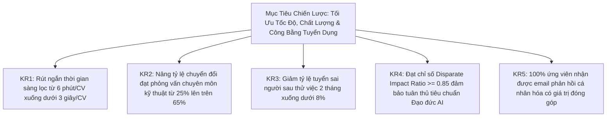

# TalentScout - Tài Liệu Yêu Cầu Sản Phẩm (Product Requirements Document - PRD)

**Mã Dự Án:** TS-PRD-2026  
**Phiên Bản:** 1.3.0 (Enterprise Specification)  
**Đề Tài:** Hệ thống Quản lý Tuyển dụng & Sàng lọc Hồ sơ Ứng viên Tự động bằng AI (TalentScout AI ATS)  
**Trạng Thái:** Đã Phê Duyệt Triển Khai (Approved for Implementation)  

---

## 1. Tầm Nhìn & Mục Tiêu Sản Phẩm (Product Vision & OKRs)

### 1.1. Tuyên Bố Tầm Nhìn (Vision Statement)
TalentScout là nền tảng quản trị tuyển dụng và sàng lọc ứng viên thông minh thế hệ mới, ứng dụng sức mạnh của Xử lý Ngôn ngữ Tự nhiên (NLP), So khớp Ngữ nghĩa (Semantic Vector Matching) và Trí tuệ Nhân tạo Minh bạch (Explainable AI - XAI). Hệ thống giúp doanh nghiệp rút ngắn 70% thời gian sơ loại hồ sơ, tăng 40% chất lượng ứng viên vào vòng phỏng vấn chuyên môn, đồng thời thiết lập môi trường tuyển dụng bình đẳng, không thiên vị (Unconscious Bias-Free).

### 1.2. Mục Tiêu & Kết Quả Then Chốt (OKRs)

---

## 2. Đối Tượng Người Dùng Mục Tiêu (Target Personas)

1. **Nhà Tuyển Dụng (Recruiter / Talent Acquisition Specialist)**:
   - *Nhiệm vụ*: Quản lý tin tuyển dụng, tiếp nhận hàng trăm hồ sơ CV từ nhiều nguồn (LinkedIn, TopCV, Email), điều phối ứng viên qua các vòng phỏng vấn và gửi thông báo.
   - *Điểm đau*: Mất 4 - 5 giờ mỗi ngày đọc thủ công, dễ bỏ sót nhân tài giỏi do đọc lướt nhanh, áp lực thời gian đóng vị trí (Time-to-Hire).
2. **Trưởng Bộ Phận Chuyên Môn (Hiring Manager / Tech Lead / Director)**:
   - *Nhiệm vụ*: Đặt ra tiêu chuẩn năng lực, trực tiếp phỏng vấn kỹ thuật và ra quyết định tuyển chọn.
   - *Điểm đau*: Mất nhiều giờ phỏng vấn ứng viên có điểm từ khóa cao nhưng năng lực thực tế yếu kém; thiếu dữ liệu phân tích khoảng trống kỹ năng khách quan.
3. **Ứng Viên (Candidate)**:
   - *Nhiệm vụ*: Tìm kiếm cơ hội việc làm đúng năng lực và nộp hồ sơ.
   - *Điểm đau*: Nộp hồ sơ vào "hố đen" không nhận được phản hồi (Ghosting); bị loại bởi các hệ thống lọc từ khóa cứng nhắc dù có năng lực thực chiến.

---

## 3. Phạm Vi Sản Phẩm (Product Scope)

### 3.1. Trong Phạm Vi (In-Scope)
- **AI Ingestion & Resume Parsing**: Đọc và bóc tách tự động các định dạng CV (.pdf, .docx, .txt) thành cấu trúc JSON chuẩn hóa (Thông tin liên hệ, Kỹ năng, Kinh nghiệm, Bằng cấp).
- **JD Management & Weighting**: Thiết lập bản mô tả công việc và phân bổ trọng số đánh giá linh hoạt (Kỹ năng, Kinh nghiệm, Học vấn, Ngữ nghĩa).
- **Hybrid Semantic Matching Engine**: So khớp đa chiều kết hợp Vector Embeddings (1536 chiều) và từ điển phân loại kỹ năng ngành CNTT (ESCO / O*NET).
- **Explainable AI (XAI) Synthesis**: Báo cáo minh bạch hóa quyết định của AI, làm rõ thế mạnh, lỗ hổng kỹ năng (Skill Gap) và gợi ý câu hỏi phỏng vấn.
- **ATS Kanban Board**: Quản lý vòng đời hồ sơ trực quan (*Applied* $\rightarrow$ *AI Screened* $\rightarrow$ *Interview* $\rightarrow$ *Offer* $\rightarrow$ *Rejected*).
- **Blind Screening Mode**: Chế độ 1-chạm che giấu PII (Tên, Ảnh, Giới tính, Năm sinh, Quê quán) để ngăn chặn thiên vị vô thức.
- **AI Contextual Outreach**: Tự động sinh email mời phỏng vấn hoặc thư từ chối mang tính xây dựng cá nhân hóa cao.
- **Analytics & Fairness Dashboard**: Đo lường thông lượng tuyển dụng và giám sát chỉ số chống thiên vị (Four-Fifths Rule).

### 3.2. Ngoài Phạm Vi (Out-of-Scope - Giai đoạn kế tiếp)
- Tích hợp phòng phỏng vấn trực tuyến qua Video AI (Facial / Tone Analysis).
- Chấm bài thi lập trình trực tiếp (Online Coding Assessment Sandbox).
- Quản lý hợp đồng lao động và tính lương (Payroll & Benefits Management).

---

## 4. Yêu Cầu Chức Năng (Functional Requirements - FR)

| Mã FR | Tên Tính Năng | Độ Ưu Tiên (MoSCoW) | Mô Tả Nghiệp Vụ |
| :--- | :--- | :---: | :--- |
| **FR-01** | **Quản Lý Vị Trí Tuyển Dụng & Trọng Số** | **Must-Have** | Cho phép tạo, lưu trữ JD. Cấu hình trọng số cho 4 nhóm: Kỹ năng chuyên môn ($w_1$), Kinh nghiệm ($w_2$), Học vấn ($w_3$), Ngữ nghĩa ($w_4$) với tổng trọng số bắt buộc bằng 100%. |
| **FR-02** | **Bóc Tách CV Thông Minh (Resume Parser)** | **Must-Have** | Tiếp nhận tệp tải lên (.pdf, .docx). Tự động nhận diện cấu trúc, trích xuất thực thể NER (Kỹ năng, Thời gian công tác, Bằng cấp) trong thời gian $< 3.0$ giây/CV. |
| **FR-03** | **Động Cơ Chấm Điểm So Khớp Ngữ Nghĩa** | **Must-Have** | Tính toán chỉ số phù hợp tổng hợp (Overall Match Score 0 - 100%) và điểm thành phần theo công thức trọng số. Sử dụng Cosine Similarity trên không gian vector nhúng. |
| **FR-04** | **Báo Cáo Minh Bạch Hóa AI (XAI)** | **Must-Have** | Hiển thị bảng phân tích: Danh sách kỹ năng trùng khớp, Kỹ năng còn thiếu (Skill Gap), Điểm mạnh cốt lõi, Rủi ro cần phỏng vấn thêm và nhãn đề xuất (`STRONG_HIRE`, `INTERVIEW`, `CONSIDER`, `NOT_MATCH`). |
| **FR-05** | **Quản Trị Quy Trình Tuyển Dụng Kanban** | **Must-Have** | Giao diện kéo thả tương tác theo 5 giai đoạn tuyển dụng. Hỗ trợ lọc ứng viên theo điểm số tối thiểu, kỹ năng và từ khóa. |
| **FR-06** | **Chế Độ Tuyển Dụng Ẩn Danh (Blind Mode)** | **Should-Have** | Nút gạt kích hoạt chế độ ẩn danh: Hệ thống tự động che giấu Tên thật, Ảnh, Giới tính, Năm sinh, Trường học; thay bằng mã định danh trung tính (ví dụ: `Candidate #TSC-9481`). |
| **FR-07** | **Trình Sinh Email Giao Tiếp AI Tự Động** | **Should-Have** | Generative AI tự động soạn thảo thư mời phỏng vấn hoặc thư từ chối mang tính xây dựng cá nhân hóa dựa trên dữ liệu đánh giá thực tế của ứng viên. |
| **FR-08** | **Báo Cáo Thống Kê & Giám Sát Công Bằng** | **Could-Have** | Biểu đồ trực quan hóa số lượng CV, thời gian xử lý trung bình, phân bổ điểm và chỉ số công bằng Disparate Impact Ratio (DIR). |

---

## 5. Yêu Cầu Phi Chức Năng (Non-Functional Requirements - NFR)

### 5.1. Hiệu Năng & Khả Năng Mở Rộng (Performance & Scalability)
- **NFR-P1**: Thời gian xử lý từ lúc tải lên CV đến khi trả về điểm số và báo cáo XAI không vượt quá **3.0 giây** đối với tệp CV tiêu chuẩn (dưới 5 trang).
- **NFR-P2**: Hệ thống chịu tải đồng thời ít nhất **100 lượt tải CV song song** mà không phát sinh lỗi nghẽn hàng đợi (Queue Latency $< 5$ giây).
- **NFR-P3**: Độ trễ hiển thị giao diện người dùng (UI Latency) nhỏ hơn **150ms** cho các thao tác kéo thả thẻ Kanban và chuyển đổi chế độ Blind Mode.

### 5.2. Độ Chuẩn Xác Của Mô Hình AI (AI Quality & Robustness)
- **NFR-A1**: Điểm F1-Score của mô hình NER trích xuất kỹ năng chuyên môn đạt tối thiểu **88%**.
- **NFR-A2**: Hệ số tương quan xếp hạng giữa AI và Chuyên gia Nhân sự (Spearman Rank Correlation) đạt tối thiểu **0.75**.
- **NFR-A3**: Tỷ lệ ảo giác (Hallucination Rate) của LLM khi sinh giải trình XAI bằng **0%** (áp dụng cơ chế RAG kiểm chứng câu trích xuất nguyên văn).

### 5.3. Bảo Mật & Tuân Thủ Quyền Riêng Tư (Security & Privacy Compliance)
- **NFR-S1**: Mã hóa toàn vẹn dữ liệu lưu trữ (AES-256) và dữ liệu truyền tải (TLS 1.3).
- **NFR-S2**: Tuân thủ Điều 17 GDPR (Right to be Forgotten): Xóa sạch vĩnh viễn tệp gốc, văn bản thô và vector embedding khi ứng viên yêu cầu.
- **NFR-S3**: Phân quyền truy cập theo vai trò (RBAC) nghiêm ngặt giữa Recruiter, Hiring Manager và Quản trị viên (Admin).
