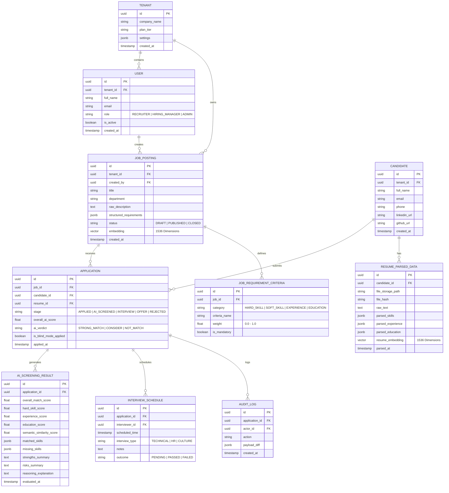

# TalentScout - Kiến Trúc Hệ Thống & Cơ Sở Dữ Liệu (System Architecture & Database Schema)

---

## 1. Tổng Quan Kiến Trúc Đa Tầng (High-Level Multi-Tier Architecture)

TalentScout được xây dựng dựa trên kiến trúc **Microservices hướng sự kiện (Event-Driven Microservices Architecture)**, kết hợp mô hình lưu trữ đa hình (**Polyglot Persistence**) nhằm tối ưu hóa hiệu năng giữa các tác vụ giao dịch transactional thông thường và tác vụ AI/NLP tiêu tốn tài nguyên tính toán.

```mermaid
graph TD
    Client[Người dùng: Web App / Mobile Responsive / ATS Extension] -->|HTTPS / WSS| CDN[Cloudflare CDN & WAF]
    CDN --> Gateway[Kong API Gateway & Reverse Proxy]

    subgraph Core_Services [Tầng Dịch Vụ Nghiệp Vụ Cốt Lõi - Golang / Node.js]
        AuthSvc[Auth & RBAC Service]
        JobSvc[Job & Workflow Service]
        AppSvc[Application & ATS Pipeline Service]
        OutreachSvc[Communication & Notification Service]
    end

    subgraph AI_ML_Pipeline [Tầng Trí Tuệ Nhân Tạo & Xử Lý Dữ Liệu - Python / FastAPI]
        ParserWorker[Resume Parser & OCR Service (Tesseract + LayoutLM)]
        EmbeddingWorker[Embedding Service (BGE-M3 / OpenAI 1536-D)]
        MatchingWorker[Semantic Matching & Scoring Engine]
        XAIWorker[Explainable AI & Reasoning Engine (LLM RAG)]
    end

    subgraph Message_Broker [Tầng Hàng Đợi & Điều Phối Bất Đồng Bộ]
        RabbitMQ[RabbitMQ / Apache Kafka Event Bus]
        RedisCache[Redis Cache & Rate Limiting]
    end

    subgraph Storage_Tier [Tầng Lưu Trữ Đa Hình - Polyglot Persistence]
        PG[(PostgreSQL - Core Relational DB)]
        VectorDB[(Qdrant / pgvector - Vector DB)]
        S3[(AWS S3 / MinIO - Encrypted Object Store)]
    end

    Gateway --> Core_Services
    Core_Services <--> RedisCache
    Core_Services --> PG
    Core_Services --> RabbitMQ

    RabbitMQ --> AI_ML_Pipeline
    AI_ML_Pipeline --> S3
    AI_ML_Pipeline --> VectorDB
    AI_ML_Pipeline --> PG
```

---

## 2. Sơ Đồ Thực Thể Quan Hệ (Entity Relationship Diagram - ERD)



---

## 3. Từ Điển Dữ Liệu Các Bảng Chính (Data Dictionary)

### 3.1. Bảng `JOB_POSTING` (Tin Tuyển Dụng)
| Tên Trường | Kiểu Dữ Liệu | Ràng Buộc | Ý Nghĩa Nghiệp Vụ |
| :--- | :--- | :---: | :--- |
| `id` | `UUID` | PK | Khóa chính tự sinh (UUIDv4) |
| `tenant_id` | `UUID` | FK | Mã định danh doanh nghiệp tuyển dụng |
| `title` | `VARCHAR(255)` | NOT NULL | Tên vị trí (Senior Fullstack Developer) |
| `department` | `VARCHAR(100)` | NOT NULL | Khối phòng ban (Engineering, Product) |
| `min_experience_years` | `SMALLINT` | DEFAULT 2 | Số năm kinh nghiệm tối thiểu |
| `structured_requirements` | `JSONB` | NOT NULL | JSON cấu trúc bóc tách kỹ năng bắt buộc và tự chọn |
| `embedding` | `VECTOR(1536)` | NULLABLE | Vector nhúng ngữ nghĩa của JD |
| `status` | `VARCHAR(20)` | DEFAULT 'DRAFT' | `DRAFT`, `PUBLISHED`, `CLOSED` |

### 3.2. Bảng `AI_SCREENING_RESULT` (Kết Quả Sàng Lọc AI & XAI)
| Tên Trường | Kiểu Dữ Liệu | Ràng Buộc | Ý Nghĩa Nghiệp Vụ |
| :--- | :--- | :---: | :--- |
| `id` | `UUID` | PK | Khóa chính |
| `application_id` | `UUID` | FK | Liên kết đơn ứng tuyển |
| `overall_match_score` | `NUMERIC(5,2)`| NOT NULL | Điểm tổng hợp 0.00% đến 100.00% |
| `hard_skill_score` | `NUMERIC(5,2)`| NOT NULL | Điểm kỹ năng chuyên môn |
| `experience_score` | `NUMERIC(5,2)`| NOT NULL | Điểm độ dày kinh nghiệm |
| `education_score` | `NUMERIC(5,2)`| NOT NULL | Điểm học vấn / bằng cấp |
| `semantic_similarity_score`| `NUMERIC(5,2)`| NOT NULL | Điểm tương đồng Cosine vector |
| `matched_skills` | `JSONB` | NOT NULL | Danh sách kỹ năng thỏa mãn yêu cầu |
| `missing_skills` | `JSONB` | NOT NULL | Danh sách kỹ năng thiếu (Skill Gap) |
| `strengths_summary` | `TEXT` | NOT NULL | Đoạn văn bản XAI tóm tắt thế mạnh |
| `risks_summary` | `TEXT` | NOT NULL | Đoạn văn bản XAI cảnh báo điểm cần phỏng vấn |
| `ai_verdict` | `VARCHAR(30)` | NOT NULL | `STRONG_HIRE`, `INTERVIEW`, `CONSIDER`, `NOT_MATCH` |

---

## 4. Thiết Kế Vector Database & Chiến Lược Đánh Chỉ Mục (Vector Indexing)

- **Collection Name**: `resume_embeddings_v1`
- **Embedding Dimensions**: 1536 chiều (tương thích OpenAI `text-embedding-3-small` hoặc mô hình nội bộ `BGE-M3`).
- **Distance Metric**: `Cosine Distance`.
- **Index Algorithm**: **HNSW (Hierarchical Navigable Small World)**:
  - `m = 16`: Số lượng liên kết tối đa giữa các điểm nút vector.
  - `ef_construction = 200`: Kích thước danh sách động khi xây dựng đồ thị phân cấp.
  - `ef_search = 100`: Kích thước danh sách khi tìm kiếm lân cận gần nhất (k-NN), đảm bảo thời gian truy vấn $< 15\text{ms}$ với độ thu hồi (Recall) đạt $> 98\%$.
