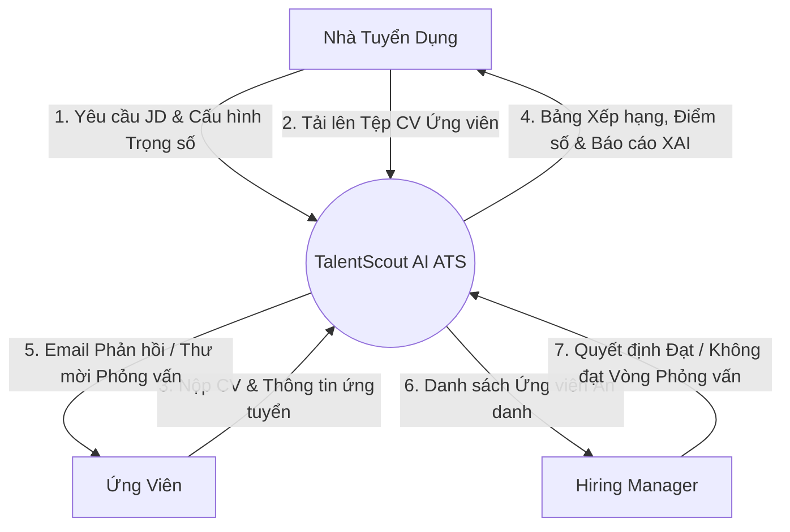
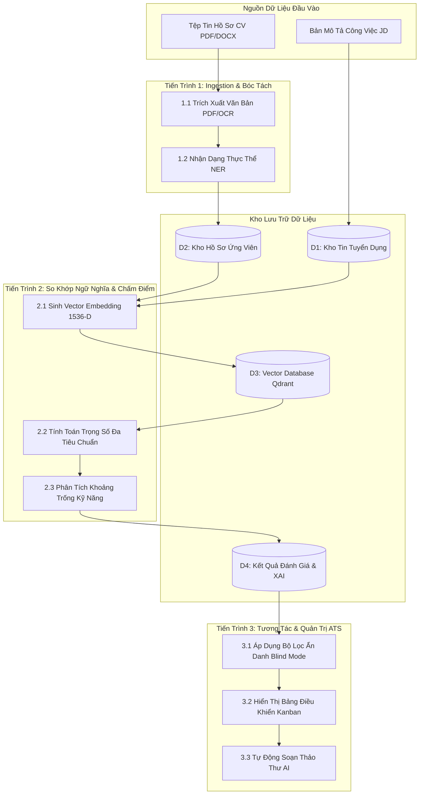
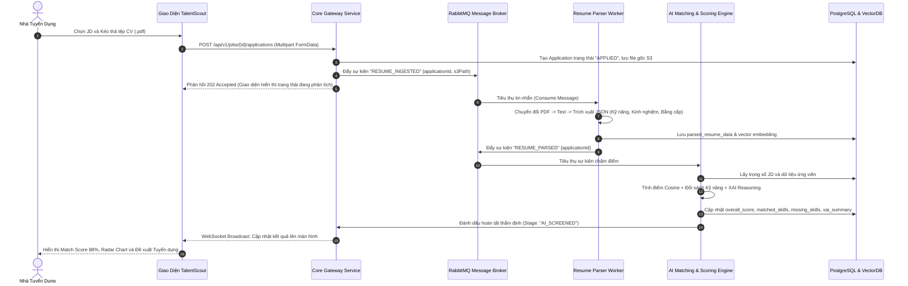
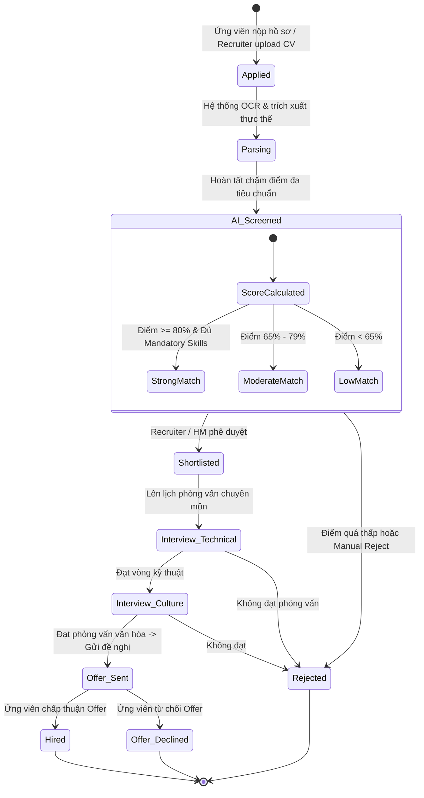

# TalentScout - Luồng Dữ Liệu & Quy Trình Xử Lý (Data Flow & System Dynamics)

---

## 1. Sơ Đồ Luồng Dữ Liệu (Data Flow Diagrams - DFD)

### 1.1. DFD Mức Ngữ Cảnh (Context Diagram - Level 0)

---

### 1.2. DFD Mức Chi Tiết (Level 1 Processing Diagram)

---

## 2. Sơ Đồ Tuần Tự Xử Lý Bất Đồng Bộ (Asynchronous Sequence Diagram)

---

## 3. Sơ Đồ Chuyển Đổi Trạng Thái Ứng Viên (Candidate Lifecycle State Machine)

