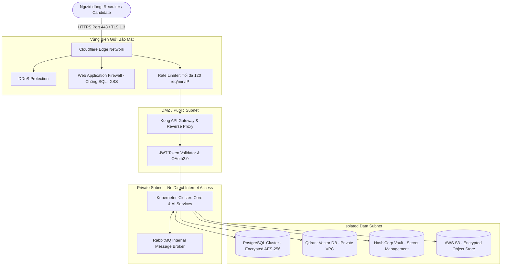
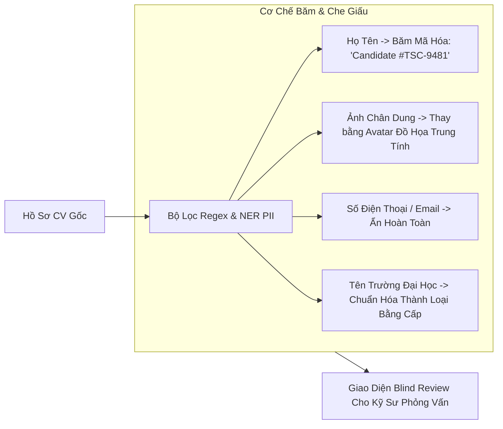

# TalentScout - Kiến Trúc An Ninh Mạng & Bảo Mật Dữ Liệu (Security & Network Architecture)

---

## 1. Mô Hình An Ninh Mạng Tổng Thể (Network Topology & Perimeter Defense)

Hệ thống TalentScout áp dụng mô hình **Zero Trust Network Architecture (ZTNA)** và phân tách các vùng mạng nghiêm ngặt bằng Virtual Private Cloud (VPC):

---

## 2. Chiến Lược Mã Hóa Dữ Liệu (Data Encryption Standards)

- **Mã Hóa Khi Truyền Tải (Encryption in Transit)**:
  - Bắt buộc toàn bộ lưu lượng mạng phải qua giao thức **TLS 1.3** với các bộ mật mã an toàn: `TLS_AES_256_GCM_SHA384` hoặc `TLS_CHACHA20_POLY1305_SHA256`.
  - Tự động chuyển hướng toàn bộ HTTP (Port 80) sang HTTPS (Port 443).
- **Mã Hóa Khi Lưu Trữ (Encryption at Rest)**:
  - Toàn bộ cơ sở dữ liệu PostgreSQL và Vector DB được mã hóa cấp đĩa bằng tiêu chuẩn **AES-256**.
  - Tệp CV gốc (.pdf, .docx) lưu trữ trên S3 bucket được cấu hình Server-Side Encryption (SSE-KMS) với khóa quản lý tự động xoay vòng mỗi 90 ngày.

---

## 3. Cơ Chế Ẩn Danh PII & Chống Thiên Vị (Blind Screening Architecture)

> [!IMPORTANT]
> **Bảo Vệ Dữ Liệu Cá Nhân Định Danh (PII Cleansing):**
> Nhằm triệt tiêu thiên vị vô thức (Unconscious Bias) và tuân thủ Đạo luật AI (EU AI Act), hệ thống xây dựng cơ chế làm sạch dữ liệu định danh ở mức ứng dụng trước khi dữ liệu được chuyển đến Hiring Manager.

---

## 4. Tuân Thủ Quy Định Bảo Vệ Dữ Liệu Toàn Cầu (GDPR Compliance)

Hệ thống TalentScout tuân thủ nghiêm ngặt Quy chế Bảo vệ Dữ liệu Chung của Châu Âu (GDPR):
1. **Quyền Được Quên (Article 17 - Right to Erasure / Right to be Forgotten)**:
   - Khi ứng viên gửi yêu cầu hủy bỏ thông tin cá nhân, API `DELETE /api/v1/candidates/{id}/purge` sẽ kích hoạt luồng dọn dẹp liên hoàn:
     1. Xóa vĩnh viễn tệp gốc trên S3.
     2. Xóa các vector embedding liên quan trên Qdrant/pgvector.
     3. Đè trắng (Overwrite) các trường PII trong bảng cơ sở dữ liệu trước khi xóa bản ghi.
2. **Quyền Truy Cập Dữ Liệu (Article 15 - Right of Access)**:
   - Ứng viên có quyền xuất (Export) toàn bộ dữ liệu bóc tách mà AI đã phân tích về hồ sơ của mình dưới định dạng JSON nén bảo mật.

---

## 5. Phân Quyền Truy Cập Dựa Trên Vai Trò (RBAC Matrix)

| Quyền Hạn Nghiệp Vụ (Permissions) | Admin (Quản Trị Viên) | Recruiter (HR) | Hiring Manager (Tech Lead) | Candidate (Ứng Viên) |
| :--- | :---: | :---: | :---: | :---: |
| Tạo / Xuất bản Tin tuyển dụng (JD) | ✅ | ✅ | ⚠️ Chỉ đề xuất | ❌ |
| Tải lên hồ sơ CV ứng viên | ✅ | ✅ | ❌ | ✅ (Nộp CV bản thân) |
| Xem Điểm số AI & Báo cáo XAI | ✅ | ✅ | ✅ | ❌ (Chỉ xem trạng thái) |
| Xem Thông tin cá nhân PII (Tên, SĐT) | ✅ | ✅ | ⚠️ Chỉ khi mở khóa phỏng vấn | ✅ |
| Chuyển vòng tuyển dụng trên Kanban | ✅ | ✅ | ⚠️ Phê duyệt vòng chuyên môn | ❌ |
| Soạn & Gửi email tự động AI | ✅ | ✅ | ❌ | ❌ |
| Xem Báo cáo Thiên vị & Thống kê | ✅ | ⚠️ Xem hạn chế | ❌ | ❌ |
| Cấu hình Trọng số đánh giá AI | ✅ | ⚠️ Cần Admin duyệt | ⚠️ Cần Admin duyệt | ❌ |
