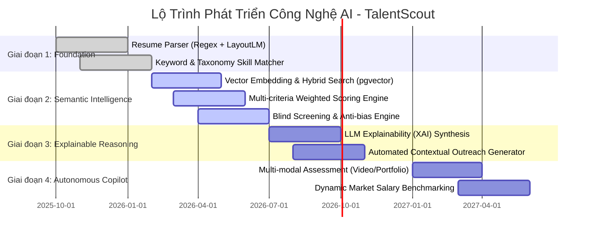
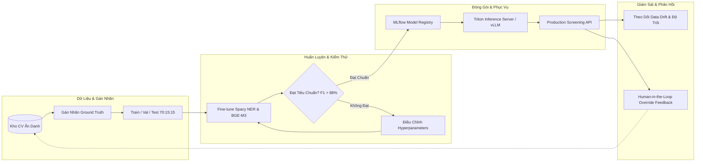

# TalentScout - Lộ Trình Phát Triển AI & Vận Hành MLOps (AI Roadmap & MLOps Strategy)

---

## 1. Lộ Trình 4 Giai Đoạn Phát Triển Trí Tuệ Nhân Tạo (AI Evolution Roadmap)

---

## 2. Chu Trình MLOps Vòng Đời Mô Hình (MLOps Lifecycle)

---

## 3. Cơ Chế Giám Sát Độ Trôi Dữ Liệu & Ảo Giác AI (Drift & Hallucination Guardrails)

1. **Giám Sát Độ Trôi Khái Niệm Kỹ Năng (Skill Concept Drift)**:
   - Các công nghệ lập trình và framework mới xuất hiện liên tục (ví dụ: các thư viện AI mới nổi).
   - Hệ thống tự động quét và gắn cờ các từ khóa không nhận diện được xuất hiện lặp lại trên 5% tổng số CV mỗi tháng để bổ sung vào Taxonomy.
2. **Kiểm Soát Ảo Giác LLM (Hallucination Verification)**:
   - Toàn bộ các câu dẫn chứng trong mục "Điểm Mạnh" và "Lỗ Hổng Kỹ Năng" phải vượt qua hàm kiểm định chuỗi ký tự (Exact Substring Matching) đối chiếu với văn bản CV gốc. Nghiêm cấm mô hình tự suy đoán bằng cấp hoặc chứng chỉ không có trong hồ sơ.
