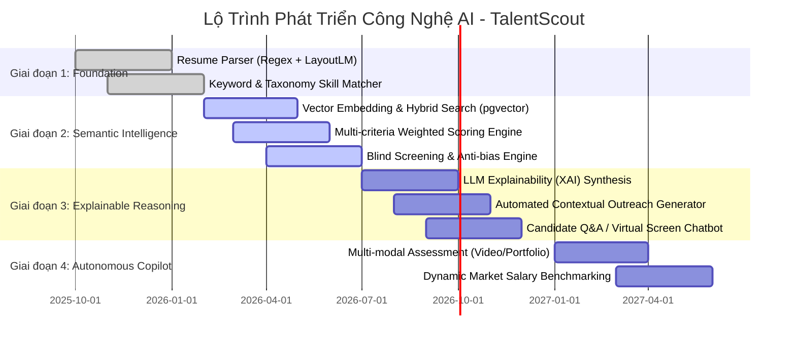
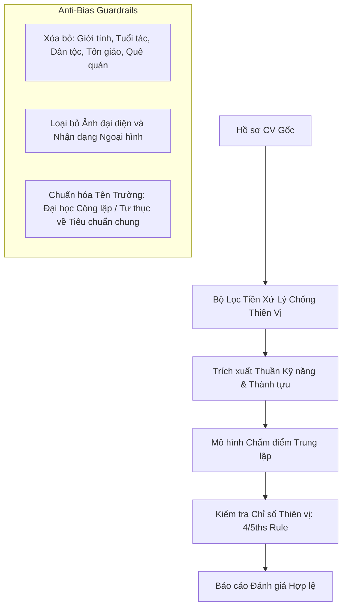
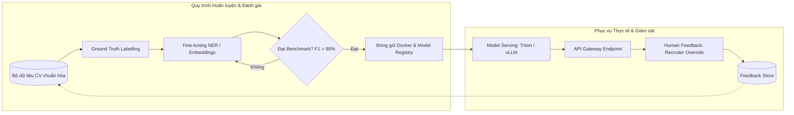

# TalentScout - AI Development Roadmap & MLOps Strategy
**Lộ Trình Phát Triển Mô Hình AI, Khung Đạo Đức & Chiến Lược MLOps**

---

## 1. Tầm Nhìn & Chiến Lược Tiến Hóa Của Hệ Thống AI

Hệ thống AI của TalentScout được thiết kế để giải quyết bài toán cốt lõi: **"Sàng lọc hồ sơ ứng viên nhanh chóng, chuẩn xác nhưng công bằng, minh bạch và không thiên vị"**.
Lộ trình phát triển được phân rã theo 4 giai đoạn tiến hóa công nghệ từ cơ bản đến tự động hóa nâng cao:

---

## 2. Chi Tiết Các Giai Đoạn Phát Triển (Phased Milestones)

### Giai Đoạn 1: Nền Tảng Bóc Tách & Từ Điển Kỹ Năng (Rule-based & Basic NLP)
- **Mục tiêu**: Đọc hiểu cấu trúc văn bản CV đa định dạng (.pdf, .docx, .txt) với độ chuẩn xác nhận dạng phần mục > 85%.
- **Công nghệ**:
  - Apache Tika / PyMuPDF trích xuất văn bản thô.
  - Mô hình Spacy NER (Named Entity Recognition) kết hợp từ điển phân loại kỹ năng O*NET Taxonomy và ESCO Taxonomy (chứa hơn 13,000 kỹ năng CNTT và kinh doanh).
- **Đầu ra**: Cấu trúc JSON chuẩn hóa chứa các trường: `skills`, `experience_years`, `educations`, `certifications`.

### Giai Đoạn 2: Trí Tuệ Ngữ Nghĩa & Chấm Điểm Đa Tiêu Chuẩn (Semantic Matching & Fair AI)
- **Mục tiêu**: Khắc phục nhược điểm của tìm kiếm từ khóa thuần túy. Hiểu được từ đồng nghĩa (Synonym) và ngữ cảnh (ví dụ: *"ReactJS"* tương đương *"React.js"*, *"Kubernetes"* nằm trong hệ sinh thái *"DevOps/Cloud"*).
- **Công nghệ**:
  - Dense Retrieval sử dụng mô hình embedding đa ngôn ngữ (`BAAI/bge-m3` hoặc OpenAI `text-embedding-3-small`).
  - Vector Database: Qdrant hoặc `pgvector` trên PostgreSQL.
  - Thuật toán chấm điểm tổ hợp (Composite Scoring Function):
    $$\text{Total Score} = 0.40 \times S_{\text{HardSkills}} + 0.30 \times S_{\text{Experience}} + 0.15 \times S_{\text{Education}} + 0.15 \times S_{\text{SemanticCosine}}$$
  - **Cơ chế Blind Screening**: Tự động xóa thực thể PII (Personally Identifiable Information) trước khi chấm điểm để chống thiên vị.

### Giai Đoạn 3: Trí Tuệ Giải Thích (Explainable AI - XAI) & Soạn Thảo Thông Minh
- **Mục tiêu**: Chấm dứt hiện tượng "Hộp đen AI" (Black-box AI). Cung cấp lý do cụ thể vì sao ứng viên đạt hoặc không đạt, các khoảng trống kỹ năng (Skill Gap) cần đào tạo.
- **Công nghệ**:
  - Tích hợp mô hình ngôn ngữ lớn (Gemini 1.5 Pro / GPT-4o-mini / Llama-3-70B) theo kỹ thuật RAG (Retrieval-Augmented Generation).
  - Prompt Engineering nghiêm ngặt với Structured JSON Output để sinh ra các mục: `Strengths`, `Red Flags`, `Missing Prerequisite Skills`, `Recommended Interview Questions`.
  - AI Contextual Email Generator: Tự động soạn thảo thư mời phỏng vấn hoặc thư cảm ơn từ chối lịch thiệp dựa trên chính điểm mạnh của ứng viên.

### Giai Đoạn 4: Trợ Lý Tuyển Dụng Đa Phương Thức Tự Động (Autonomous HR Copilot)
- **Mục tiêu**: Tự động hóa toàn diện từ khâu sàng lọc đến sơ vấn trực tuyến.
- **Tính năng**:
  - Phân tích mã nguồn GitHub hoặc Portfolio dự án thiết kế (Behance/Dribbble) của ứng viên.
  - Phân tích video giới thiệu bản thân 60 giây (tông giọng, độ tự tin, khả năng diễn đạt tiếng Anh).
  - Dự báo mức lương thị trường (Salary Benchmarking) theo cấp bậc kỹ năng.

---

## 3. Khung Đạo Đức AI & Kiểm Soát Thiên Vị (AI Ethics & Bias Mitigation)

Để đảm bảo tuân thủ tiêu chuẩn tuyển dụng công bằng của Hoa Kỳ (EEOC), Đạo luật AI của Liên minh Châu Âu (EU AI Act - High Risk AI System Category) và Luật Dữ liệu Việt Nam:

### 3.1. Các Chỉ Số Đánh Giá Tính Công Bằng (Fairness Metrics)
1. **Quy tắc 80% (Four-Fifths Rule / Disparate Impact Ratio)**:
   - Tỷ lệ hồ sơ được AI chọn giữa các nhóm thiểu số và đa số (ví dụ: Tỷ lệ Nam vs Nữ, Vùng miền) không được nhỏ hơn 0.8 (80%).
   - Nếu tỷ lệ $DIR < 0.80$, hệ thống sẽ tự động phát cảnh báo rủi ro thiên vị tới Quản trị viên hệ thống.
2. **Loại trừ biến số tiềm ẩn (Proxy Feature Elimination)**:
   - Nghiêm cấm sử dụng mã bưu chính (Zip code), khoảng thời gian trống dài ngày (Career gap do thai sản) làm tiêu chí trừ điểm nặng nề.

---

## 4. Kiến Trúc MLOps & Quy Trình Vận Hành Mô Hình

### 4.1. Vòng lặp Phản hồi của Con người (Human-in-the-Loop - HITL)
- AI chỉ đóng vai trò là **Công cụ Gợi ý và Trợ lý (Augmented Intelligence)**, không bao giờ tự động ra quyết định loại bỏ ứng viên mà không có sự phê duyệt của con người.
- Khi Recruiter thay đổi trạng thái của ứng viên (ví dụ: Chuyển từ "Từ chối" lên "Phỏng vấn"), hệ thống sẽ ghi nhận độ lệch (Label Shift) để tái huấn luyện mô hình (Retraining Dataset).

### 4.2. Giám Sát Độ Trôi Dữ Liệu & Ảo Giác (Drift & Hallucination Guardrails)
- **Data Drift**: Theo dõi sự xuất hiện của các công nghệ mới nổi (ví dụ: các framework AI mới chưa có trong từ điển kỹ năng) định kỳ mỗi 30 ngày.
- **Hallucination Checker**: Kiểm tra chéo (Cross-verification) văn bản do LLM sinh ra để đảm bảo 100% bằng chứng kỹ năng được trích xuất trực tiếp từ văn bản CV gốc, nghiêm cấm việc suy diễn không có căn cứ.
