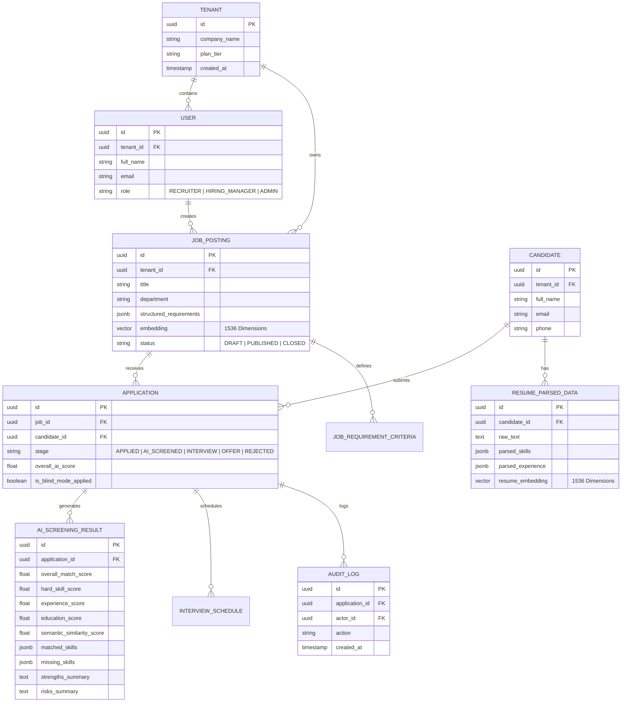
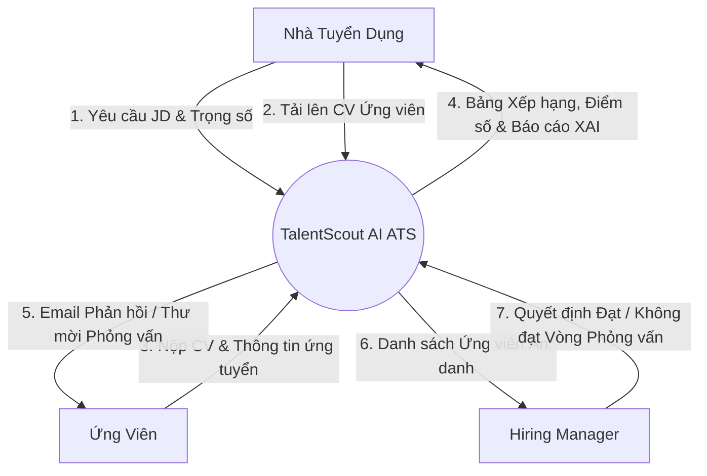
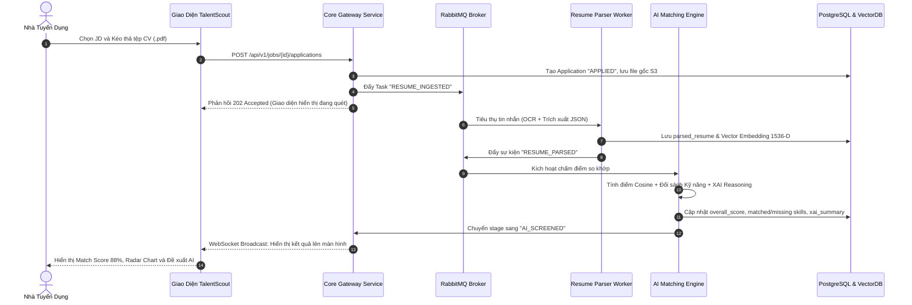

# TalentScout - Kiến Trúc Hệ Thống, CSDL & Bảo Mật (System Architecture & Security)

---

## 1. Tổng Quan Kiến Trúc Đa Tầng (High-Level Architecture)

TalentScout được thiết kế theo mô hình **Microservices hướng sự kiện (Event-Driven Architecture)**, kết hợp lưu trữ đa hình (**Polyglot Persistence**) nhằm cân bằng giữa giao dịch dữ liệu chuẩn xác (ACID) và hiệu năng tính toán AI/Vector đa chiều.

```mermaid
graph TD
    Client[Người dùng: Web App / Mobile Responsive / ATS Extension] -->|HTTPS / WSS| CDN[Cloudflare CDN & WAF]
    CDN --> Gateway[Kong API Gateway & Reverse Proxy]

    subgraph Core_Services [Tầng Dịch Vụ Nghiệp Vụ - Golang / Node.js]
        AuthSvc[Auth & RBAC Service]
        JobSvc[Job & Workflow Service]
        AppSvc[Application & ATS Pipeline Service]
        OutreachSvc[Communication & Notification Service]
    end

    subgraph AI_ML_Pipeline [Tầng Trí Tuệ Nhân Tạo - Python / FastAPI]
        ParserWorker[Resume Parser & OCR Service (Tesseract + LayoutLM)]
        EmbeddingWorker[Embedding Service (BGE-M3 / OpenAI 1536-D)]
        MatchingWorker[Semantic Matching & Scoring Engine]
        XAIWorker[Explainable AI & Reasoning Engine (LLM RAG)]
    end

    subgraph Message_Broker [Tầng Điều Phối Bất Đồng Bộ]
        RabbitMQ[RabbitMQ / Kafka Event Bus]
        RedisCache[Redis Cache & Rate Limiter]
    end

    subgraph Storage_Tier [Tầng Lưu Trữ Đa Hình]
        PG[(PostgreSQL - Core Relational DB)]
        VectorDB[(Qdrant / pgvector - Vector DB)]
        S3[(AWS S3 - Encrypted Object Store)]
    end

    Gateway --> Core_Services
    Core_Services <--> RedisCache
    Core_Services --> PG
    Core_Services --> RabbitMQ

    RabbitMQ --> AI_ML_Pipeline
    AI_ML_Pipeline --> S3
    AI_ML_Pipeline --> VectorDB
    AI_ML_Pipeline --> PG
```

---

## 2. Sơ Đồ Thực Thể Quan Hệ (Entity Relationship Diagram - ERD)



---

## 3. Sơ Đồ Luồng Dữ Liệu (DFD) & Xử Lý Bất Đồng Bộ

### 3.1. DFD Mức Ngữ Cảnh (Level 0 Context Diagram)



### 3.2. Sơ Đồ Tuần Tự Xử Lý Bất Đồng Bộ (Asynchronous Sequence)



---

## 4. An Ninh Mạng, Bảo Mật Dữ Liệu & Sàng Lọc Ẩn Danh (Blind Mode)

1. **Mô Hình Zero Trust Network (ZTNA)**:
   - Toàn bộ lưu lượng ngoài vào qua Cloudflare Edge (DDoS Protection, WAF, Rate Limiter 120 req/min).
   - Tách biệt Public DMZ (Kong Gateway) và Private VPC Cluster (Kubernetes, Database).
2. **Tiêu Chuẩn Mã Hóa (Encryption Standards)**:
   - Mã hóa khi truyền tải (Transit): Bắt buộc **TLS 1.3**.
   - Mã hóa khi lưu trữ (Rest): **AES-256** trên toàn bộ PostgreSQL, Vector DB và S3 buckets.
3. **Cơ Chế Blind Screening (Chống Thiên Vị Vô Thức)**:
   - Khi kích hoạt: Tên $\rightarrow$ `Candidate #TSC-XXXX`, Ảnh $\rightarrow$ Avatar trung tính, SĐT/Email/Quê quán $\rightarrow$ Ẩn hoàn toàn.
4. **Tuân Thủ GDPR Điều 17 (Right to be Forgotten)**:
   - Xóa cascade vĩnh viễn: S3 file $\rightarrow$ Vector embeddings $\rightarrow$ Database records khi nhận yêu cầu purge.
5. **Ma Trận Phân Quyền (RBAC)**:
   - Quản trị viên (Admin) $\ge$ Chuyên viên tuyển dụng (Recruiter) $\ge$ Trưởng bộ phận kỹ thuật (Hiring Manager).
