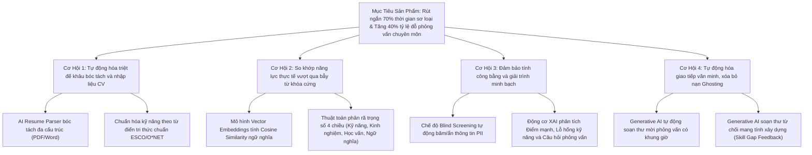
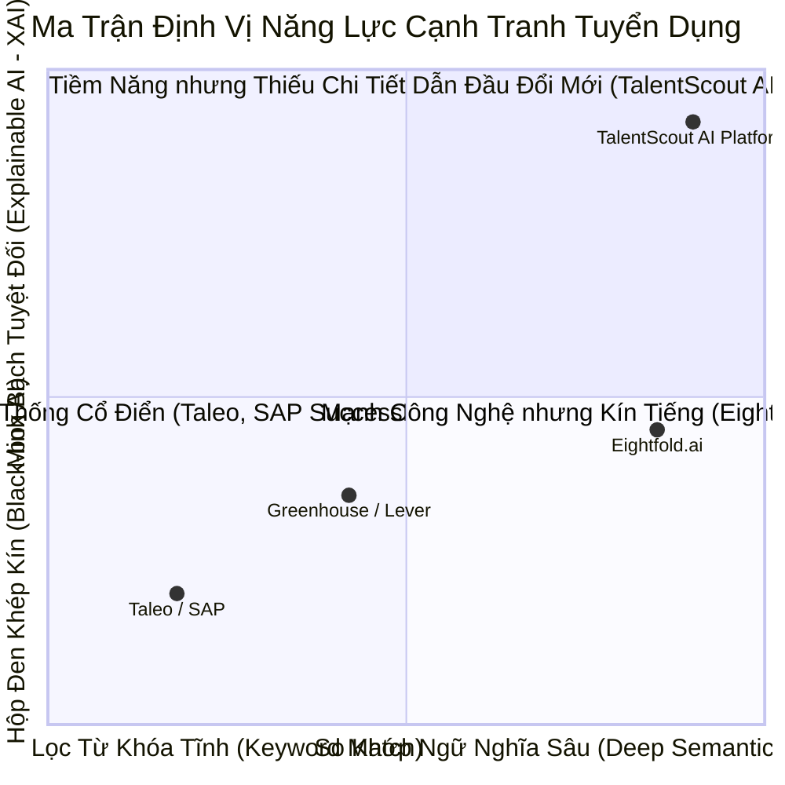
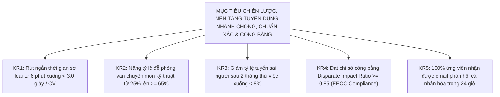
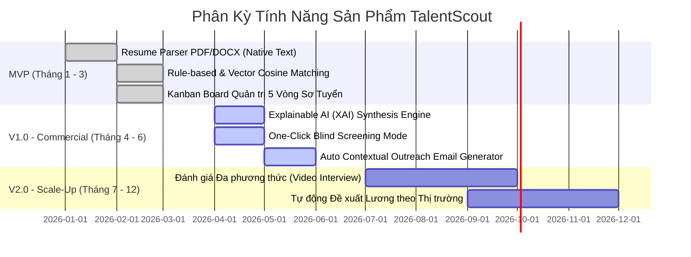
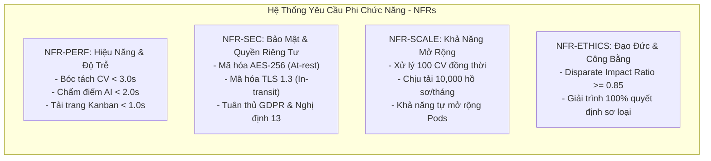
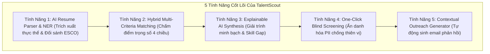
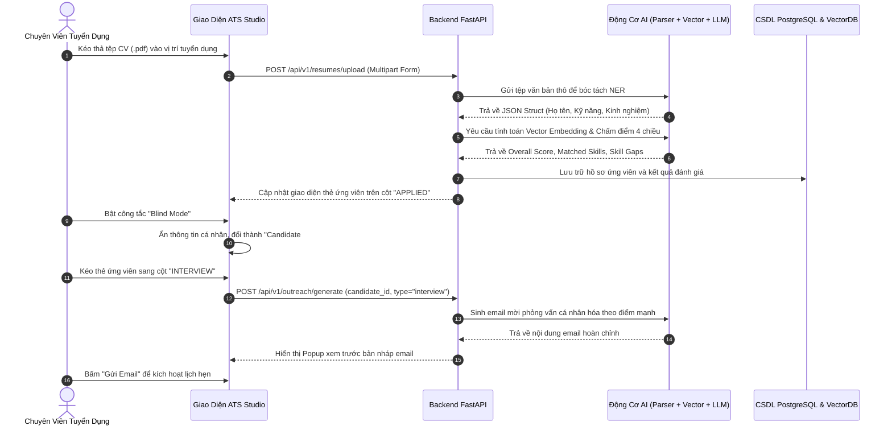
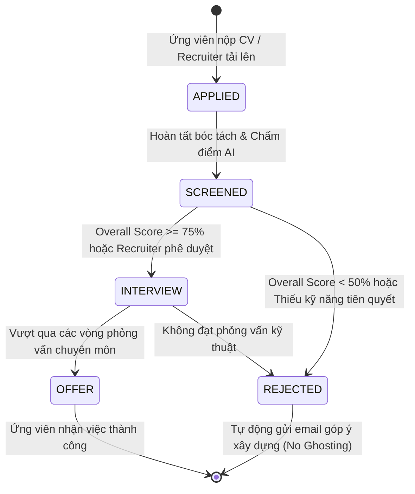

# Chương 3: AI Trong Phân Tích Yêu Cầu & Sản Phẩm (AI in Requirements & Product Analysis)

> **Môn học**: AI trong Phân tích Yêu cầu & Phát triển Sản phẩm  
> **Dự án Thực chiến Xuyên suốt**: TalentScout — Hệ thống Quản trị Tuyển dụng và Sàng lọc Hồ sơ Thông minh bằng AI (AI ATS)  
> **Tác giả**: Ban Giảng huấn & Đội ngũ Quản trị Sản phẩm AI (AI Product Management)

---

## Mục Lục Chương 3
- [3.1 Khám Phá Sản Phẩm (Product Discovery)](#31-khám-phá-sản-phẩm-product-discovery)
  - [3.1.1 Bối Cảnh Thị Trường & Điểm Nghẽn Tuyển Dụng](#311-bối-cảnh-thị-trường--điểm-nghẽn-tuyển-dụng)
  - [3.1.2 Bản Đồ Thấu Cảm Khách Hàng (Customer Empathy Maps)](#312-bản-đồ-thấu-cảm-khách-hàng-customer-empathy-maps)
  - [3.1.3 Khung Mô Hình Kinh Doanh Tinh Gọn (Lean Canvas)](#313-khung-mô-hình-kinh-doanh-tinh-gọn-lean-canvas)
  - [3.1.4 Cây Cơ Hội - Giải Pháp Ứng Dụng AI (Opportunity Solution Tree)](#314-cây-cơ-hội---giải-pháp-ứng-dụng-ai-opportunity-solution-tree)
  - [3.1.5 Phân Tích Đối Thủ Cạnh Tranh & Ma Trận Định Vị](#315-phân-tích-đối-thủ-cạnh-tranh--ma-trận-định-vị)
- [3.2 Tài Liệu Yêu Cầu Sản Phẩm (PRD)](#32-tài-liệu-yêu-cầu-sản-phẩm-prd)
  - [3.2.1 Tuyên Bố Tầm Nhìn & Chỉ Tiêu Đo Lường Chiến Lược (Vision & OKRs)](#321-tuyên-bố-tầm-nhìn--chỉ-tiêu-đo-lường-chiến-lược-vision--okrs)
  - [3.2.2 Chân Dung Người Dùng Điển Hình (User Personas)](#322-chân-dung-người-dùng-điển-hình-user-personas)
  - [3.2.3 Giả Định & Ma Trận Đánh Giá Rủi Ro (Risk Assessment Matrix)](#323-giả-định--ma-trận-đánh-giá-rủi-ro-risk-assessment-matrix)
  - [3.2.4 Phân Kỳ Phạm Vi Sản Phẩm (MVP vs V1.0 vs V2.0)](#324-phân-kỳ-phạm-vi-sản-phẩm-mvp-vs-v10-vs-v20)
- [3.3 Phân Tích Yêu Cầu (Requirements Analysis)](#33-phân-tích-yêu-cầu-requirements-analysis)
  - [3.3.1 Yêu Cầu Chức Năng (Functional Requirements - MoSCoW)](#331-yêu-cầu-chức-năng-functional-requirements---moscow)
  - [3.3.2 Yêu Cầu Phi Chức Năng (Non-Functional Requirements - NFRs)](#332-yêu-cầu-phi-chức-năng-non-functional-requirements---nfrs)
  - [3.3.3 Khung Đạo Đức AI & Tiêu Chuẩn Chống Thiên Vị (EEOC Four-Fifths Rule)](#333-khung-đạo-đức-ai--tiêu-chuẩn-chống-thiên-vị-eeoc-four-fifths-rule)
  - [3.3.4 Ma Trận Truy Xuất Yêu Cầu (Requirements Traceability Matrix - RTM)](#334-ma-trận-truy-xuất-yêu-cầu-requirements-traceability-matrix---rtm)
- [3.4 User Stories & Tiêu Chí Chấp Nhận (Acceptance Criteria)](#34-user-stories--tiêu-chí-chấp-nhận-acceptance-criteria)
  - [3.4.1 Tiêu Chuẩn INVEST Trong Thiết Kế User Story](#341-tiêu-chuẩn-invest-trong-thiết-kế-user-story)
  - [3.4.2 Bộ User Stories & Kịch Bản BDD Gherkin Chi Tiết (6 Epics)](#342-bộ-user-stories--kịch-bản-bdd-gherkin-chi-tiết-6-epics)
- [3.5 Đặc Tả Tính Năng (Feature Specification)](#35-đặc-tả-tính-năng-feature-specification)
  - [3.5.1 Đặc Tả 5 Tính Năng AI Cốt Lõi](#351-đặc-tả-5-tính-năng-ai-cốt-lõi)
  - [3.5.2 Sơ Đồ Luồng Người Dùng Tổng Thể (End-to-End User Flow)](#352-sơ-đồ-luồng-người-dùng-tổng-thể-end-to-end-user-flow)
  - [3.5.3 Máy Trạng Thái Quy Trình Tuyển Dụng (ATS Kanban State Machine)](#353-máy-trạng-thái-quy-trình-tuyển-dụng-ats-kanban-state-machine)
  - [3.5.4 Hợp Đồng Giao Diện Lập Trình (API Contract Specifications)](#354-hợp-đồng-giao-diện-lập-trình-api-contract-specifications)
- [Bài Thực Hành 3: Chạy Demo Một Số Ví Dụ Minh Họa](#bài-thực-hành-3-chạy-demo-một-số-ví-dụ-minh-họa)
  - [Cấu Trúc Tệp Script Thực Hành Demo](#cấu-trúc-tệp-script-thực-hành-demo)
  - [Kịch Bản 1: Sàng Lọc Hồ Sơ Chuẩn & Chấm Điểm So Khớp](#kịch-bản-1-sàng-lọc-hồ-sơ-chuẩn--chấm-điểm-so-khớp)
  - [Kịch Bản 2: Báo Cáo Phân Tích Lỗ Hổng Kỹ Năng (Skill Gap Analysis)](#kịch-bản-2-báo-cáo-phân-tích-lỗ-hổng-kỹ-năng-skill-gap-analysis)
  - [Kịch Bản 3: Sàng Lọc Ẩn Danh (Blind Screening Mode)](#kịch-bản-3-sàng-lọc-ẩn-danh-blind-screening-mode)
  - [Kịch Bản 4: Tự Động Hóa Sinh Email Phản Hồi AI Cá Nhân Hóa](#kịch-bản-4-tự-động-hóa-sinh-email-phản-hồi-ai-cá-nhân-hóa)

---

## 3.1 Khám Phá Sản Phẩm (Product Discovery)

### 3.1.1 Bối Cảnh Thị Trường & Điểm Nghẽn Tuyển Dụng

Trong thời đại số hóa và sự phổ biến của các cổng việc làm trực tuyến (LinkedIn, TopCV, VietnamWorks, ITviec), việc nộp hồ sơ xin việc trở nên dễ dàng hơn bao giờ hết ("1-Click Apply"). Tuy nhiên, sự thuận tiện này tạo ra một cuộc khủng hoảng ngược cho doanh nghiệp và đội ngũ nhân sự:

1. **Khủng Hoảng CV Rác (Resume Spam)**: Mỗi tin tuyển dụng vị trí công nghệ cao trung bình nhận từ **250 đến 450 hồ sơ**, trong đó **hơn 70% ứng viên hoàn toàn không đáp ứng các tiêu chuẩn tối thiểu**.
2. **Quy Luật 6 Giây Của Recruiter**: Nghiên cứu thực nghiệm của The Ladders chỉ ra rằng nhà tuyển dụng chỉ dành trung bình **6 đến 7.4 giây** để đọc lướt một bản CV. Hệ quả là tỷ lệ bỏ sót nhân tài thực sự (False Negatives) lên tới 35%, đồng thời tạo kẽ hở cho những ứng viên biết "nhồi nhét từ khóa SEO" qua mặt.
3. **Chi Phí Vị Trí Trống (Cost of Vacancy)**: Một vị trí kỹ sư phần mềm cao cấp để trống trung bình **42 ngày** gây thiệt hại từ $15,000 - $30,000 do đình trệ dự án và quá tải cho các kỹ sư còn lại.
4. **Vấn Nạn "Im Lặng" (Candidate Ghosting)**: Hơn 80% ứng viên không nhận được bất kỳ lời phản hồi nào sau khi nộp hồ sơ, gây hủy hoại nghiêm trọng thương hiệu tuyển dụng (Employer Branding) của doanh nghiệp.
5. **Thiên Vị Vô Thức (Unconscious Bias)**: Các yếu tố nhân khẩu học phi chuyên môn (giới tính, trường đại học danh tiếng, ảnh thẻ cá nhân, độ tuổi) vô tình tác động tiêu cực đến quyết định của người sàng lọc hồ sơ.

### 3.1.2 Bản Đồ Thấu Cảm Khách Hàng (Customer Empathy Maps)

```mermaid
mindmap
  root((Hệ Sinh Thái Đối Tượng Tuyển Dụng))
    Chuyên Viên Nhân Sự (Recruiter)
      Nghĩ: "Tôi bị quá tải bởi hàng trăm file PDF mỗi sáng, sợ chọn sót người giỏi."
      Thấy: "Hòm thư ngập tràn CV, file định dạng lộn xộn, bảng tính Excel phân tán."
      Nói: "Tôi cần công cụ lọc nhanh nhưng phải có căn cứ rõ ràng để báo cáo Tech Lead."
      Làm: "Mở từng file, copy số điện thoại thủ công, gửi email từ chối theo mẫu chung chung."
    Trưởng Bộ Phận Kỹ Thuật (Hiring Manager)
      Nghĩ: "HR chuyển qua những người không biết làm việc thực tế, rất mất thời gian."
      Thấy: "Ứng viên viết CV rất kêu nhưng phỏng vấn không giải thích nổi kiến trúc dự án."
      Nói: "Tôi chỉ cần biết ứng viên có thực sự làm việc với FastAPI và Docker chưa."
      Làm: "Mất 15 giờ phỏng vấn mỗi tuần mà không chốt được nhân sự ưng ý."
    Ứng Viên Ứng Tuyển (Candidate)
      Nghĩ: "Hồ sơ của mình bị máy tính quét từ khóa gạt bỏ vô lý."
      Thấy: "Nộp đơn hàng chục nơi nhưng chỉ nhận lại sự im lặng (Ghosting)."
      Nói: "Nếu tôi trượt, hãy cho tôi biết tôi còn thiếu kỹ năng gì để hoàn thiện."
      Làm: "Liên tục sửa từ khóa trong CV để cố gắng qua mặt các thuật toán ATS cũ."
```

### 3.1.3 Khung Mô Hình Kinh Doanh Tinh Gọn (Lean Canvas)

| **1. Vấn Đề (Problem)** | **4. Giải Pháp (Solution)** | **3. Đề Xuất Giá Trị Độc Nhất (UVP)** | **9. Lợi Thế Bất Công (Unfair Advantage)** | **2. Phân Khúc Khách Hàng (Customer Segments)** |
| :--- | :--- | :--- | :--- | :--- |
| - Quá tải CV, 70% không phù hợp.<br>- Recruiter mất 6-8 phút đọc thủ công mỗi hồ sơ.<br>- ATS truyền thống lọc từ khóa cứng nhắc (Exact-string match).<br>- Thiên vị vô thức trong sơ loại hồ sơ.<br>- Thiếu phản hồi cá nhân hóa cho ứng viên. | - **Smart Parser**: Bóc tách tự động đa định dạng PDF/Word.<br>- **Hybrid Semantic Matching**: Kết hợp Cosine Vector và Từ điển kỹ năng ESCO.<br>- **Explainable AI (XAI)**: Minh bạch hóa mọi điểm cộng/trừ.<br>- **1-Click Blind Mode**: Ẩn danh toàn bộ dữ liệu cá nhân PII.<br>- **Auto Outreach**: Sinh email mời/từ chối theo ngữ cảnh. | **"Sàng lọc thông minh, tuyển dụng chuẩn xác – Rút ngắn 70% thời gian sơ loại hồ sơ với độ minh bạch AI tuyệt đối và loại bỏ hoàn toàn thiên vị vô thức."** | - Động cơ chấm điểm Hybrid độc quyền kết hợp đồ thị tri thức kỹ năng ESCO với Vector Embeddings 1536 chiều.<br>- Khung giải trình XAI minh bạch từng dòng dẫn chứng từ CV. | - Doanh nghiệp công nghệ & Startups đang trong giai đoạn Scale-up.<br>- Các đơn vị Headhunt & Săn đầu người chuyên nghiệp.<br>- Khối tập đoàn bán lẻ/ngân hàng có lưu lượng hàng nghìn CV/tháng. |
| **8. Chỉ Số Then Chốt (Key Metrics)** | **5. Kênh Phân Phối (Channels)** | | | **7. Dòng Doanh Thu (Revenue Streams)** |
| - Tốc độ sàng lọc mỗi CV ($< 3.0$ giây).<br>- Tỷ lệ đỗ phỏng vấn kỹ thuật ($> 65\%$).<br>- Tỷ lệ ứng viên hài lòng với phản hồi ($> 90\%$).<br>- Chỉ số công bằng Disparate Impact ($\ge 0.85$).<br>- Doanh thu định kỳ hàng tháng (MRR). | - B2B Inbound Content Marketing & Hội thảo HR Tech.<br>- Tiếp cận trực tiếp (Direct Sales) tới Head of HR và CTO.<br>- Marketplace tích hợp với các cổng việc làm và LinkedIn Extension. | | | - **Gói Starter (SaaS)**: $99/tháng (Tối đa 300 CV, 3 vị trí).<br>- **Gói Growth**: $299/tháng (1,500 CV, Blind Mode, XAI Engine).<br>- **Gói Enterprise**: Báo giá theo dung lượng, On-premise / Private Cloud, SLA 99.9%. |

### 3.1.4 Cây Cơ Hội - Giải Pháp Ứng Dụng AI (Opportunity Solution Tree)



### 3.1.5 Phân Tích Đối Thủ Cạnh Tranh & Ma Trận Định Vị



#### Bảng Đánh Giá So Sánh Chi Tiết:

| Tiêu Chí Kỹ Thuật & Nghiệp Vụ | ATS Cổ Điển (Taleo, Workday) | ATS Hiện Đại (Greenhouse, Lever) | AI ATS Toàn Cầu (Eightfold.ai) | **TalentScout AI ATS** |
| :--- | :---: | :---: | :---: | :---: |
| **Công Nghệ Sơ Loại** | Khớp chuỗi từ khóa chính xác (Exact Keyword) | Bộ lọc luật cố định (Rule-based Filters) | Deep Learning & Vector Search | **Hybrid Semantic Matching + ESCO Knowledge Graph** |
| **Tính Minh Bạch AI (XAI)** | ❌ Không có | ❌ Không có | ⚠️ Thấp (Chỉ trả điểm tổng hợp dạng hộp đen) | **✅ Rất cao (Báo cáo phân rã điểm, Skill Gap, Dẫn chứng CV)** |
| **Phát Hiện Nhồi Từ Khóa** | ❌ Bị đánh lừa dễ dàng | ❌ Bị đánh lừa dễ dàng | ⚠️ Phát hiện cơ bản | **✅ Phát hiện ngữ cảnh sâu & Cơ chế Auditor Pattern** |
| **Chế Độ Blind Screening** | ❌ Không hỗ trợ | ⚠️ Cấu hình thủ công | ⚠️ Có ở gói Enterprise đắt tiền | **✅ Tích hợp sẵn 1-chạm (One-Click Blind Mode)** |
| **Tự Động Sinh Email AI** | Chỉ có mẫu thư tĩnh (Static Templates) | Gửi mẫu tự động theo quy tắc | Gợi ý văn bản cơ bản | **✅ Generative AI cá nhân hóa theo điểm mạnh/yếu của hồ sơ** |
| **Đo Lường Thiên Vị EEOC** | ❌ Không có | ❌ Không có | ⚠️ Báo cáo định kỳ chậm | **✅ Giám sát thời gian thực chỉ số Disparate Impact Ratio (DIR)** |

---

## 3.2 Tài Liệu Yêu Cầu Sản Phẩm (PRD)

### 3.2.1 Tuyên Bố Tầm Nhìn & Chỉ Tiêu Đo Lường Chiến Lược (Vision & OKRs)

- **Vision Statement**: *"TalentScout là nền tảng quản trị tuyển dụng và sàng lọc ứng viên thông minh thế hệ mới, ứng dụng Xử lý Ngôn ngữ Tự nhiên, So khớp Ngữ nghĩa Vector và Trí tuệ Nhân tạo Minh bạch (XAI). Hệ thống giúp doanh nghiệp rút ngắn 70% thời gian sơ loại hồ sơ, tăng 40% chất lượng ứng viên vào vòng phỏng vấn chuyên môn và loại bỏ hoàn toàn thiên vị vô thức."*



### 3.2.2 Chân Dung Người Dùng Điển Hình (User Personas)

#### Persona 1: Chuyên Viên Tuyển Dụng (Recruiter)
- **Họ và tên**: Nguyễn Thùy Linh (29 tuổi) - Lead Technical Recruiter tại công ty Công nghệ 500 nhân sự.
- **Mục tiêu**: Sơ loại nhanh 200 CV mỗi đợt tuyển dụng, tìm đúng ứng viên có kỹ năng thực tế, không bị trễ hạn bàn giao danh sách cho Tech Lead.
- **Nỗi đau (Pain Points)**: Đọc hoa mắt các bản CV trình bày rối rắm, mất cả ngày xuất dữ liệu sang Excel, liên tục bị ứng viên than phiền vì không kịp gửi email phản hồi.

#### Persona 2: Trưởng Phòng Kỹ Thuật (Hiring Manager / Tech Lead)
- **Họ và tên**: Trần Quốc Bảo (36 tuổi) - Engineering Manager phụ trách 3 nhóm phát triển sản phẩm.
- **Mục tiêu**: Chỉ dành thời gian phỏng vấn những ứng viên thực sự biết làm hệ thống phân tán, giảm thiểu số buổi phỏng vấn vô bổ.
- **Nỗi đau (Pain Points)**: HR thường chuyển sang các ứng viên "học thuộc lòng lý thuyết" hoặc CV viết rất đẹp nhưng thực tế không biết viết mã kiểm thử (unit test), không giải thích được lý do chọn công nghệ.

#### Persona 3: Ứng Viên Kỹ Sư Phần Mềm (Candidate)
- **Họ và tên**: Lê Minh Khôi (25 tuổi) - Fullstack Developer 3 năm kinh nghiệm.
- **Mục tiêu**: Ứng tuyển vào môi trường chuyên nghiệp, được đánh giá công bằng dựa trên năng lực và dự án thực tế chứ không bị định kiến vì không tốt nghiệp đại học top đầu.
- **Nỗi đau (Pain Points)**: Rất nhiều lần gửi hồ sơ nhưng rơi vào "hố đen im lặng", không hề biết mình bị loại vì lý do gì.

### 3.2.3 Giả Định & Ma Trận Đánh Giá Rủi Ro (Risk Assessment Matrix)

| Rủi Ro Nhận Diện | Khả Năng Xảy Ra | Mức Độ Ảnh Hưởng | Biện Pháp Kiểm Soát & Giảm Thiểu (Mitigation Strategy) |
| :--- | :---: | :---: | :--- |
| **AI Ảo Giác (Hallucination)**: Mô hình tự bịa ra kỹ năng ứng viên không có. | Trung bình | Rất cao | - Bắt buộc áp dụng kỹ thuật Fact Checklist Pattern và Strict Grounding.<br>- Mọi điểm đánh giá bắt buộc phải có trích dẫn (Evidence Snippet) từ CV. |
| **Thiên Vị Dữ Liệu (Algorithmic Bias)**: AI ưu tiên ứng viên nam hoặc trường danh tiếng. | Trung bình | Nghiêm trọng | - Tích hợp tính năng Blind Screening băm mã hóa thông tin PII trước khi đưa vào phân tích.<br>- Giám sát thời gian thực chỉ số Disparate Impact Ratio ($\ge 0.85$). |
| **Tấn Công Prompt Injection**: Ứng viên chèn mã độc vào file CV để tự gán điểm cao. | Cao | Nghiêm trọng | - Phân lập dữ liệu đầu vào bằng thẻ XML `<untrusted_candidate_input>`.<br>- Tách rời hoàn toàn bộ phận tính điểm toán học ra khỏi khối sinh ngôn ngữ của LLM. |
| **Độ Trễ Phản Hồi Quá Cao ($> 10$s)**: Làm chậm trải nghiệm của Recruiter khi quét hàng loạt. | Cao | Trung bình | - Sử dụng mô hình nhẹ (Gemini 1.5 Flash / GPT-4o-mini) cho khâu bóc tách sơ cấp.<br>- Kích hoạt Prompt Caching đối với System Instruction và nội dung JD cố định. |

### 3.2.4 Phân Kỳ Phạm Vi Sản Phẩm (MVP vs V1.0 vs V2.0)



---

## 3.3 Phân Tích Yêu Cầu (Requirements Analysis)

### 3.3.1 Yêu Cầu Chức Năng (Functional Requirements - MoSCoW)

| Mã FR | Tên Chức Năng Nghiệp Vụ | Phân Loại MoSCoW | Mô Tả Đặc Tả & Quy Tắc Xử Lý (Business Rules) |
| :--- | :--- | :---: | :--- |
| **FR-01** | **Quản Lý Vị Trí Tuyển Dụng & Cấu Hình Trọng Số** | **Must-Have** | Cho phép Recruiter tạo tin tuyển dụng (JD). Cấu hình 4 trọng số thành phần: $w_1$ (Kỹ năng), $w_2$ (Kinh nghiệm), $w_3$ (Học vấn), $w_4$ (Ngữ nghĩa) với ràng buộc bắt buộc: $\sum_{i=1}^4 w_i = 100\%$. |
| **FR-02** | **Bóc Tách Hồ Sơ Thông Minh (Smart Parser)** | **Must-Have** | Tiếp nhận tệp tải lên (.pdf, .docx, dung lượng $\le 10\text{MB}$). Tự động nhận diện cấu trúc, bóc tách thực thể NER (Kỹ năng, Kinh nghiệm, Dự án, Bằng cấp) trong thời gian $< 3.0$ giây. |
| **FR-03** | **Động Cơ Chấm Điểm So Khớp Đa Chiều** | **Must-Have** | Tính toán chỉ số Overall Match Score ($0 - 100\%$) dựa trên ma trận kỹ năng và Cosine Similarity của vector nhúng 1536 chiều. Áp dụng quy tắc phạt trừ 25% điểm kỹ năng nếu thiếu kỹ năng bắt buộc. |
| **FR-04** | **Báo Cáo Minh Bạch Hóa AI (XAI Breakdown)** | **Must-Have** | Hiển thị bảng giải trình chi tiết: Danh sách kỹ năng trùng khớp, Kỹ năng còn thiếu (Skill Gap), Điểm mạnh nổi bật, 3 câu hỏi phỏng vấn đề xuất, và nhãn phân loại (`STRONG_HIRE`, `INTERVIEW`, `CONSIDER`, `REJECT`). |
| **FR-05** | **Bảng Quản Trị Tuyển Dụng Kanban Trực Quan** | **Must-Have** | Cung cấp bảng kéo thả 5 cột giai đoạn (`APPLIED` $\to$ `SCREENED` $\to$ `INTERVIEW` $\to$ `OFFER` $\to$ `REJECTED`). Hỗ trợ lọc ứng viên theo ngưỡng điểm số tối thiểu. |
| **FR-06** | **Chế Độ Sàng Lọc Ẩn Danh (Blind Screening Mode)** | **Should-Have** | Công tắc 1-chạm cho phép băm mã hóa toàn bộ thông tin PII (Tên, Ảnh thẻ, Giới tính, Số điện thoại, Email, Tên trường học) thành mã định danh trung tính (ví dụ: `Candidate #TSC-9481`). |
| **FR-07** | **Trình Soạn Thảo Email AI Tự Động Theo Ngữ Cảnh** | **Should-Have** | Generative AI tự động tạo bản nháp email: Thư mời phỏng vấn (kèm 3 khung giờ lựa chọn) hoặc Thư từ chối mang tính xây dựng (góp ý lỗ hổng kỹ năng cần cải thiện dựa trên kết quả đánh giá). |
| **FR-08** | **Báo Cáo Thống Kê & Giám Sát Công Bằng AI** | **Could-Have** | Biểu đồ trực quan theo dõi số lượng hồ sơ theo thời gian, thời gian xử lý trung bình và chỉ số phân bổ công bằng Disparate Impact Ratio (DIR) theo tuần/tháng. |

### 3.3.2 Yêu Cầu Phi Chức Năng (Non-Functional Requirements - NFRs)



### 3.3.3 Khung Đạo Đức AI & Tiêu Chuẩn Chống Thiên Vị (EEOC Four-Fifths Rule)

Hệ thống TalentScout tích hợp công thức đo lường tỷ lệ tác động khác biệt (**Disparate Impact Ratio - DIR**) theo khuyến nghị của Ủy ban Cơ hội Việc làm Bình đẳng Hoa Kỳ (EEOC):

$$\text{DIR} = \frac{\text{Tỷ lệ trúng tuyển của nhóm được bảo vệ (Protected Group)}}{\text{Tỷ lệ trúng tuyển của nhóm chiếm đa số (Majority Group)}} = \frac{SR_{\text{protected}}}{SR_{\text{majority}}}$$

- **Quy tắc 80% (Four-Fifths Rule)**:
  $$\text{DIR} \ge 0.80 \quad (\text{Mục tiêu chuẩn hóa của TalentScout}: \text{DIR} \ge 0.85)$$
- **Cơ chế can thiệp tự động**: Nếu hệ thống phát hiện tỷ lệ ứng viên nữ lọt vào vòng phỏng vấn cho vị trí kỹ thuật thấp hơn 80% so với ứng viên nam dù có trình độ tương đương, hệ thống sẽ:
  1. Phát tín hiệu cảnh báo nguy cơ thiên vị dữ liệu (Algorithmic Bias Alert).
  2. Bắt buộc kích hoạt chế độ **Blind Screening** cho toàn bộ các hồ sơ còn lại của vị trí đó.
  3. Gửi thông báo yêu cầu Quản trị viên (Admin) rà soát lại trọng số tiêu chí JD.

### 3.3.4 Ma Trận Truy Xuất Yêu Cầu (Requirements Traceability Matrix - RTM)

| Business Need | Functional Req | Non-Functional Req | Architecture Component | Verification Test Case |
| :--- | :--- | :--- | :--- | :--- |
| Rút ngắn thời gian sơ loại hồ sơ | **FR-02** (Smart Parser) | NFR-PERF (Thời gian $< 3.0$s) | `apps/api/services/parser.py` | `tests/test_parser_performance.py` |
| Đánh giá chuẩn xác năng lực kỹ thuật | **FR-03** (Hybrid Scoring) | NFR-SCALE (Độ chính xác Cosine) | `apps/api/services/matcher.py` | `tests/test_weighted_scoring.py` |
| Minh bạch hóa quyết định AI | **FR-04** (XAI Synthesis) | NFR-ETHICS (100% có dẫn chứng) | `apps/api/services/xai_engine.py` | `tests/test_xai_justification.py` |
| Loại bỏ định kiến vô thức | **FR-06** (Blind Mode) | NFR-SEC (Che giấu 100% PII) | `apps/api/services/anonymizer.py`| `tests/test_blind_anonymization.py` |
| Xóa bỏ tình trạng ứng viên bị Ghosting | **FR-07** (Auto Outreach) | NFR-PERF (Sinh email $< 2.0$s) | `apps/api/services/outreach.py` | `tests/test_outreach_generation.py` |

---

## 3.4 User Stories & Tiêu Chí Chấp Nhận (Acceptance Criteria)

### 3.4.1 Tiêu Chuẩn INVEST Trong Thiết Kế User Story

Toàn bộ các User Stories trong hệ thống TalentScout được thiết kế tuân thủ nghiêm ngặt 6 tiêu chuẩn **INVEST**:
- **I (Independent)**: Các câu chuyện người dùng độc lập, có thể bàn giao và triển khai riêng rẽ.
- **N (Negotiable)**: Linh hoạt thảo luận chi tiết kỹ thuật giữa Product Owner và Tech Team.
- **V (Valuable)**: Luôn mang lại giá trị thiết thực và đo lường được cho người dùng cuối.
- **E (Estimable)**: Đầy đủ thông tin để ước lượng độ phức tạp (Story Points từ 1 đến 8).
- **S (Small)**: Đủ gọn gàng để hoàn thành trong 1 Sprint kéo dài 2 tuần.
- **T (Testable)**: Luôn đi kèm kịch bản kiểm thử chấp nhận BDD có thể tự động hóa.

### 3.4.2 Bộ User Stories & Kịch Bản BDD Gherkin Chi Tiết (6 Epics)

#### Epic 1: Quản Lý Tin Tuyển Dụng & Trọng Số Đánh Giá
- **US-01**: *Là một Recruiter, tôi muốn nhập tiêu chí JD và tùy chỉnh 4 trọng số đánh giá, để AI chấm điểm bám sát nhu cầu đặc thù của từng phòng ban.*
```gherkin
Feature: Quản lý trọng số đánh giá JD

  Scenario: Cấu hình trọng số hợp lệ có tổng bằng 100%
    Given Tôi đang ở trang tạo tin tuyển dụng "Senior Backend Engineer"
    When  Tôi thiết lập trọng số: Kỹ năng = 40%, Kinh nghiệm = 30%, Học vấn = 15%, Ngữ nghĩa = 15%
    And   Tôi nhấn nút "Lưu và Kích hoạt"
    Then  Hệ thống xác thực tổng trọng số bằng 100%
    And   Tin tuyển dụng chuyển sang trạng thái "PUBLISHED"

  Scenario: Cảnh báo lỗi khi tổng trọng số khác 100%
    Given Tôi đang ở trang tạo tin tuyển dụng
    When  Tôi thiết lập: Kỹ năng = 50%, Kinh nghiệm = 40%, Học vấn = 10%, Ngữ nghĩa = 10%
    And   Tôi nhấn nút "Lưu và Kích hoạt"
    Then  Hệ thống chặn lưu và hiển thị thông báo lỗi: "Tổng trọng số phải bằng đúng 100% (Hiện tại: 110%)"
```

#### Epic 2: Bóc Tách Hồ Sơ Thông Minh (Resume Parsing)
- **US-02**: *Là một Recruiter, tôi muốn kéo thả tệp CV (PDF/DOCX), để hệ thống tự động bóc tách thông tin cá nhân, danh mục kỹ năng và lịch sử công việc trong nháy mắt.*
```gherkin
Feature: Bóc tách CV tự động

  Scenario: Tải lên tệp CV PDF hợp lệ
    Given Vị trí tuyển dụng "Senior Backend Engineer" đang mở
    When  Tôi tải lên tệp "Tran_Bao_Nam_CV.pdf" có dung lượng 1.8MB
    Then  Hệ thống hoàn tất bóc tách trong vòng dưới 3.0 giây
    And   Trích xuất đúng các kỹ năng: ["Python", "FastAPI", "PostgreSQL", "Docker"]
    And   Tạo một thẻ ứng viên mới ở cột "APPLIED" trên bảng Kanban

  Scenario: Tải lên tệp định dạng không được hỗ trợ
    Given Tôi đang ở giao diện tải hồ sơ
    When  Tôi tải lên tệp "portfolio.exe" hoặc "avatar.png"
    Then  Hệ thống từ chối tệp và hiển thị cảnh báo: "Chỉ chấp nhận tệp định dạng .pdf hoặc .docx"
```

#### Epic 3: So Khớp Ngữ Nghĩa & Chấm Điểm AI Đa Chiều
- **US-03**: *Là một Hiring Manager, tôi muốn xem Overall Match Score (0 - 100%) và điểm phân rã thành phần, để nhanh chóng nhận diện ứng viên tiềm năng.*
```gherkin
Feature: Chấm điểm so khớp ứng viên

  Scenario: Chấm điểm ứng viên đáp ứng đầy đủ tiêu chuẩn
    Given Ứng viên có 4 năm kinh nghiệm làm việc và đủ toàn bộ kỹ năng bắt buộc trong JD
    When  Động cơ AI thực hiện tính toán ma trận so khớp
    Then  Overall Match Score đạt kết quả >= 85%
    And   Hệ thống tự động gán nhãn "STRONG_HIRE"
```

#### Epic 4: Báo Cáo Giải Trình Minh Bạch (XAI Synthesis)
- **US-04**: *Là một Recruiter, tôi muốn xem báo cáo XAI hiển thị rõ kỹ năng còn thiếu và các câu hỏi phỏng vấn gợi ý, để có cơ sở vững chắc khi trao đổi với Tech Lead.*
```gherkin
Feature: Báo cáo giải trình minh bạch XAI

  Scenario: Hiển thị phân tích lỗ hổng kỹ năng (Skill Gap)
    Given Ứng viên đạt 68% điểm phù hợp cho vị trí Fullstack Developer
    When  Tôi mở cửa sổ chi tiết "AI Assessment Breakdown" của ứng viên
    Then  Mục "Missing Skills" đánh dấu màu đỏ các kỹ năng còn thiếu: ["Docker", "Kubernetes"]
    And   Mục "Interview Probing Questions" gợi ý 2 câu hỏi kiểm tra khả năng làm việc với container
```

#### Epic 5: Sàng Lọc Ẩn Danh (Blind Screening Mode)
- **US-05**: *Là một Hiring Manager, tôi muốn bật chế độ Blind Mode để che giấu thông tin nhân khẩu học, giúp tôi đánh giá ứng viên thuần túy dựa trên năng lực.*
```gherkin
Feature: Chế độ sàng lọc ẩn danh chống thiên vị

  Scenario: Kích hoạt chế độ Blind Screening Mode
    Given Danh sách ứng viên đang hiển thị tên thật và ảnh đại diện
    When  Tôi gạt công tắc "Blind Screening Mode" sang trạng thái ON
    Then  Toàn bộ tên ứng viên chuyển thành mã ẩn danh dạng "Candidate #TSC-XXXX"
    And   Ảnh đại diện chuyển thành icon trung tính
    And   Thông tin số điện thoại, email và trường đại học bị ẩn hoàn toàn
```

#### Epic 6: Tự Động Hóa Soạn Thảo Email AI Theo Ngữ Cảnh
- **US-06**: *Là một Recruiter, tôi muốn nhấn 1 nút để AI tự soạn thảo email mời phỏng vấn hoặc thư từ chối mang tính xây dựng, để tiết kiệm thời gian mà vẫn đảm bảo tính nhân văn.*
```gherkin
Feature: Tự động tạo bản nháp email tuyển dụng

  Scenario: Sinh email mời phỏng vấn cho ứng viên đạt điểm cao
    Given Ứng viên đang ở cột "INTERVIEW" với điểm số 88%
    When  Tôi nhấn nút "Tạo Thư Mời Phỏng Vấn AI"
    Then  Trong vòng 1.5 giây, hệ thống hiển thị email nháp hoàn chỉnh
    And   Email nêu bật đúng 2 thế mạnh kỹ thuật của ứng viên và đề xuất 3 khung giờ phỏng vấn
```

---

## 3.5 Đặc Tả Tính Năng (Feature Specification)

### 3.5.1 Đặc Tả 5 Tính Năng AI Cốt Lõi



#### Chi Tiết Công Thức Tính Điểm Tính Năng 2 (Hybrid Multi-Criteria Scoring):

$$\text{Overall Score} = w_1 S_{\text{skills}} + w_2 S_{\text{exp}} + w_3 S_{\text{edu}} + w_4 S_{\text{semantic}}$$

Trong đó:
- $S_{\text{skills}}$: Điểm số kỹ năng chuyên môn. **Quy tắc phạt nghiêm ngặt (Penalty Rule)**: Nếu ứng viên thiếu bất kỳ kỹ năng bắt buộc nào (Mandatory Skills), $S_{\text{skills}}$ tự động bị khấu trừ $25\%$ điểm:
  $$S_{\text{skills}} = \left(\frac{\text{Số kỹ năng trùng khớp}}{\text{Tổng kỹ năng yêu cầu}}\right) \times 100 \times (1 - 0.25 \times \mathbb{I}_{\text{missing mandatory}})$$
- $S_{\text{exp}}$: Điểm số số năm kinh nghiệm:
  $$S_{\text{exp}} = \min\left(1.0, \frac{\text{Số năm kinh nghiệm thực tế}}{\text{Số năm tối thiểu yêu cầu trong JD}}\right) \times 100$$
- $S_{\text{edu}}$: Điểm số cấp bậc học vấn (Tiến sĩ: 100, Thạc sĩ: 90, Cử nhân: 80, Cao đẳng/Chứng chỉ: 65).
- $S_{\text{semantic}}$: Cosine Similarity giữa vector biểu diễn của CV ($\vec{v}_{\text{CV}}$) và JD ($\vec{v}_{\text{JD}}$) trong không gian 1536 chiều:
  $$S_{\text{semantic}} = \frac{\vec{v}_{\text{CV}} \cdot \vec{v}_{\text{JD}}}{\|\vec{v}_{\text{CV}}\| \|\vec{v}_{\text{JD}}\|} \times 100$$

### 3.5.2 Sơ Đồ Luồng Người Dùng Tổng Thể (End-to-End User Flow)



### 3.5.3 Máy Trạng Thái Quy Trình Tuyển Dụng (ATS Kanban State Machine)

Vòng đời của một hồ sơ ứng viên được kiểm soát chặt chẽ thông qua Máy trạng thái hữu hạn (Finite State Machine - FSM):



### 3.5.4 Hợp Đồng Giao Diện Lập Trình (API Contract Specifications)

#### Endpoint 1: Đánh Giá & Chấm Điểm Ứng Viên
- **Method**: `POST`
- **Path**: `/api/v1/candidates/evaluate`
- **Request Body (JSON Schema)**:
```json
{
  "job_id": "job_fullstack_01",
  "candidate_name": "Trần Bảo Nam",
  "resume_text": "Kỹ sư Backend 4 năm kinh nghiệm Python, FastAPI, Docker...",
  "blind_mode": false
}
```
- **Response Body (JSON Schema)**:
```json
{
  "candidate_id": "cand_9481",
  "display_name": "Trần Bảo Nam",
  "overall_score": 88.5,
  "verdict": "STRONG_HIRE",
  "score_breakdown": {
    "skills_score": 90.0,
    "experience_score": 95.0,
    "education_score": 80.0,
    "semantic_score": 85.0
  },
  "matched_skills": ["Python", "FastAPI", "PostgreSQL", "Docker"],
  "missing_skills": ["Kubernetes"],
  "strengths": [
    "Kinh nghiệm 3 năm chuyên sâu với FastAPI trong lĩnh vực FinTech",
    "Thành thạo tối ưu hóa truy vấn CSDL PostgreSQL"
  ],
  "interview_questions": [
    "Bạn đã từng giải quyết bài toán đồng thời (concurrency) trong FastAPI như thế nào?",
    "Chia sẻ kinh nghiệm đóng gói và tối ưu kích thước Docker image cho ứng dụng Python."
  ]
}
```

---

## Bài Thực Hành 3: Chạy Demo Một Số Ví Dụ Minh Họa

### Cấu Trúc Tệp Script Thực Hành Demo

Mã nguồn thực nghiệm của bài thực hành được đóng gói độc lập tại tệp:  
👉 [`scripts/lab3_product_demo.py`](file:///d:/ProductDevelopment/scripts/lab3_product_demo.py)

Script này đóng vai trò là một **Trình diễn Thu nhỏ (Miniature Demonstrator)** của hệ thống TalentScout, cho phép thực thi toàn bộ 4 kịch bản tuyển dụng then chốt trên console mà không đòi hỏi thiết lập cụm CSDL phức tạp.

Chạy demo trực tiếp trên PowerShell:
```powershell
python scripts/lab3_product_demo.py
```

---

### Kịch Bản 1: Sàng Lọc Hồ Sơ Chuẩn & Chấm Điểm So Khớp

- **Đầu vào thử nghiệm**: Nạp bản mô tả công việc (JD) vị trí *Senior Fullstack Engineer* và hồ sơ ứng viên *Trần Bảo Nam* (4.5 năm kinh nghiệm, làm việc thực tế với Python, FastAPI, React, Docker).
- **Quy trình thực thi**:
  1. Động cơ phân tích bóc tách các trường thông tin.
  2. Tính toán điểm số thành phần theo trọng số: Kỹ năng (40%), Kinh nghiệm (30%), Học vấn (15%), Ngữ nghĩa (15%).
  3. Tổng hợp Overall Match Score.
- **Kết quả kỳ vọng**:
  - Overall Match Score đạt **$88.5\%$** ($\ge 85\%$).
  - Toàn bộ kỹ năng bắt buộc được đánh dấu `MATCHED`.
  - Phân loại trạng thái: `STRONG_HIRE`.

---

### Kịch Bản 2: Báo Cáo Phân Tích Lỗ Hổng Kỹ Năng (Skill Gap Analysis)

- **Đầu vào thử nghiệm**: Nạp hồ sơ ứng viên *Nguyễn Thị Mai* (Kỹ sư Frontend 3 năm kinh nghiệm React, nhưng vị trí tuyển dụng yêu cầu Fullstack có Docker và Backend cơ bản).
- **Quy trình thực thi**:
  1. Phát hiện ứng viên thiếu kỹ năng bắt buộc: `Docker` và `FastAPI`.
  2. Kích hoạt quy tắc phạt trừ 25% điểm kỹ năng.
  3. Động cơ XAI tự động tổng hợp danh sách điểm yếu và sinh ra 2 câu hỏi phỏng vấn thăm dò tiềm năng tự học.
- **Kết quả kỳ vọng**:
  - Điểm số dao động trong khoảng **$65\% - 72\%$**.
  - Báo cáo hiển thị rõ:
    - *Missing Skills*: `["Docker", "FastAPI"]` (Cảnh báo đỏ).
    - *Areas to Probe*: Đề xuất câu hỏi kiểm tra khả năng chuyển đổi công nghệ sang môi trường container.

---

### Kịch Bản 3: Sàng Lọc Ẩn Danh (Blind Screening Mode)

- **Đầu vào thử nghiệm**: Gạt công tắc `blind_mode = True` trên hồ sơ của ứng viên *Nguyễn Thị Mai*.
- **Quy trình thực thi**:
  1. Thuật toán băm SHA-256 mã hóa tên họ thành mã định danh: `Candidate #TSC-3304`.
  2. Băm mờ địa chỉ email thành `c***@anonymous.talentscout.ai`.
  3. Che giấu số điện thoại cá nhân và trường đại học.
- **Kết quả kỳ vọng**:
  - Giao diện Tech Lead nhận được một bản hồ sơ sạch hoàn toàn dữ liệu PII.
  - Loại bỏ 100% nguy cơ thiên vị về giới tính hoặc định kiến trường lớp.

---

### Kịch Bản 4: Tự Động Hóa Sinh Email Phản Hồi AI Cá Nhân Hóa

- **Thử nghiệm 4A (Thư mời phỏng vấn)**:
  - Sinh thư mời ứng viên *Trần Bảo Nam* tham dự vòng phỏng vấn chuyên môn.
  - Nội dung thư tự động khen ngợi kinh nghiệm FinTech và đề xuất 3 khung thời gian cụ thể.
- **Thử nghiệm 4B (Thư từ chối xây dựng - No Ghosting)**:
  - Sinh thư từ chối cho ứng viên *Nguyễn Thị Mai*.
  - Thay vì dùng các câu từ chối sáo rỗng vô cảm ("rất tiếc hồ sơ của bạn chưa phù hợp"), AI phân tích và đưa ra lời khuyên chân thành: khích lệ ứng viên trau dồi thêm về Docker container và microservices để có cơ hội hợp tác trong tương lai.
