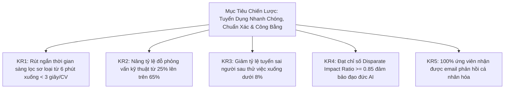

# PRD: TalentScout — Hệ Thống Quản Lý Tuyển Dụng & Sàng Lọc Hồ Sơ Ứng Viên Tự Động (AI ATS)

> **Tài liệu Yêu cầu Sản phẩm & Đặc tả Kỹ thuật Toàn diện (Unified Product Requirements & Technical Specifications)**  
> **Phiên bản**: 2.0 (Merged Master)  
> **Trạng thái**: Approved for Implementation  

---

## 1. Tầm Nhìn & Mục Tiêu Sản Phẩm (Vision & OKRs)

### 1.1. Bối cảnh & Vấn đề (Problem Statement)
Trong quy trình tuyển dụng nhân sự truyền thống, chuyên viên tuyển dụng (Recruiter) và Trưởng bộ phận chuyên môn (Hiring Manager) phải đối mặt với các nút thắt lớn:
- **Quá tải hồ sơ thủ công**: Một vị trí mở tuyển có thể nhận hàng trăm CV, HR mất từ 5 đến 10 phút để đọc lướt từng hồ sơ, dẫn đến kiệt sức và dễ bỏ sót ứng viên tiềm năng.
- **Thiên vị vô thức & Đánh giá thiếu nhất quán**: Việc đánh giá CV phụ thuộc vào cảm tính, mệt mỏi, hoặc các định kiến nhân khẩu học (tuổi tác, giới tính, trường đại học).
- **Trải nghiệm ứng viên kém (Ghosting)**: Hơn 75% ứng viên trượt không nhận được phản hồi hoặc chỉ nhận email mẫu vô cảm, gây ảnh hưởng tiêu cực tới thương hiệu tuyển dụng (Employer Branding).
- **Độ trễ phản hồi tuyển dụng**: Thời gian từ lúc nhận CV đến lúc sơ loại và mời phỏng vấn kéo dài nhiều tuần, làm mất các ứng viên xuất sắc vào tay đối thủ.

### 1.2. Giải pháp (Proposed Solution)
**TalentScout** là nền tảng quản trị tuyển dụng và sàng lọc ứng viên thông minh thế hệ mới, ứng dụng Xử lý Ngôn ngữ Tự nhiên (NLP), So khớp Ngữ nghĩa (Semantic Vector Matching) và Trí tuệ Nhân tạo Minh bạch (Explainable AI - XAI):
- **Tự động hóa bóc tách (Resume Parser)**: Trích xuất thông tin kỹ năng, kinh nghiệm, bằng cấp từ CV (.pdf, .docx) trong thời gian dưới 3 giây.
- **LLM-based Screening & XAI**: Sử dụng Large Language Models (như GPT-4, Claude 3.5, Gemini) với bộ prompt kỹ thuật cao để đối chiếu sâu toàn bộ CV với Bản mô tả công việc (Job Description - JD), chấm điểm tương thích (Match Score), giải trình lý do (Điểm mạnh, Lỗ hổng kỹ năng, Câu hỏi cần phỏng vấn).
- **Quy trình trực quan Kanban**: Quản trị vòng đời ứng viên 5 giai đoạn (`Applied` → `Screened` → `Interview` → `Offer` → `Rejected`).
- **Chế độ Tuyển dụng Ẩn danh (Blind Mode)**: Tự động mã hóa thông tin định danh cá nhân (PII), avatar trung tính nhằm ngăn ngừa hoàn toàn thiên vị vô thức.
- **Tự động sinh email cá nhân hóa (AI Outreach)**: Tạo thư mời phỏng vấn hoặc thư từ chối mang tính xây dựng, phù hợp với năng lực thực tế của từng ứng viên chỉ với 1 cú nhấp chuột.

### 1.3. Mục Tiêu Chiến Lược & Kết Quả Then Chốt (OKRs)



---

## 2. Tiêu Chí Đo Lường Thành Công (Success Metrics & KPIs)

### 2.1. Mục tiêu kinh doanh & vận hành (Business Goals)
- Rút ngắn 70% thời gian sơ loại hồ sơ của HR (từ trung bình 6-8 phút xuống dưới 10 giây/hồ sơ).
- Nâng tỷ lệ ứng viên vượt qua vòng phỏng vấn chuyên môn lên trên 65% nhờ đánh giá đầu vào chính xác.
- Tự động hóa 100% email thông báo và phản hồi cho ứng viên tham gia ứng tuyển.

### 2.2. Chỉ số thành công kỹ thuật (Technical KPIs)
- **Tốc độ bóc tách CV (Parsing Latency)**: $< 3.0$ giây/CV đối với tệp định dạng PDF/DOCX dung lượng $\le 5$MB.
- **Độ chính xác sàng lọc (Screening Accuracy)**: Độ tương thích gợi ý top 10% ứng viên tiềm năng đạt $\ge 85\%$ theo thẩm định của Hiring Manager.
- **Thời gian sinh phân tích XAI & Email**: $< 4.0$ giây cho mỗi hồ sơ phân tích đầy đủ.
- **Chỉ số công bằng không thiên vị (Disparate Impact Ratio - DIR)**: $\ge 0.85$ (Tuân thủ chuẩn Four-Fifths Rule theo EEOC).
- **Độ ổn định hệ thống**: Hệ thống xử lý hàng đợi tải lên nhiều CV đồng thời mà không bị crash hoặc tràn bộ nhớ.

---

## 3. User Stories & Kịch Bản Kiểm Thử BDD (Given - When - Then)

### US-001: Quản lý Vị trí Tuyển dụng và Tiêu chí Đánh giá (Job Posting & Criteria Setup)
**Description:** As a **Recruiter / Hiring Manager**, I want **tạo và quản lý các vị trí tuyển dụng với mô tả công việc (JD) cùng bộ tiêu chí rõ ràng**, so that **hệ thống AI có dữ liệu căn cứ để so khớp ứng viên chính xác**.

**Acceptance Criteria:**
- [ ] Người dùng có thể tạo vị trí tuyển dụng mới với các trường: Vị trí, Phòng ban, Cấp bậc, Mô tả công việc (JD Text), Kỹ năng bắt buộc (Mandatory Skills), Kỹ năng ưu tiên (Preferred Skills), và Số năm kinh nghiệm tối thiểu.
- [ ] Người dùng có thể chỉnh sửa, đóng/mở trạng thái tin tuyển dụng (`Active` / `Closed`).
- [ ] Danh sách các vị trí tuyển dụng hiển thị đầy đủ số lượng ứng viên theo từng trạng thái.
- [ ] Dữ liệu JD được lưu trữ an toàn trong cơ sở dữ liệu và validate đầu vào đầy đủ.
- [ ] Typecheck/lint passes.
- [ ] **[UI stories only]** Verify in browser using dev-browser skill.

**Kịch bản BDD Kiểm thử Chấp nhận:**
```gherkin
Scenario: Cấu hình trọng số tuyển dụng hợp lệ
  Given Tôi đang ở trang tạo tin tuyển dụng
  When  Tôi thiết lập: Kỹ năng = 40%, Kinh nghiệm = 30%, Bằng cấp = 15%, Ngữ nghĩa = 15%
  And   Tôi nhấn nút "Lưu và Kích hoạt"
  Then  Hệ thống xác thực tổng trọng số bằng 100% và lưu trạng thái PUBLISHED
```

---

### US-002: Tải lên và Bóc tách Hồ sơ Ứng viên Hàng loạt (Resume Upload & Parsing)
**Description:** As a **Recruiter**, I want **kéo thả một hoặc nhiều tệp CV (PDF, DOCX) vào vị trí tuyển dụng**, so that **hệ thống tự động trích xuất thông tin ứng viên mà không cần nhập liệu thủ công**.

**Acceptance Criteria:**
- [ ] Hỗ trợ kéo thả hoặc chọn tệp với định dạng `.pdf`, `.docx` dung lượng tối đa 10MB/tệp.
- [ ] Hệ thống bóc tách thành công: Họ tên, Email, Số điện thoại, Kỹ năng, Học vấn, Lịch sử làm việc, Số năm kinh nghiệm tổng quan.
- [ ] Thời gian bóc tách và phản hồi cho 1 tệp CV trung bình $< 3.0$ giây.
- [ ] Hiển thị thông báo lỗi rõ ràng nếu tệp bị hỏng, sai định dạng hoặc không đọc được chữ (scanned image không có text layer).
- [ ] Typecheck/lint passes.
- [ ] **[UI stories only]** Verify in browser using dev-browser skill.

**Kịch bản BDD Kiểm thử Chấp nhận:**
```gherkin
Scenario: Tải lên tệp CV PDF hợp lệ
  Given Vị trí tuyển dụng đang hoạt động
  When  Tôi tải lên tệp "Nguyen_Van_A_Resume.pdf" (1.5MB)
  Then  Hệ thống bóc tách trong vòng dưới 3 giây, hiển thị kỹ năng và tạo đơn ứng tuyển "APPLIED"
```

---

### US-003: Sàng lọc và So khớp Ứng viên bằng LLM (LLM-based Screening & Matching)
**Description:** As a **Hiring Manager**, I want **hệ thống sử dụng LLM phân tích toàn diện CV so với JD**, so that **tôi nhận được điểm tương thích tổng quan (Match Score 0-100%) và phân loại nhãn chuẩn xác**.

**Acceptance Criteria:**
- [ ] LLM nhận context gồm JD tiêu chuẩn và dữ liệu ứng viên đã bóc tách, áp dụng cấu trúc Prompt chặt chẽ để chấm điểm.
- [ ] Điểm số tương thích (Overall Match Score) được chuẩn hóa theo thang điểm 0 - 100%.
- [ ] Hệ thống tự động gán nhãn đề xuất hành động dựa trên ngưỡng điểm:
  - $\ge 80\%$: `STRONG_HIRE` (Ứng viên xuất sắc)
  - $65\% - 79\%$: `INTERVIEW` (Đủ tiêu chuẩn phỏng vấn)
  - $50\% - 64\%$: `CONSIDER` (Cần cân nhắc)
  - $< 50\%$: `NOT_MATCH` (Chưa phù hợp)
- [ ] Hệ thống lưu trữ kết quả phân tích trong CSDL để tránh gọi lại LLM tốn kém khi mở lại xem.
- [ ] Typecheck/lint passes.

**Kịch bản BDD Kiểm thử Chấp nhận:**
```gherkin
Scenario: Chấm điểm ứng viên xuất sắc
  Given Ứng viên có 4.5 năm kinh nghiệm và đầy đủ kỹ năng yêu cầu trong JD
  When  Động cơ AI thực hiện tính toán ma trận so khớp
  Then  Hệ thống chấm điểm Overall Match Score >= 85% và gán nhãn "STRONG_HIRE"
```

---

### US-004: Báo cáo Giải trình Minh bạch AI (Explainable AI - XAI Assessment View)
**Description:** As a **Recruiter / Interviewer**, I want **xem chi tiết báo cáo giải trình lý do chấm điểm của AI**, so that **tôi hiểu rõ điểm mạnh, điểm yếu và có câu hỏi phỏng vấn chuẩn bị sẵn**.

**Acceptance Criteria:**
- [ ] Giao diện hiển thị chi tiết hồ sơ bao gồm:
  - **Điểm mạnh then chốt (Key Strengths)**: Những điểm vượt trội so với JD.
  - **Khoảng trống kỹ năng (Skill Gaps)**: Kỹ năng còn thiếu hoặc kinh nghiệm chưa đạt yêu cầu.
  - **Gợi ý câu hỏi phỏng vấn (Suggested Interview Questions)**: 3-5 câu hỏi chuyên sâu đào sâu vào các điểm chưa rõ trong CV.
- [ ] Hiển thị danh sách kỹ năng đã khớp (Matched Skills) với highlight màu xanh và kỹ năng thiếu (Missing Skills) với highlight màu đỏ/cam.
- [ ] Có nút sao chép nhanh báo cáo hoặc xuất bản tóm tắt sang định dạng PDF/Clipboard.
- [ ] Typecheck/lint passes.
- [ ] **[UI stories only]** Verify in browser using dev-browser skill.

**Kịch bản BDD Kiểm thử Chấp nhận:**
```gherkin
Scenario: Nhận diện khoảng trống kỹ năng
  Given Ứng viên đạt 68% điểm phù hợp cho vị trí Fullstack
  When  Tôi mở cửa sổ chi tiết "AI Assessment Breakdown"
  Then  Mục "Missing Skills" hiển thị màu đỏ các kỹ năng còn thiếu (Docker, AWS)
  And   Mục "Areas to Probe" gợi ý câu hỏi kiểm tra khả năng tự học
```

---

### US-005: Quản lý Quy trình Tuyển dụng bằng Kanban Board (Recruitment Pipeline Management)
**Description:** As a **Recruiter**, I want **kéo thả thẻ ứng viên giữa các giai đoạn tuyển dụng trên giao diện Kanban**, so that **tôi quản lý tiến độ vòng đời của từng ứng viên một cách trực quan**.

**Acceptance Criteria:**
- [ ] Bảng Kanban hiển thị 5 cột giai đoạn chuẩn:
  1. `Applied` (Mới tiếp nhận)
  2. `Screened` (Đã sàng lọc AI)
  3. `Interview` (Mời phỏng vấn)
  4. `Offer` (Đề nghị nhận việc)
  5. `Rejected` (Từ chối)
- [ ] Cho phép kéo thả ứng viên giữa các cột với animation mượt mà; trạng thái được cập nhật tức thì xuống backend.
- [ ] Mỗi thẻ ứng viên trên Kanban hiển thị: Tên (hoặc mã ẩn danh nếu bật Blind mode), Vị trí ứng tuyển, Match Score (với badge màu sắc tương ứng), Nhãn phân loại (`STRONG_HIRE`, `INTERVIEW`, ...).
- [ ] Bộ lọc tương tác nhanh trên đầu bảng: Lọc theo điểm số tối thiểu (slider hoặc dropdown $\ge 80\%$, $\ge 70\%$), lọc theo từ khóa kỹ năng, sắp xếp theo điểm số giảm dần.
- [ ] Typecheck/lint passes.
- [ ] **[UI stories only]** Verify in browser using dev-browser skill.

---

### US-006: Tự động Sinh Email Phản hồi Ứng viên bằng AI (AI Outreach Email Generator)
**Description:** As a **Recruiter**, I want **AI tự động soạn thảo email mời phỏng vấn hoặc email từ chối mang tính xây dựng dựa trên dữ liệu đánh giá thực tế**, so that **tôi tiết kiệm thời gian phản hồi mà vẫn đem lại trải nghiệm chuyên nghiệp, ấm áp cho ứng viên**.

**Acceptance Criteria:**
- [ ] Tại giao diện chi tiết ứng viên hoặc khi chuyển trạng thái (sang `Interview` hoặc `Rejected`), người dùng có thể kích hoạt tính năng "Tạo Email Bằng AI".
- [ ] Đối với thư mời phỏng vấn (`Interview Invitation`):
  - Email tự động đề cập đúng tên ứng viên, vị trí ứng tuyển.
  - Khen ngợi cụ thể 1-2 điểm mạnh nổi bật trích xuất từ CV.
  - Cung cấp đề xuất lịch trình/khung thời gian phỏng vấn rõ ràng.
- [ ] Đối với thư từ chối (`Constructive Rejection`):
  - Văn phong lịch thiệp, tôn trọng, không tạo cảm giác máy móc.
  - Chỉ ra 1-2 gợi ý mang tính xây dựng về kỹ năng ứng viên có thể trau dồi thêm cho các cơ hội tương lai.
- [ ] Cho phép Recruiter xem trước (Preview), chỉnh sửa trực tiếp nội dung trên trình soạn thảo trước khi nhấn nút "Gửi Email" (hoặc sao chép).
- [ ] Typecheck/lint passes.
- [ ] **[UI stories only]** Verify in browser using dev-browser skill.

**Kịch bản BDD Kiểm thử Chấp nhận:**
```gherkin
Scenario: Sinh email mời phỏng vấn tự động
  Given Ứng viên đạt 88% điểm và đang ở vòng "Interview"
  When  Tôi nhấn "Tạo Thư Mời Phỏng Vấn AI"
  Then  Trong vòng 1 giây, hiển thị email hoàn chỉnh khen ngợi đúng thế mạnh và có 3 khung giờ phỏng vấn
```

---

### US-007: Chế độ Tuyển dụng Ẩn danh (Blind Screening Mode)
**Description:** As a **Hiring Manager**, I want **bật chế độ Blind Screening ẩn thông tin cá nhân và nhân khẩu học**, so that **đội ngũ phỏng vấn đánh giá hoàn toàn khách quan dựa trên năng lực**.

**Acceptance Criteria:**
- [ ] Nút gạt chuyển đổi (Toggle switch) "Blind Screening Mode" trên giao diện.
- [ ] Khi kích hoạt:
  - Họ tên được thay thế bằng mã định danh trung tính (ví dụ: `Candidate #TSC-8821`).
  - Ẩn ảnh đại diện (dùng avatar trừu tượng trung tính).
  - Ẩn thông tin liên hệ: Email, Số điện thoại, Địa chỉ cá nhân.
  - Ẩn tên trường đại học, năm tốt nghiệp (chỉ giữ lại bậc học và chuyên ngành).
- [ ] Trạng thái bật/tắt được đồng bộ xuyên suốt từ danh sách Kanban tới màn hình chi tiết ứng viên.
- [ ] Typecheck/lint passes.
- [ ] **[UI stories only]** Verify in browser using dev-browser skill.

**Kịch bản BDD Kiểm thử Chấp nhận:**
```gherkin
Scenario: Bật chế độ Blind Mode
  Given Danh sách ứng viên đang hiển thị tên thật và ảnh đại diện
  When  Tôi gạt công tắc "Blind Screening Mode" sang ON
  Then  Tên đổi thành mã định danh "Candidate #TSC-9481" và ẩn toàn bộ dữ liệu nhân khẩu học
```

---

## 4. Phạm Vi Yêu Cầu Chức Năng (Functional Requirements - FR)

| Mã FR | Tên Chức Năng | Phân Loại (MoSCoW) | Mô Tả Nghiệp Vụ & Quy Tắc |
| :--- | :--- | :---: | :--- |
| **FR-01** | **Quản Lý Vị Trí Tuyển Dụng & Trọng Số** | **Must-Have** | Cho phép tạo, sửa, xóa, kích hoạt JD. Cấu hình trọng số: Kỹ năng chuyên môn ($w_1$), Kinh nghiệm ($w_2$), Học vấn ($w_3$), Ngữ nghĩa ($w_4$) với tổng bắt buộc bằng 100%. |
| **FR-02** | **Bóc Tách Hồ Sơ Thông Minh (Multi-format Ingestion)** | **Must-Have** | Tiếp nhận tệp (.pdf, .docx $\le 10$MB). Tự động bóc tách cấu trúc, làm sạch văn bản, trích xuất thực thể NER (Kỹ năng, Kinh nghiệm, Bằng cấp) trong thời gian $< 3.0$ giây. |
| **FR-03** | **Động Cơ Chấm Điểm So Khớp Ngữ Nghĩa (Matching Core)** | **Must-Have** | Tính chỉ số phù hợp tổng hợp (Overall Match Score 0 - 100%) theo công thức trọng số kết hợp độ tương đồng vector ngữ nghĩa Cosine. Phạt trừ 25% điểm kỹ năng nếu thiếu Mandatory Skills. |
| **FR-04** | **Báo Cáo Minh Bạch Hóa AI (XAI Synthesis)** | **Must-Have** | Trả về cấu trúc JSON nghiêm ngặt: Kỹ năng trùng khớp, Lỗ hổng kỹ năng, Điểm mạnh, Câu hỏi phỏng vấn đào sâu, và nhãn phân loại (`STRONG_HIRE`, `INTERVIEW`, `CONSIDER`, `NOT_MATCH`). |
| **FR-05** | **Quản Trị Quy Trình Tuyển Dụng (Kanban Board)** | **Must-Have** | Giao diện kéo thả tương tác 5 giai đoạn (*Applied* $\rightarrow$ *Screened* $\rightarrow$ *Interview* $\rightarrow$ *Offer* $\rightarrow$ *Rejected*). Cập nhật trạng thái tức thì qua API và lưu Audit Log. |
| **FR-06** | **Chế Độ Tuyển Dụng Ẩn Danh (Blind Screening)** | **Should-Have** | Công tắc 1-chạm che giấu Tên thật, Ảnh, Giới tính, Năm sinh, Trường học; thay bằng mã định danh trung tính (ví dụ: `Candidate #TSC-9481`) ngăn chặn thiên vị vô thức. |
| **FR-07** | **Trình Sinh Email Giao Tiếp AI Tự Động (AI Outreach)** | **Should-Have** | Generative AI tự động soạn thảo thư mời phỏng vấn hoặc thư từ chối mang tính xây dựng cá nhân hóa dựa trên dữ liệu đánh giá thực tế của ứng viên; hỗ trợ chỉnh sửa và gửi qua SMTP. |
| **FR-08** | **Bộ Lọc, Tìm Kiếm & Giám Sát Công Bằng** | **Could-Have** | Lọc theo thanh trượt điểm số, từ khóa kỹ năng, sắp xếp danh sách và biểu đồ giám sát chỉ số phân bổ công bằng Disparate Impact Ratio (DIR). |

---

## 5. Đặc Tả Kỹ Thuật Tính Năng & Thuật Toán (Feature Specifications & Algorithms)

### 5.1. Thuật Toán Chấm Điểm Hợp Thành Đa Tiêu Chuẩn (Composite Scoring)
Điểm số tổng hợp **Overall Match Score ($S_{\text{overall}}$)** nằm trong đoạn $[0, 100]$:

$$S_{\text{overall}} = w_{\text{skill}} \cdot S_{\text{skill}} + w_{\text{exp}} \cdot S_{\text{exp}} + w_{\text{edu}} \cdot S_{\text{edu}} + w_{\text{sem}} \cdot S_{\text{sem}}$$

- **$w_{\text{skill}} = 0.40$ (Kỹ năng chuyên môn)**: So sánh danh sách kỹ năng thực tế với JD:
  $$S_{\text{skill\_raw}} = \frac{|\text{Matched Skills}|}{|\text{Total Required Skills}|} \times 100$$
  - **Quy tắc phạt (Penalty Rule)**: Nếu thiếu bất kỳ kỹ năng nào trong danh sách **Mandatory Skills**, phạt giảm trừ 25%:
    $$S_{\text{skill}} = S_{\text{skill\_raw}} \times 0.75 \quad (\text{nếu } |\text{Missing Mandatory}| > 0)$$
- **$w_{\text{exp}} = 0.30$ (Kinh nghiệm làm việc)**: Tỷ lệ số năm thực tế $Y_{\text{actual}}$ so với yêu cầu $Y_{\text{req}}$:
  $$S_{\text{exp}} = \min\left(1.0, \frac{Y_{\text{actual}}}{Y_{\text{req}}}\right) \times 100$$
- **$w_{\text{edu}} = 0.15$ (Học vấn)**: Thang điểm chuẩn hóa theo bằng cấp:
  - Tiến sĩ (Ph.D): $100$ điểm
  - Thạc sĩ (Master): $95$ điểm
  - Cử nhân / Kỹ sư (Bachelor): $85$ điểm
  - Khóa đào tạo ngắn hạn / Chứng chỉ nghề: $65$ điểm
- **$w_{\text{sem}} = 0.15$ (Độ tương đồng ngữ nghĩa Cosine)**: Khoảng cách góc giữa vector nhúng CV $\vec{v}_{\text{cv}}$ và vector JD $\vec{v}_{\text{jd}}$:
  $$S_{\text{sem}} = \frac{\vec{v}_{\text{cv}} \cdot \vec{v}_{\text{jd}}}{\|\vec{v}_{\text{cv}}\| \|\vec{v}_{\text{jd}}\|} \times 100$$

### 5.2. Ngưỡng Phân Loại Nhãn Tuyển Dụng AI (Verdict Thresholds)
- **$S_{\text{overall}} \ge 80.0\%$ (và không bị phạt thiếu Mandatory)**: `STRONG_HIRE` (Ứng viên xuất sắc, đề xuất phỏng vấn ngay).
- **$65.0\% \le S_{\text{overall}} < 80.0\%$**: `INTERVIEW` (Ứng viên tiềm năng, đủ tiêu chuẩn phỏng vấn).
- **$50.0\% \le S_{\text{overall}} < 65.0\%$**: `CONSIDER` (Ứng viên cần cân nhắc, có thể phỏng vấn vòng bổ sung).
- **$S_{\text{overall}} < 50.0\%$**: `NOT_MATCH` (Chưa phù hợp với yêu cầu vị trí).

---

## 6. Hợp Đồng Giao Tiếp API (API Specifications)

### 6.1. Endpoint Đánh Giá Sàng Lọc Hồ Sơ
- **Route**: `POST /api/v1/screening/evaluate`
- **Request Body**:
```json
{
  "job_id": "job_fullstack_01",
  "candidate_raw_text": "Trần Bảo Nam... 4.5 năm kinh nghiệm Python, FastAPI, React...",
  "weights": {
    "skills": 0.40,
    "experience": 0.30,
    "education": 0.15,
    "semantic": 0.15
  },
  "is_blind_mode": false
}
```
- **Response**:
```json
{
  "overall_score": 92.0,
  "verdict": "STRONG_HIRE",
  "score_breakdown": {
    "skills": 95.0,
    "experience": 100.0,
    "education": 85.0,
    "semantic": 92.0
  },
  "matched_skills": ["Python", "FastAPI", "React", "Docker", "PostgreSQL"],
  "missing_mandatory": [],
  "missing_preferred": ["AWS", "Kubernetes"],
  "strengths": [
    "Đáp ứng 100% mandatory skills và kinh nghiệm 4.5 năm vượt mức yêu cầu 4.0 năm.",
    "Điểm ngữ nghĩa kỹ thuật đạt 92%."
  ],
  "interview_questions": [
    "Bạn đã tối ưu hiệu năng FastAPI khi xử lý concurrency cao như thế nào?",
    "Chia sẻ kinh nghiệm thiết kế caching bằng Redis."
  ]
}
```

### 6.2. Endpoint Tự Động Sinh Email Giao Tiếp
- **Route**: `POST /api/v1/outreach/generate-email`
- **Request Body**:
```json
{
  "application_id": "app_9481",
  "email_type": "INTERVIEW_INVITATION",
  "custom_notes": "Đề xuất phỏng vấn vòng kỹ thuật vào thứ Năm"
}
```
- **Response**:
```json
{
  "recipient": "baonam.tran@email.com",
  "subject": "[TalentScout] Thư mời phỏng vấn vị trí Senior Fullstack Engineer — Trần Bảo Nam",
  "body_markdown": "Chào bạn Trần Bảo Nam,\n\nCảm ơn bạn đã quan tâm đến TalentScout...",
  "status": "DRAFT_READY"
}
```

---

## 7. Non-Goals (Phạm Vi Loại Trừ - Out of Scope)

Để đảm bảo phạm vi phát triển tập trung và chất lượng cho phiên bản MVP này, các tính năng sau đây được **loại trừ (Out of Scope)**:
- **Tự động đồng bộ lịch phỏng vấn hai chiều với Google Calendar / Outlook**: Hệ thống chỉ sinh nội dung gợi ý thời gian phỏng vấn trong email; việc xác nhận lịch họp và gửi link Google Meet/Zoom do Recruiter và ứng viên tự thỏa thuận.
- **Tự động thực hiện video interview hoặc nhận diện nét mặt ứng viên bằng AI**: Không áp dụng AI phân tích cảm xúc hoặc video call tự động để tránh các rủi ro pháp lý và đạo đức AI.
- **Cổng thông tin tự nộp đơn công khai dành riêng cho ứng viên (Public Career Portal)**: Phiên bản hiện tại tập trung cho đội ngũ tuyển dụng nội bộ (Recruiter/Hiring Manager upload CV trực tiếp hoặc qua ingestion API).
- **Tích hợp tính lương, bảo hiểm và Onboarding nhân sự chuyên sâu**: TalentScout dừng lại ở giai đoạn chấp thuận tuyển dụng (`Offer`), không đóng vai trò là phần mềm HRM toàn diện.
- **Hỗ trợ định dạng CV âm thanh/video hoặc CV quét ảnh chất lượng cực thấp không có OCR layer**: Chỉ hỗ trợ các tệp PDF và DOCX chứa text tiêu chuẩn.

---

## 8. Kiến Trúc Kỹ Thuật & Thiết Kế Giao Diện (Architecture & UI Design)

### 8.1. Kiến Trúc Tổng Thể (Full-Stack Architecture)
```
[ Frontend: ATS Studio (HTML5 / Vanilla CSS / Modern JS) ]
      │
      │ REST API / JSON
      ▼
[ Backend: FastAPI Web Service ]
      ├── 1. Ingestion & File Parser (PyMuPDF / python-docx)
      ├── 2. NLP Entity Extraction (Spacy NER + ESCO Taxonomy)
      ├── 3. Hybrid Matcher (Composite Weighted Scoring Engine)
      ├── 4. Prompt Orchestrator & LLM Client (OpenAI / Gemini / Claude)
      ├── 5. PII Masking Engine (Blind Screening Mode)
      ├── 6. Database Layer (SQLite / PostgreSQL with pgvector)
      └── 7. Email Templating & Outreach Service
```

### 8.2. Kỹ Thuật Prompt Engineering Chống Ảo Giác
- Áp dụng kỹ thuật **Few-Shot CoT (Chain-of-Thought)**: Hướng dẫn LLM từng bước:
  1. Liệt kê các kỹ năng bắt buộc trong JD và kiểm tra sự xuất hiện trong CV.
  2. Tính toán tổng số năm kinh nghiệm liên quan trực tiếp đến vị trí tuyển dụng.
  3. Đánh giá chất lượng các dự án hoặc vai trò mà ứng viên đã đảm nhiệm.
  4. Tổng hợp điểm số từ 0 - 100% và đưa ra nhận xét trung thực, không suy đoán ngoài dữ liệu CV.
- Ép kiểu định dạng JSON phản hồi với **Structured Outputs** (JSON Schema Mode) để backend parse trực tiếp vào Pydantic model mà không bao giờ bị lỗi định dạng.

### 8.3. Nguyên Tắc Thiết Kế Giao Diện Người Dùng (UI/UX Principles)
- **Thiết kế Hiện đại & Chuyên nghiệp**: Tông màu tối thanh lịch (Dark Slate / Deep Navy kết hợp điểm nhấn Indigo/Emerald), typography rõ nét (Plus Jakarta Sans / JetBrains Mono).
- **Trực quan hóa Dữ liệu (Data Visualization)**: Thẻ tròn Match Score phân tầng màu sắc, ma trận 4 trọng số điểm thành phần, chip tags màu xanh/đỏ phân biệt rõ ràng.
- **Thao tác 1-chạm (Micro-interactions)**: Kéo thả thẻ Kanban mượt mà, chuyển trạng thái kèm toast notification, công tắc Blind Mode chuyển đổi tức thì không cần tải lại trang.
