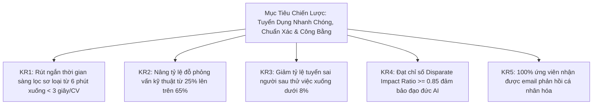

# TalentScout - Tài Liệu Yêu Cầu Sản Phẩm & Đặc Tả Kỹ Thuật (Product Requirements & Specifications)

---

## 1. Tầm Nhìn & Mục Tiêu Sản Phẩm (Vision & OKRs)

### 1.1. Tuyên Bố Tầm Nhìn (Vision Statement)
TalentScout là nền tảng quản trị tuyển dụng và sàng lọc ứng viên thông minh thế hệ mới, ứng dụng Xử lý Ngôn ngữ Tự nhiên (NLP), So khớp Ngữ nghĩa (Semantic Vector Matching) và Trí tuệ Nhân tạo Minh bạch (Explainable AI - XAI). Hệ thống giúp doanh nghiệp rút ngắn 70% thời gian sơ loại hồ sơ, tăng 40% chất lượng ứng viên vào vòng phỏng vấn chuyên môn và loại bỏ hoàn toàn thiên vị vô thức (Unconscious Bias-Free).

### 1.2. Mục Tiêu & Kết Quả Then Chốt (OKRs)



---

## 2. Phạm Vi Yêu Cầu Chức Năng (Functional Requirements - FR)

| Mã FR | Tên Chức Năng | Mức Độ (MoSCoW) | Mô Tả Nghiệp Vụ & Quy Tắc |
| :--- | :--- | :---: | :--- |
| **FR-01** | **Quản Lý Vị Trí Tuyển Dụng & Trọng Số** | **Must-Have** | Cho phép tạo, lưu trữ JD. Cấu hình trọng số: Kỹ năng chuyên môn ($w_1$), Kinh nghiệm ($w_2$), Học vấn ($w_3$), Ngữ nghĩa ($w_4$) với tổng bắt buộc bằng 100%. |
| **FR-02** | **Bóc Tách Hồ Sơ Thông Minh (Resume Parser)** | **Must-Have** | Tiếp nhận file (.pdf, .docx). Tự động nhận diện cấu trúc, trích xuất thực thể NER (Kỹ năng, Kinh nghiệm, Bằng cấp) trong thời gian $< 3.0$ giây. |
| **FR-03** | **Động Cơ Chấm Điểm So Khớp Ngữ Nghĩa** | **Must-Have** | Tính chỉ số phù hợp tổng hợp (Overall Match Score 0 - 100%) và điểm thành phần theo công thức trọng số. Sử dụng Cosine Similarity trên không gian vector nhúng. |
| **FR-04** | **Báo Cáo Minh Bạch Hóa AI (XAI)** | **Must-Have** | Hiển thị bảng phân tích: Kỹ năng trùng khớp, Lỗ hổng kỹ năng (Skill Gap), Điểm mạnh, Điểm cần đào sâu khi phỏng vấn và nhãn đề xuất (`STRONG_HIRE`, `INTERVIEW`, `CONSIDER`, `NOT_MATCH`). |
| **FR-05** | **Quản Trị Quy Trình Tuyển Dụng (Kanban)** | **Must-Have** | Giao diện kéo thả tương tác 5 giai đoạn (*Applied* $\rightarrow$ *Screened* $\rightarrow$ *Interview* $\rightarrow$ *Offer* $\rightarrow$ *Rejected*). Hỗ trợ lọc theo điểm số tối thiểu. |
| **FR-06** | **Chế Độ Tuyển Dụng Ẩn Danh (Blind Mode)** | **Should-Have** | Công tắc 1-chạm che giấu Tên thật, Ảnh, Giới tính, Năm sinh, Trường học; thay bằng mã định danh trung tính (ví dụ: `Candidate #TSC-9481`). |
| **FR-07** | **Trình Sinh Email Giao Tiếp AI Tự Động** | **Should-Have** | Generative AI tự động soạn thảo thư mời phỏng vấn hoặc thư từ chối mang tính xây dựng cá nhân hóa dựa trên dữ liệu đánh giá thực tế của ứng viên. |
| **FR-08** | **Báo Cáo Thống Kê & Giám Sát Công Bằng** | **Could-Have** | Biểu đồ đo lường số lượng CV, thời gian xử lý trung bình và chỉ số phân bổ công bằng Disparate Impact Ratio (DIR). |

---

## 3. User Stories & Kịch Bản Kiểm Thử Chấp Nhận BDD (Given - When - Then)

### Epic 1: Quản Lý Vị Trí & Trọng Số Đánh Giá
- **US-01**: Là một **Recruiter**, tôi muốn **nhập thông tin JD và tùy chỉnh tỷ lệ trọng số**, để **AI chấm điểm bám sát nhu cầu thực tế**.
```gherkin
Scenario: Cấu hình trọng số hợp lệ
  Given Tôi đang ở trang tạo tin tuyển dụng
  When  Tôi thiết lập: Kỹ năng = 40%, Kinh nghiệm = 30%, Bằng cấp = 15%, Ngữ nghĩa = 15%
  And   Tôi nhấn nút "Lưu và Kích hoạt"
  Then  Hệ thống xác thực tổng trọng số bằng 100% và lưu trạng thái PUBLISHED
```

### Epic 2: Bóc Tách CV Thông Minh (Resume Parsing)
- **US-02**: Là một **Recruiter**, tôi muốn **kéo thả tệp CV PDF/DOCX**, để **hệ thống tự động trích xuất kỹ năng và kinh nghiệm**.
```gherkin
Scenario: Tải lên tệp CV PDF hợp lệ
  Given Vị trí tuyển dụng đang hoạt động
  When  Tôi tải lên tệp "Nguyen_Van_A_Resume.pdf" (1.5MB)
  Then  Hệ thống bóc tách trong vòng dưới 3 giây, hiển thị kỹ năng và tạo đơn ứng tuyển "APPLIED"
```

### Epic 3: So Khớp Ngữ Nghĩa & Chấm Điểm AI
- **US-03**: Là một **Hiring Manager**, tôi muốn **xem Overall Match Score từ 0 - 100%**, để **nhanh chóng nhận biết ứng viên tiềm năng**.
```gherkin
Scenario: Chấm điểm ứng viên xuất sắc
  Given Ứng viên có 4.5 năm kinh nghiệm và đầy đủ kỹ năng yêu cầu trong JD
  When  Động cơ AI thực hiện tính toán ma trận so khớp
  Then  Hệ thống chấm điểm Overall Match Score >= 85% và gán nhãn "STRONG_HIRE"
```

### Epic 4: Báo Cáo Giải Trình Minh Bạch (XAI)
- **US-04**: Là một **Recruiter**, tôi muốn **xem danh sách kỹ năng còn thiếu và các điểm cần phỏng vấn**, để **có căn cứ đánh giá vững chắc**.
```gherkin
Scenario: Nhận diện khoảng trống kỹ năng
  Given Ứng viên đạt 68% điểm phù hợp cho vị trí Fullstack
  When  Tôi mở cửa sổ chi tiết "AI Assessment Breakdown"
  Then  Mục "Missing Skills" hiển thị màu đỏ các kỹ năng còn thiếu (Docker, AWS)
  And   Mục "Areas to Probe" gợi ý câu hỏi kiểm tra khả năng tự học
```

### Epic 5: Sàng Lọc Ẩn Danh (Blind Screening Mode)
- **US-05**: Là một **Hiring Manager**, tôi muốn **bật Blind Mode che giấu tên tuổi, ảnh và giới tính**, để **đánh giá thuần túy dựa trên năng lực**.
```gherkin
Scenario: Bật chế độ Blind Mode
  Given Danh sách ứng viên đang hiển thị tên thật và ảnh đại diện
  When  Tôi gạt công tắc "Blind Screening Mode" sang ON
  Then  Tên đổi thành mã định danh "Candidate #TSC-9481" và ẩn toàn bộ dữ liệu nhân khẩu học
```

### Epic 6: Trình Sinh Email AI Cá Nhân Hóa
- **US-06**: Là một **Recruiter**, tôi muốn **nhấn nút để AI tự động soạn thảo email**, để **tiết kiệm thời gian mà vẫn đảm bảo tính chỉn chu**.
```gherkin
Scenario: Sinh email mời phỏng vấn tự động
  Given Ứng viên đạt 88% điểm và đang ở vòng "Interview"
  When  Tôi nhấn "Tạo Thư Mời Phỏng Vấn AI"
  Then  Trong vòng 1 giây, hiển thị email hoàn chỉnh khen ngợi đúng thế mạnh và có 3 khung giờ phỏng vấn
```

---

## 4. Đặc Tả Kỹ Thuật Tính Năng (Feature Specifications)

### 4.1. Thuật Toán Chấm Điểm Hợp Thành Đa Tiêu Chuẩn (Composite Scoring)
Điểm số tổng hợp **Overall Match Score ($S_{\text{overall}}$)** nằm trong đoạn $[0, 100]$:

$$S_{\text{overall}} = w_{\text{skill}} \cdot S_{\text{skill}} + w_{\text{exp}} \cdot S_{\text{exp}} + w_{\text{edu}} \cdot S_{\text{edu}} + w_{\text{sem}} \cdot S_{\text{sem}}$$

- $w_{\text{skill}} = 0.40$ (Kỹ năng chuyên môn): So sánh danh sách kỹ năng thực tế với JD, phạt giảm trừ 25% nếu thiếu Mandatory Skills.
- $w_{\text{exp}} = 0.30$ (Kinh nghiệm): Tỷ lệ số năm thực tế $Y_{\text{actual}}$ so với yêu cầu $Y_{\text{req}}$.
- $w_{\text{edu}} = 0.15$ (Học vấn): Bằng cấp (Tiến sĩ: 100, Thạc sĩ: 95, Cử nhân/Kỹ sư: 85, Khóa ngắn hạn: 65).
- $w_{\text{sem}} = 0.15$ (Độ tương đồng ngữ nghĩa Cosine): Khoảng cách góc giữa vector CV $\vec{v}_{\text{cv}}$ và vector JD $\vec{v}_{\text{jd}}$.

### 4.2. Khung Giải Trình Minh Bạch (Explainable AI - XAI)
- **Matched Skills**: Danh sách kỹ năng trùng khớp.
- **Missing Skills**: Danh sách kỹ năng còn thiếu (Skill Gap).
- **Key Strengths**: 2 - 3 luận điểm chứng minh năng lực vượt trội.
- **Areas to Probe**: Câu hỏi phỏng vấn gợi ý để kiểm chứng các điểm còn thiếu sót.
- **Phân loại AI Verdict**:
  - $\ge 80\% \rightarrow$ `STRONG_HIRE` (Đề xuất phỏng vấn ngay)
  - $65\% - 79\% \rightarrow$ `INTERVIEW` (Tiềm năng, cần sơ vấn)
  - $50\% - 64\% \rightarrow$ `CONSIDER` (Cân nhắc xem xét)
  - $< 50\% \rightarrow$ `NOT_MATCH` (Chưa phù hợp)

---

## 5. Hợp Đồng Giao Tiếp API (API Specifications)

- **Đánh Giá Sàng Lọc**: `POST /api/v1/screening/evaluate`
  - Input: `{ "job_id": "...", "candidate_raw_text": "...", "weights": {...}, "is_blind_mode": false }`
  - Output: `{ "overall_score": 88.0, "breakdown": {...}, "verdict": "STRONG_HIRE", "xai_synthesis": {...} }`
- **Sinh Email Tự Động**: `POST /api/v1/outreach/generate-email`
  - Input: `{ "application_id": "...", "email_type": "INTERVIEW_INVITATION" }`
  - Output: `{ "subject": "...", "body_markdown": "...", "recipient": "..." }`
