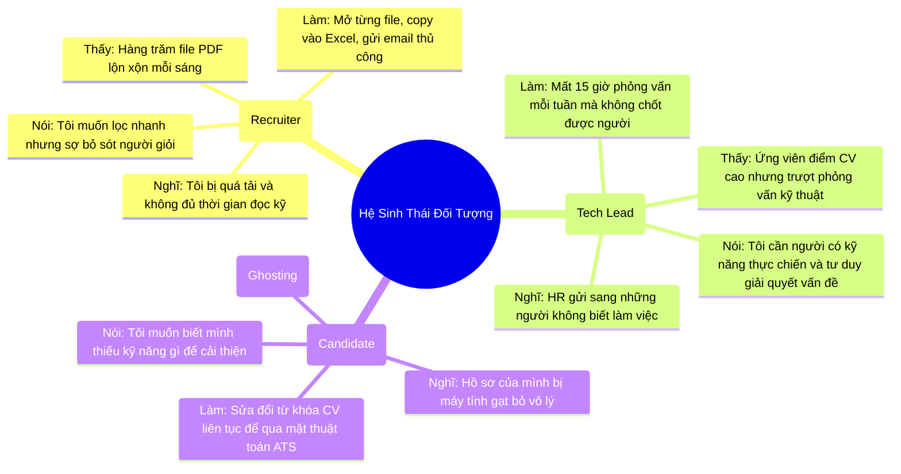
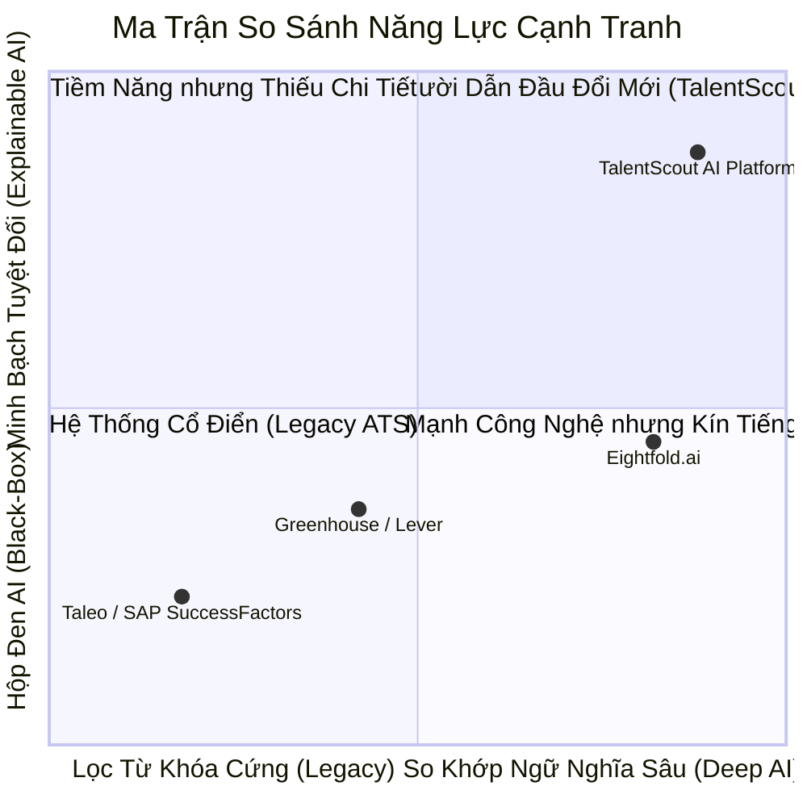
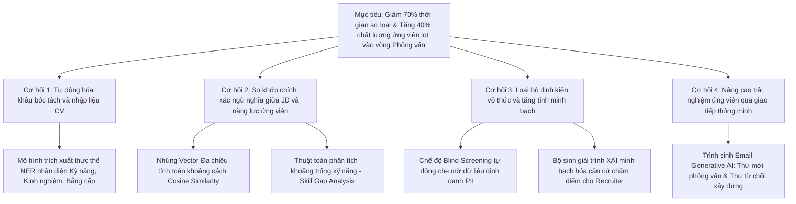

# TalentScout - Nghiên Cứu Thị Trường & Khám Phá Sản Phẩm (Research Notes & Product Discovery)

---

## 1. Bối Cảnh Thị Trường & Thực Trạng Ngành Tuyển Dụng

Trong làn sóng chuyển đổi số và bùng nổ các cổng việc làm trực tuyến (LinkedIn, TopCV, VietnamWorks), thị trường tuyển dụng nhân sự (HR Tech) đang đối mặt với bài toán nan giải: **"Lượng hồ sơ nộp về tăng đột biến nhưng doanh nghiệp vẫn khủng hoảng nhân tài phù hợp"**.

### Số Liệu Thực Tế:
- **Tình trạng CV Spam**: Trung bình mỗi tin đăng vị trí công nghệ nhận được từ **250 đến 450 hồ sơ**, trong đó **hơn 70% ứng viên không thỏa mãn các yêu cầu cơ bản**.
- **Áp lực sàng lọc 6 giây**: Theo nghiên cứu của Ladders Inc., chuyên viên tuyển dụng chỉ dành trung bình **6 đến 7.4 giây** để đọc lướt một bản CV. Việc này dẫn đến tỷ lệ bỏ sót nhân tài rất cao (False Negatives) và tạo kẽ hở cho ứng viên "nhồi nhét từ khóa" (Keyword Stuffing).
- **Chi phí vị trí trống (Cost of Vacancy)**: Doanh nghiệp mất trung bình **42 ngày** để hoàn tất tuyển dụng một vị trí chuyên môn, gây đình trệ tiến độ và thiệt hại kinh tế lớn.
- **Thiên vị vô thức (Unconscious Bias)**: Định kiến về trường đại học, giới tính, tuổi tác, ngoại hình vẫn âm thầm ảnh hưởng đến quyết định sơ tuyển, làm giảm tính đa dạng và công bằng trong tổ chức.

---

## 2. Bản Đồ Chân Dung Người Dùng (Customer Empathy Maps)

---

## 3. Khung Mô Hình Kinh Doanh Tinh Gọn (Lean Canvas)

| **1. Vấn Đề (Problem)** | **4. Giải Pháp (Solution)** | **3. Đề Xuất Giá Trị Độc Nhất (UVP)** | **9. Lợi Thế Bất Công (Unfair Advantage)** | **2. Phân Khúc Khách Hàng (Customer Segments)** |
| :--- | :--- | :--- | :--- | :--- |
| - Quá tải hồ sơ ứng tuyển, 70% không phù hợp. - Sàng lọc thủ công mất nhiều thời gian, dễ sai sót. - ATS truyền thống lọc từ khóa cứng ngắc. - Thiên vị vô thức trong sơ tuyển. | - **AI Resume Parser**: Bóc tách tự động đa định dạng. - **Semantic Matching**: So khớp ngữ nghĩa không gian vector. - **Explainable AI**: Báo cáo lý giải minh bạch. - **Blind Mode**: Sàng lọc ẩn danh PII. | **"Sàng lọc thông minh, tuyển dụng chuẩn xác – Rút ngắn 70% thời gian tuyển chọn nhân tài với độ minh bạch AI tuyệt đối."** | - Động cơ chấm điểm Hybrid kết hợp Tri thức Kỹ năng ESCO và Vector Embeddings. - Báo cáo XAI giải trình rõ ràng mọi tiêu chí đánh giá. | - Doanh nghiệp công nghệ & Startups đang tăng trưởng nhanh. - Các công ty dịch vụ nhân sự và Headhunt. - Tập đoàn lớn có lưu lượng ứng tuyển hàng nghìn CV/tháng. |
| **8. Chỉ Số Then Chốt (Key Metrics)** | **5. Kênh Phân Phối (Channels)** | | | **7. Dòng Doanh Thu (Revenue Streams)** |
| - Thời gian sàng lọc mỗi CV ($< 3.0$s). - Tỷ lệ đỗ phỏng vấn kỹ thuật ($> 65\%$). - Chỉ số công bằng Disparate Impact ($\ge 0.85$). - Doanh thu định kỳ hàng tháng (MRR). | - B2B Inbound Marketing & Hội thảo HR Tech. - Tiếp thị trực tiếp đến các Giám đốc Nhân sự & Tech Leads. - Quan hệ đối tác tích hợp cổng việc làm. | | | - **Gói Starter (SaaS)**: $99/tháng (Tối đa 300 CV). - **Gói Pro**: $299/tháng (1,500 CV, Blind Mode, XAI). - **Gói Enterprise**: Báo giá theo dung lượng & tích hợp tùy biến. |

---

## 4. Phân Tích Đối Thủ Cạnh Tranh (Competitor Benchmarking)

### Bảng So Sánh Chi Tiết:
| Tiêu Chí Đánh Giá | ATS Truyền Thống (Taleo, Workday) | Nền Tảng Hiện Đại (Greenhouse, Lever) | Nền Tảng AI Toàn Cầu (Eightfold.ai) | **TalentScout AI ATS** |
| :--- | :---: | :---: | :---: | :---: |
| **Công Nghệ Sàng Lọc** | Khớp từ khóa chuỗi tĩnh (Exact Match) | Bộ lọc quy tắc (Rules-based Filters) | Machine Learning & Deep Matching | **Hybrid Semantic Matching + ESCO Knowledge Graph** |
| **Tính Minh Bạch AI (XAI)** | ❌ Không có | ❌ Không có | ⚠️ Thấp (Chỉ trả % điểm số hộp đen) | **✅ Rất cao (Phân rã điểm, Skill Gap, Điểm mạnh/yếu)** |
| **Chế Độ Blind Screening** | ❌ Không hỗ trợ | ⚠️ Cấu hình thủ công phức tạp | ⚠️ Có ở gói Enterprise cao cấp | **✅ Tích hợp sẵn 1-chạm (One-Click Blind Mode)** |
| **Tự Động Hóa Email Outreach** | Mẫu email tĩnh (Static Template) | Tự động hóa gửi mẫu cơ bản | Gợi ý đoạn văn | **✅ Generative AI cá nhân hóa theo ngữ cảnh hồ sơ** |

---

## 5. Cây Cơ Hội - Giải Pháp Ứng Dụng AI (Opportunity Solution Tree)

