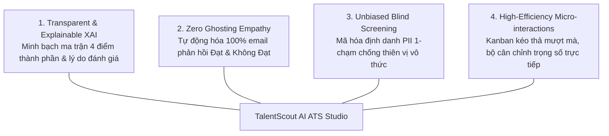
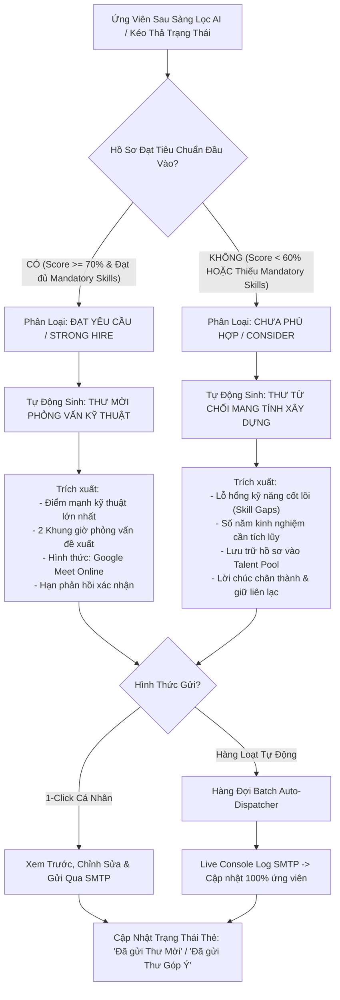

# Đặc Tả Thiết Kế Giao Diện & Trải Nghiệm Người Dùng (UI/UX Specification)
# Hệ Thống Tuyển Dụng & Sàng Lọc Hồ Sơ AI — TalentScout

> **Tài liệu**: UI/UX Design System, Wireframes & Interaction Specifications  
> **Phiên bản**: 2.0 (Pro Master)  
> **Phân hệ**: ATS Studio & Automated Candidate Outreach Engine  
> **Trạng thái**: Approved for Implementation & Evaluation  

---

## 1. Tổng Quan & Triết Lý Thiết Kế (Design Overview & Core Philosophy)

TalentScout là nền tảng quản trị tuyển dụng và sàng lọc ứng viên thông minh thế hệ mới, giải quyết 4 bài toán cốt lõi: quá tải hồ sơ thủ công, thiên vị tuyển dụng vô thức, thiếu minh bạch trong các mô hình AI ("Black-box AI"), và vấn nạn ứng viên bị bỏ rơi không nhận được phản hồi ("Ghosting").

### 1.1. Bốn Trụ Cột Triết Lý Thiết Kế (Core UI/UX Pillars)



1. **Minh bạch hóa Quyết định AI (Explainable AI - XAI)**: Tuyệt đối không đưa ra điểm số đơn thuần mà không có giải trình. Giao diện trực quan hóa ma trận 4 trụ cột đánh giá (Kỹ năng, Kinh nghiệm, Bằng cấp, Ngữ nghĩa), đối chiếu song song Kỹ năng đạt chuẩn vs Kỹ năng còn thiếu.
2. **Giao tiếp Thấu cảm & Không bỏ rơi ứng viên (Zero Ghosting & Candidate Empathy)**: 100% ứng viên dù **Đạt yêu cầu** hay **Chưa phù hợp** đều nhận được thư phản hồi tự động cá nhân hóa. Với ứng viên chưa đạt, AI giải thích rõ lỗ hổng kỹ năng để họ hoàn thiện bản thân, bảo vệ danh tiếng thương hiệu nhà tuyển dụng (Employer Branding).
3. **Tuyển dụng Ẩn danh Công bằng (Blind Screening Mode)**: Công tắc 1-chạm che giấu toàn bộ thông tin định danh cá nhân (PII), chuyển ảnh đại diện thành avatar trung tính dạng hình học, mã hóa mã ứng viên (`#TSC-XXXX`) để ngăn chặn thiên vị theo giới tính, tuổi tác, trường đại học.
4. **Hiệu suất & Thao tác Tinh gọn (High Efficiency & Dynamic Interaction)**: Mọi thao tác cốt lõi (thay đổi vòng tuyển dụng, hiệu chỉnh trọng số AI, gửi email hàng loạt) đều hoàn tất trong tối đa 2 cú click chuột.

---

## 2. Chân Dung Người Dùng & Bản Đồ Thấu Cảm (User Personas)

### Persona 1: Nhà Tuyển Dụng Chuyên Nghiệp (Senior IT Recruiter)
- **Họ tên**: Nguyễn Thùy Linh (29 tuổi, TP.HCM).
- **Mục tiêu**: Sàng lọc 200+ hồ sơ mỗi tuần cho các vị trí kỹ thuật cấp cao; không để sót ứng viên giỏi; duy trì tỷ lệ phản hồi email 100%.
- **Điểm nghẽn (Pain points)**: Kiệt sức vì đọc CV thủ công lặp đi lặp lại; mất thời gian viết từng email từ chối; bị cấp quản lý phàn nàn vì tiến độ chậm.
- **Kỳ vọng giao diện**: Bảng Kanban 5 giai đoạn trực quan, thanh trượt lọc điểm nhanh, nút bấm gửi email tự động hàng loạt chỉ trong 1 cú click.

### Persona 2: Trưởng Nhóm Kỹ Thuật (Engineering Manager / Tech Lead)
- **Họ tên**: Trần Minh Hoàng (35 tuổi, Hà Nội).
- **Mục tiêu**: Nhận hồ sơ ứng viên đã được kiểm chứng chuẩn xác về kỹ thuật; chuẩn bị sẵn câu hỏi phỏng vấn đào sâu năng lực thực tế.
- **Điểm nghẽn**: Đọc các CV "bóng bẩy" nhưng khi phỏng vấn thì kỹ năng thực tế không khớp; tốn thời gian soạn câu hỏi tình huống kỹ thuật.
- **Kỳ vọng giao diện**: Báo cáo XAI phân tích rõ điểm mạnh, cảnh báo phạt điểm nếu thiếu kỹ năng bắt buộc, và danh sách câu hỏi phỏng vấn được AI gợi ý sẵn.

### Persona 3: Ứng Viên Công Nghệ (Candidate)
- **Họ tên**: Lê Hoàng Nam (25 tuổi, Đà Nẵng).
- **Mục tiêu**: Ứng tuyển minh bạch, nhận được phản hồi nhanh chóng và chuyên nghiệp.
- **Điểm nghẽn**: Ứng tuyển nhiều nơi nhưng không có phản hồi ("ghosted"); nếu trượt chỉ nhận email mẫu vô cảm không biết mình còn thiếu kỹ năng gì.
- **Kỳ vọng giao diện**: Nhận được thư mời phỏng vấn có sẵn lịch họp cụ thể, hoặc thư từ chối mang tính xây dựng giải thích rõ các kỹ năng cần trau dồi thêm.

---

## 3. Kiến Trúc Thông Tin & Bản Đồ Điều Hướng (Information Architecture)

```mermaid
graph TD
    Root[TalentScout ATS Studio] --> Header[Top Navigation Bar]
    Root --> Hero[Job Requisition & Live Weight Calibrator]
    Root --> Toolbar[Interactive Controls & Filter Bar]
    Root --> Views[Main Content View Switcher]
    Root --> Modals[Interactive Modals Subsystem]

    Header --> KPI[KPI Stats: Total, Strong Hire, Qualified Rate, Outreach Progress, DIR]
    Header --> QuickAct[Quick Actions: Batch Auto-Email, Blind Mode Toggle, Ingest CV]

    Hero --> WeightsDrawer[Live Weight Calibrator: 4 Sliders - Skills, Exp, Edu, Semantic]
    Hero --> SkillsTags[Mandatory 100% vs Preferred Skills Tags]

    Toolbar --> Search[Search Input by Name / Skills / University]
    Toolbar --> Sliders[Min Score Slider 0-100%]
    Toolbar --> Dropdowns[Verdict Filter, Qualification Filter, Email Status Filter, Sort]

    Views --> KanbanView[View 1: 5-Stage Kanban Board<br/>Applied | Screened | Interview | Offer | Rejected]
    Views --> TableView[View 2: Dense Analytics Data Table<br/>Scores, Breakdown Chips, Statuses, Quick Actions]

    Modals --> ModalXAI[Modal 1: XAI Breakdown Report & Probing Questions]
    Modals --> ModalEmail[Modal 2: Single AI Outreach Studio - Invite vs Reject]
    Modals --> ModalBatch[Modal 3: Batch Auto-Email Dispatcher Engine]
    Modals --> ModalUpload[Modal 4: Resume Ingestion & 4-Step OCR/NER Parser]
```

---

## 4. Hệ Thống Thiết Kế (Design System & Design Tokens)

### 4.1. Bảng Màu Thương Hiệu & Trạng Thái (Color Tokens)

Hệ thống sử dụng phong cách **Dark Glassmorphism** hiện đại kết hợp điểm nhấn màu Neon/Pastel để tạo chiều sâu thị giác và giảm mỏi mắt cho người dùng làm việc cường độ cao:

| Tên Token | Mã Hex / HSL | Ý Nghĩa Ứng Dụng |
| :--- | :--- | :--- |
| `--bg-primary` | `#070B14` (Deep Charcoal Blue) | Màu nền tổng thể trang web |
| `--bg-card` | `rgba(19, 27, 46, 0.75)` | Thẻ kính mờ Kanban, Card thông tin |
| `--border-subtle` | `rgba(255, 255, 255, 0.08)` | Viền ngăn cách tinh tế, chuẩn Glassmorphism |
| `--primary` | `#6366F1` (Neon Indigo) | Nút hành động chính, viền tiêu điểm, thanh tiến trình |
| `--secondary` | `#06B6D4` (Cyan Glow) | Điểm nhấn công nghệ, nhãn AI, thông báo hệ thống |
| `--emerald` | `#10B981` (Vibrant Mint) | Điểm Match Score cao ($\ge 85\%$), Đạt chuẩn, Thư mời phỏng vấn |
| `--amber` | `#F59E0B` (Warm Amber) | Nút Tự động phản hồi mail, Cân nhắc, Thư góp ý xây dựng |
| `--rose` | `#F43F5E` (Coral Rose) | Không đạt, kỹ năng thiếu bắt buộc, từ chối hồ sơ |

### 4.2. Hệ Thống Kiểu Chữ (Typography Scale)

- **Font chữ giao diện chính**: `Plus Jakarta Sans`, `-apple-system`, `sans-serif` (đem lại cảm giác hiện đại, dễ đọc ở kích thước nhỏ).
- **Font chữ dữ liệu & mã hóa số**: `JetBrains Mono`, `monospace` (dành cho phần trăm điểm Match Score, số năm kinh nghiệm, mã ứng viên ẩn danh `#TSC-XXXX`, log bảng điều khiển).

| Cấp Bậc | Kích Thước | Trọng Số (Weight) | Áp Dụng |
| :--- | :--- | :--- | :--- |
| **Heading 1** | `1.5rem (24px)` | Bold (700) | Tên vị trí tuyển dụng (Job Title Hero) |
| **Heading 2 / 3** | `1.125rem (18px)` | SemiBold (600) | Tiêu đề Modal, Tên cột Kanban, Tên nhóm hồ sơ |
| **Body Standard** | `0.875rem (14px)` | Regular (400) | Nội dung email, mô tả hồ sơ ứng viên |
| **Caption / Meta** | `0.75rem (12px)` | Medium (500) | Nhãn kỹ năng (Skill Chips), Ngày nộp, Kinh nghiệm |
| **Score Number** | `1.125rem (18px)` | ExtraBold (800) | Số điểm tròn Match Score trên thẻ ứng viên |

### 4.3. Quy Chuẩn Không Gian & Bo Góc (Spacing & Elevation)
- **Base Grid**: Hệ số 8pt (`0.25rem = 4px`, `0.5rem = 8px`, `1rem = 16px`, `1.5rem = 24px`, `2rem = 32px`).
- **Border Radius**:
  - `6px` - 8px: Skill chips, meta pills, input fields.
  - `12px` - 14px: Thẻ ứng viên Kanban (Candidate Cards), thanh điều khiển tiêu chí.
  - `16px` - 20px: Bảng dữ liệu lớn, Hộp thoại Modal, Dropzone nạp CV.
- **Glass Shadows**: `0 8px 32px 0 rgba(0, 0, 0, 0.37)` kết hợp `backdrop-filter: blur(16px)`.

---

## 5. Đặc Tả Luồng Tự Động Phản Hồi Email (Auto-Email Response Engine)

Tính năng cốt lõi đáp ứng yêu cầu tuyển dụng thấu cảm: Hệ thống tự động phân loại ứng viên theo chuẩn đầu vào và soạn thảo/gửi email theo 2 nhánh kịch bản:

### 5.1. Sơ Đồ Khối Quyết Định Phản Hồi (Decision Matrix)



### 5.2. Mẫu Email Kịch Bản 1: Ứng Viên ĐẠT YÊU CẦU (Pass / Technical Interview Invitation)

- **Tiêu đề**: `[TalentScout] Thư Mời Phỏng Vấn Vị Trí Senior Fullstack Engineer — {candidate_name}`
- **Nội dung mẫu sinh tự động**:
```text
Chào bạn {candidate_name},

Cảm ơn bạn đã quan tâm và nộp hồ sơ ứng tuyển vị trí Senior Fullstack Engineer (Python + React) tại TalentScout.

Hội đồng chuyên môn và hệ thống phân tích AI của chúng tôi đã xem xét rất kỹ hồ sơ của bạn và ghi nhận thế mạnh vượt trội: "{top_strength}". Với điểm số tương thích đạt {overall_score}%, hồ sơ của bạn hoàn toàn ĐẠT TIÊU CHUẨN đầu vào cho vị trí này.

Chúng tôi trân trọng kính mời bạn tham dự buổi Phỏng Vấn Chuyên Sâu (Technical Round):
  • Thời gian đề xuất 1: 09:30 - 10:30 Thứ Năm, ngày 18/09/2026
  • Thời gian đề xuất 2: 14:00 - 15:00 Thứ Sáu, ngày 19/09/2026
  • Hình thức: Trực tuyến qua Google Meet (Link sẽ được gửi sau khi bạn xác nhận)
  • Người phỏng vấn: Tech Lead & Trưởng bộ phận Core Engineering

Bạn vui lòng phản hồi email này để xác nhận khung giờ thuận tiện nhất nhé.

Trân trọng,
Đội ngũ Tuyển dụng TalentScout
```

### 5.3. Mẫu Email Kịch Bản 2: Ứng Viên CHƯA PHÙ HỢP (Constructive Feedback Rejection)

- **Tiêu đề**: `[TalentScout] Cập Nhật Kết Quả Tuyển Dụng Vị Trí Senior Fullstack Engineer — {candidate_name}`
- **Nội dung mẫu sinh tự động**:
```text
Chào bạn {candidate_name},

Lời đầu tiên, TalentScout xin chân thành cảm ơn sự quan tâm và thời gian bạn đã dành để ứng tuyển cho vị trí Senior Fullstack Engineer (Python + React).

Sau quá trình đối chiếu kỹ lưỡng với bộ tiêu chí của vị trí Senior hiện tại, chúng tôi rất tiếc phải thông báo hiện tại hồ sơ của bạn chưa phù hợp nhất với đợt tuyển dụng này. Hệ thống AI ghi nhận định hướng để bạn có thể tiếp tục trau dồi nâng cao năng lực: "{top_skill_gap}".

Hồ sơ của bạn đã được trân trọng lưu trữ trong Cơ sở Dữ liệu Tài Năng (Talent Pool) của TalentScout. Khi có các dự án mới hoặc vị trí khác phù hợp hơn với thế mạnh của bạn, bộ phận nhân sự sẽ chủ động kết nối lại.

Chúc bạn luôn giữ vững ngọn lửa đam mê và gặt hái thật nhiều thành công trong sự nghiệp!

Trân trọng,
Đội ngũ Tuyển dụng TalentScout
```

---

## 6. Bản Vẽ Bố Cục Giao Diện (ASCII Wireframes)

### 6.1. Bố Cục Thanh Điều Hướng & KPI Header (Executive Navbar)

```
+---------------------------------------------------------------------------------------------------------+
| [TS] TalentScout [AI ATS]  |  (o) Hồ sơ: 6  | Strong Hire: 3  | Đạt chuẩn: 67% | Email: 3/6 | DIR: 0.92  |
|                            |  [ [K] Kanban | [=] Bảng ]  [⚡ Tự Động Phản Hồi Mail]  [O- Blind]  [+ Nạp CV] |
+---------------------------------------------------------------------------------------------------------+
```

### 6.2. Hero Banner & Bảng Cân Chỉnh Trọng Số AI Thời Gian Thực (Live Calibrator)

```
+---------------------------------------------------------------------------------------------------------+
| [Senior Level] [Core Product Engineering] [$2,500 - $3,500] [TP.HCM Hybrid] [🟢 Đang mở tuyển]          |
| Senior Fullstack Engineer (Python + React)                         [⚙️ Bộ Tiêu Chí & Tùy Chỉnh Trọng Số] |
+---------------------------------------------------------------------------------------------------------+
| (KHI MỞ DRAWER TIÊU CHÍ):                                                                              |
| Kỹ năng bắt buộc (100%): [Python] [FastAPI] [React] [Docker] | Ưu tiên: [PostgreSQL] [Redis] [AWS]...  |
| Tổng trọng số: [ 100% (Hợp lệ) ]                                                                        |
| +---------------------+ +---------------------+ +---------------------+ +---------------------+        |
| | Kỹ năng (Skills):40%| | Kinh nghiệm (Exp):30%| | Bằng cấp (Edu): 15% | | Ngữ nghĩa (Sem): 15%|        |
| | [====o============] | | [======o==========] | | [==o==============] | | [==o==============] |        |
| +---------------------+ +---------------------+ +---------------------+ +---------------------+        |
| 💡 Kéo thanh trượt để thử nghiệm kịch bản.          [Khôi phục mặc định] [⚡ Áp Dụng & Tái Tính Điểm AI]  |
+---------------------------------------------------------------------------------------------------------+
```

### 6.3. Bảng Kanban 5 Giai Đoạn (5-Stage Kanban Board)

```
+---------------------------------------------------------------------------------------------------------+
| 🔍 [Tìm theo tên, kỹ năng...] [Điểm >=: 0% [===o]] [Tất cả phân loại v] [Tất cả chuẩn v] [Lọc email v]  |
+---------------------------------------------------------------------------------------------------------+
| 1. Mới Ứng Tuyển (1) | 2. Đã Sàng Lọc (2)  | 3. Phỏng Vấn (1)    | 4. Đề Nghị Việc (1) | 5. Từ Chối (1) |
|----------------------+---------------------+---------------------+---------------------+----------------|
| +------------------+ | +-----------------+ | +-----------------+ | +-----------------+ | +------------+ |
| | (Avt) N.T. Mai   | | | (Avt) T.B. Nam  | | | (Avt) L.H. Long | | | (Avt) P.T. Vy   | | | (Avt) V.Q.Anh| |
| | 3.2 năm | Cử nhân| | | 4.5 năm | Cử nhân| | | 5.0 năm | ThS   | | | 4.0 năm | Kỹ sư | | | 1.5 năm    | |
| | [ 58% ] MATCH    | | | [ 92% ] MATCH   | | | [ 88% ] MATCH   | | | [ 86% ] MATCH   | | | [ 42% ]    | |
| | [CONSIDER]       | | | [STRONG HIRE]   | | | [STRONG HIRE]   | | | [STRONG HIRE]   | | | [NOT MATCH]| |
| | [🔴 CHƯA PHÙ HỢP]| | | [🟢 ĐẠT YÊU CẦU]| | | [🟢 ĐẠT YÊU CẦU]| | | [🟢 ĐẠT YÊU CẦU]| | | [🔴 CHƯA]   | |
| | [⏳ Chưa gửi mail]| | | [⏳ Chưa gửi]   | | | [📨 Đã gửi mời] | | | [📨 Đã gửi mời] | | | [🤝 Đã từ chối| |
| | [React][TS][Node]| | | [Python][FastAPI]| | | [Python][Docker]| | | [React][FastAPI]| | | [Python][JS]| |
| | [Chi Tiết XAI]   | | | [Chi Tiết XAI]  | | | [Chi Tiết XAI]  | | | [Chi Tiết XAI]  | | | [XAI] [Mail| |
| | [Phản Hồi Mail]  | | | [Phản Hồi Mail] | | | [Phản Hồi Mail] | | | [Phản Hồi Mail] | | +------------+ |
| +------------------+ | +-----------------+ | +-----------------+ | +-----------------+ |                |
+---------------------------------------------------------------------------------------------------------+
```

### 6.4. Hộp Thoại Tự Động Phản Hồi Mail Toàn Bộ (Batch Auto-Email Dispatcher)

```
+---------------------------------------------------------------------------------------------------------+
| ⚡ Hệ Thống Tự Động Phản Hồi Mail Ứng Viên (Batch Auto-Email Engine)                               [X]  |
+---------------------------------------------------------------------------------------------------------+
| Hệ thống AI tự động phân loại ứng viên theo chuẩn đầu vào:                                             |
|                                                                                                         |
|  🟢 NHÓM 1: ĐẠT YÊU CẦU (4)                      🔴 NHÓM 2: CHƯA PHÙ HỢP (2)                           |
|  Hành động: [Gửi Thư Mời Phỏng Vấn]              Hành động: [Gửi Thư Từ Chối Góp Ý Xây Dựng]            |
|  +---------------------------------------------+ +---------------------------------------------+        |
|  | Trần Bảo Nam (92%)       [✓ Đã gửi thư mời] | | Nguyễn Thị Mai (58%)   [⏳ Chờ gửi thư góp ý] |        |
|  | Lê Hoàng Long (88%)      [✓ Đã gửi thư mời] | | Vũ Quốc Anh (42%)      [✓ Đã gửi thư góp ý] |        |
|  | Phạm Thảo Vy (86%)       [✓ Đã gửi thư mời] | +---------------------------------------------+        |
|  | Đỗ Gia Hưng (79%)        [⏳ Chờ gửi thư mời]                                                        |
|  +---------------------------------------------+                                                        |
|                                                                                                         |
|  TIẾN ĐỘ GỬI SMTP THỜI GIAN THỰC:                                                                       |
|  Đang xử lý: 6/6 hồ sơ... [====================================================================] 100%   |
|  +----------------------------------------------------------------------------------------------------+ |
|  | [14:26:01] Gửi Thư Mời Phỏng Vấn -> Trần Bảo Nam (baonam.tran@email.com) [THÀNH CÔNG]             | |
|  | [14:26:02] Gửi Thư Từ Chối Xây Dựng (Thiếu Python, Docker) -> Nguyễn Thị Mai [THÀNH CÔNG]         | |
|  | [14:26:03] Hoàn thành 100% email phản hồi không bỏ rơi ứng viên nào!                              | |
|  +----------------------------------------------------------------------------------------------------+ |
|                                                                                                         |
|  Sẵn sàng gửi: 4 Thư Mời Phỏng Vấn, 2 Thư Từ Chối Xây Dựng.                [Đóng] [🚀 Kích Hoạt Gửi Hàng Loạt] |
+---------------------------------------------------------------------------------------------------------+
```

---

## 7. Tiêu Chuẩn Khả Năng Tiếp Cận & Đạo Đức AI (Accessibility & AI Ethics)

1. **Tuân thủ WCAG 2.1 AA**:
   - Tỷ lệ tương phản màu sắc văn bản (Contrast Ratio) đạt tối thiểu $4.5:1$ đối với văn bản thông thường và $3:1$ đối với các thành phần đồ họa lớn.
   - Hỗ trợ đầy đủ phím tắt bàn phím: phím `Tab` để di chuyển giữa các thẻ và nút hành động, phím `Esc` để đóng tức thì bất kỳ modal nào.
   - Thẻ ngữ nghĩa HTML5 (`<header>`, `<main>`, `<section>`, `<table>`, `<button>`).
2. **Tuân thủ Quy tắc 4/5 Đạo đức AI (Four-Fifths Rule & DIR)**:
   - Hệ thống hiển thị chỉ số **Disparate Impact Ratio (DIR $\ge 0.85$)** trực tiếp trên thanh điều hướng trung tâm.
   - Khi bật chế độ **Blind Screening**, thuật toán loại bỏ hoàn toàn các trường dữ liệu nhạy cảm (Tên, Ảnh chân dung, Giới tính, Tuổi tác, Trường đại học), chỉ truyền tải danh mục kỹ năng và số năm kinh nghiệm vào mô hình đánh giá.

---

## 8. Kế Hoạch Đánh Giá & Kiểm Thử Người Dùng (Usability Testing)

| Kịch Bản Kiểm Thử (BDD Scenario) | Thao Tác Của Người Dùng | Kết Quả Mong Đợi |
| :--- | :--- | :--- |
| **TC-01: Kéo thả ứng viên & Kích hoạt Email** | Kéo thẻ ứng viên từ cột `Đã Sàng Lọc` sang cột `Mời Phỏng Vấn` | Thẻ cập nhật vị trí, toast thông báo thành công hiển thị, hệ thống tự động mở bản nháp Thư Mời Phỏng Vấn cá nhân hóa |
| **TC-02: Phản hồi Email hàng loạt** | Nhấn nút `⚡ Tự Động Phản Hồi Mail` và bấm `Kích Hoạt Gửi Tự Động` | Ứng viên đạt yêu cầu nhận thư mời, ứng viên không đạt nhận thư từ chối có nêu lỗ hổng kỹ năng, trạng thái thẻ Kanban chuyển sang `Đã gửi` |
| **TC-03: Tùy chỉnh trọng số AI trực tiếp** | Kéo thanh trượt `Kỹ năng` lên 50% và nhấn `Áp Dụng & Tái Tính Điểm AI` | Điểm Match Score của tất cả ứng viên được tính toán lại ngay lập tức, phân loại tự động điều chỉnh theo bộ trọng số mới |
| **TC-04: Kích hoạt Blind Mode** | Gạt công tắc `Blind Mode` trên thanh điều hướng | Danh tính và avatar chuyển sang mã ẩn danh `#TSC-XXXX`, thông tin cá nhân được che giấu tức thời |
