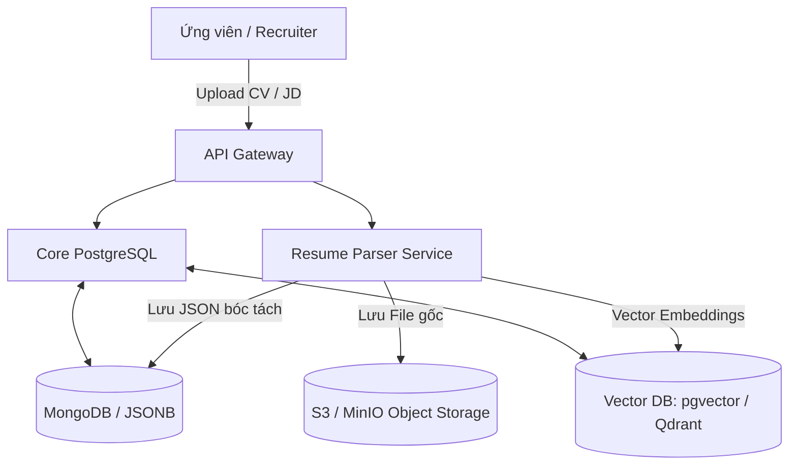
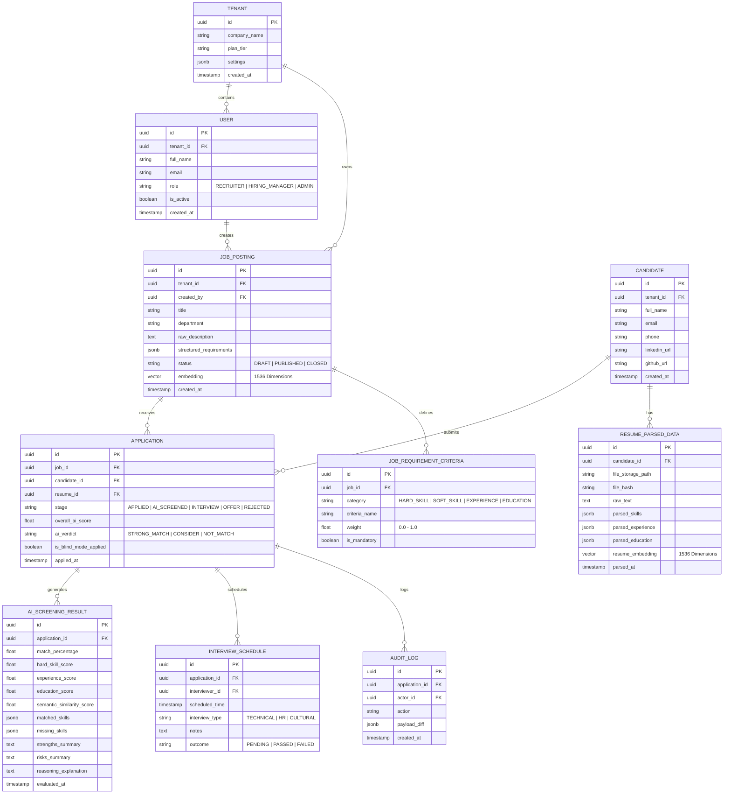

# TalentScout - Database Schema & Data Architecture
**Hệ thống Quản lý Tuyển dụng & Sàng lọc Hồ sơ Ứng viên Tự động bằng AI**

---

## 1. Tổng quan Kiến trúc Dữ liệu

TalentScout kết hợp mô hình lưu trữ đa hình (**Polyglot Persistence**) nhằm phục vụ tối ưu các loại dữ liệu khác nhau:
1. **Relational Database (PostgreSQL)**: Quản lý dữ liệu giao dịch cốt lõi (Core ATS), bao gồm người dùng, công ty, tin tuyển dụng (Job Postings), quy trình phỏng vấn và trạng thái ứng tuyển.
2. **Document / Unstructured Store (MongoDB / PostgreSQL JSONB)**: Lưu trữ nội dung hồ sơ bóc tách chi tiết (Parsed Resume JSON), cấu trúc học vấn, kinh nghiệm và lịch sử hoạt động.
3. **Vector Database (Qdrant / Milvus / pgvector)**: Lưu trữ các vector embedding (kích thước 1536 hoặc 768 chiều từ OpenAI Text-Embedding-3 hoặc BGE-M3) của JD và CV phục vụ Semantic Search & Hybrid Matching.
4. **Object Storage (AWS S3 / MinIO)**: Lưu trữ tệp tin gốc (.pdf, .docx) của ứng viên kèm chữ ký số và bảo mật.



---

## 2. Sơ đồ Thực thể Quan hệ (Entity Relationship Diagram - ERD)



---

## 3. Đặc tả Chi tiết các Bảng CSDL (Data Dictionary)

### 3.1. Bảng `JOB_POSTING` (Tin Tuyển Dụng)
Lưu thông tin vị trí tuyển dụng và vector nhúng để so khớp ngữ nghĩa.

| Tên Cột | Kiểu Dữ Liệu | Khóa | Cho Phép Rỗng | Diễn Giải & Quy Tắc |
| :--- | :--- | :---: | :---: | :--- |
| `id` | `UUID` | PK | ❌ | Mã định danh duy nhất (UUIDv4) |
| `tenant_id` | `UUID` | FK | ❌ | Liên kết đến tổ chức tuyển dụng (`TENANT.id`) |
| `title` | `VARCHAR(255)` | | ❌ | Tên chức danh (ví dụ: Senior AI Engineer) |
| `department` | `VARCHAR(100)` | | ❌ | Phòng ban (ví dụ: Engineering, Product) |
| `min_experience_years` | `SMALLINT` | | ❌ | Số năm kinh nghiệm tối thiểu (ví dụ: 3) |
| `raw_description` | `TEXT` | | ❌ | Văn bản JD gốc bằng Markdown hoặc plain text |
| `structured_requirements` | `JSONB` | | ❌ | JSON cấu trúc bóc tách: skills, certs, degrees |
| `embedding` | `VECTOR(1536)` | | ❌ | Vector biểu diễn ngữ nghĩa của toàn bộ JD |
| `status` | `VARCHAR(20)` | | ❌ | `DRAFT`, `PUBLISHED`, `ARCHIVED`, `CLOSED` |
| `created_at` | `TIMESTAMPTZ` | | ❌ | Thời gian tạo bản ghi |

---

### 3.2. Bảng `RESUME_PARSED_DATA` (Hồ Sơ Ứng Viên Đã Phân Tích)
Lưu trữ toàn bộ dữ liệu bóc tách được bằng AI từ CV (PDF/Docx) của ứng viên.

| Tên Cột | Kiểu Dữ Liệu | Khóa | Cho Phép Rỗng | Diễn Giải & Quy Tắc |
| :--- | :--- | :---: | :---: | :--- |
| `id` | `UUID` | PK | ❌ | Mã định danh hồ sơ bóc tách |
| `candidate_id` | `UUID` | FK | ❌ | Liên kết bảng `CANDIDATE.id` |
| `file_storage_path` | `VARCHAR(500)` | | ❌ | Đường dẫn S3 tệp CV gốc |
| `file_hash` | `VARCHAR(64)` | | ❌ | SHA-256 hash chống tải trùng lặp |
| `raw_text` | `TEXT` | | ❌ | Toàn bộ văn bản thô trích xuất từ OCR/PDF Parser |
| `parsed_skills` | `JSONB` | | ❌ | Danh sách kỹ năng: `[{name: "Python", years: 4, level: "expert"}]` |
| `parsed_experience` | `JSONB` | | ❌ | Lịch sử công tác: công ty, chức danh, thời gian, mô tả |
| `parsed_education` | `JSONB` | | ❌ | Bằng cấp: trường, chuyên ngành, xếp loại, năm TN |
| `resume_embedding` | `VECTOR(1536)` | | ❌ | Vector nhúng ngữ nghĩa của CV |
| `anonymized_view` | `JSONB` | | ❌ | Dữ liệu ẩn danh (loại bỏ PII: Tên, Tuổi, Giới tính, Ảnh) |
| `parsed_at` | `TIMESTAMPTZ` | | ❌ | Thời gian AI hoàn tất phân tích |

---

### 3.3. Bảng `AI_SCREENING_RESULT` (Kết Quả Đánh Giá & Sàng Lọc AI)
Lưu trữ kết quả chấm điểm đa tiêu chuẩn, phân tích khoảng trống kỹ năng (Skill Gap), và giải trình Explainable AI.

| Tên Cột | Kiểu Dữ Liệu | Khóa | Cho Phép Rỗng | Diễn Giải & Quy Tắc |
| :--- | :--- | :---: | :---: | :--- |
| `id` | `UUID` | PK | ❌ | Mã định danh kết quả thẩm định |
| `application_id` | `UUID` | FK | ❌ | Liên kết bảng `APPLICATION.id` |
| `overall_match_score` | `NUMERIC(5,2)` | | ❌ | Điểm tổng hợp từ 0.00 đến 100.00% |
| `hard_skill_score` | `NUMERIC(5,2)` | | ❌ | Điểm tương thích kỹ năng chuyên môn |
| `experience_score` | `NUMERIC(5,2)` | | ❌ | Điểm tương thích độ dày kinh nghiệm |
| `education_score` | `NUMERIC(5,2)` | | ❌ | Điểm tương thích trình độ học vấn/chứng chỉ |
| `semantic_score` | `NUMERIC(5,2)` | | ❌ | Điểm tương đồng ngữ nghĩa Vector Cosine |
| `matched_skills` | `JSONB` | | ❌ | Mảng các kỹ năng thỏa mãn yêu cầu JD |
| `missing_skills` | `JSONB` | | ❌ | Mảng các kỹ năng bắt buộc còn thiếu |
| `strengths_summary` | `TEXT` | | ❌ | Tóm tắt các điểm vượt trội của ứng viên |
| `risks_summary` | `TEXT` | | ❌ | Các cảnh báo rủi ro (nhảy việc, thiếu kỹ năng cốt lõi) |
| `reasoning_explanation`| `TEXT` | | ❌ | Diễn giải minh bạch (XAI) vì sao chấm mức điểm này |
| `ai_recommendation` | `VARCHAR(30)` | | ❌ | `STRONG_HIRE`, `SHORTLIST`, `CONSIDER`, `REJECT` |
| `evaluated_at` | `TIMESTAMPTZ` | | ❌ | Thời gian xử lý |

---

## 4. Thiết Kế NoSQL & Vector Embedding Schema (Qdrant / pgvector)

### 4.1. Payload Schema trong Vector Collection `candidate_embeddings`
```json
{
  "id": "c9a6f140-5e28-4bb9-952b-426b610c3b88",
  "vector": [0.0124, -0.0431, 0.0829, "... (1536 floats)"],
  "payload": {
    "tenant_id": "d3b07384-d113-4663-bb0e-1100f9a2e3a1",
    "candidate_id": "7bf3b934-4b55-4309-8809-77f6b92a5432",
    "years_of_experience": 5.5,
    "primary_role": "Backend Engineer",
    "top_skills": ["Go", "Kubernetes", "PostgreSQL", "Kafka", "gRPC"],
    "education_level": "Bachelor",
    "is_anonymized": true,
    "last_updated": "2026-09-08T03:00:00Z"
  }
}
```

### 4.2. Vector Indexing Strategy
- **Index Type**: HNSW (Hierarchical Navigable Small World).
- **Distance Metric**: Cosine Similarity.
- **Parameters**:
  - `m = 16` (Số lượng kết nối 2 chiều trên mỗi phần tử).
  - `ef_construction = 200` (Kích thước danh sách động khi xây dựng cây).
  - `ef_search = 100` (Cân bằng giữa tốc độ truy vấn < 15ms và độ chuẩn xác Recall > 98%).

---

## 5. Chính Sách Bảo Mật, Ẩn Danh (Blind Screening) & Tuân Thủ GDPR

> [!IMPORTANT]
> **Quy định Bảo vệ Quyền riêng tư (Data Privacy & Bias Mitigation):**
> 1. **PII Masking**: Khi chế độ Blind Screening được kích hoạt, hệ thống sẽ lọc bỏ các trường `full_name`, `email`, `phone`, `avatar`, `gender`, `date_of_birth` từ bảng `CANDIDATE` trước khi gửi dữ liệu sang giao diện Review của Hiring Manager.
> 2. **Right to be Forgotten (GDPR Article 17)**: Ứng viên có quyền yêu cầu xóa toàn bộ dữ liệu. Thao tác xóa sẽ tự động cascade: Xóa CV file trên S3, xóa vector embedding trên Vector DB, xóa bản ghi trong Postgres.
> 3. **Immutability of Audit Logs**: Bảng `AUDIT_LOG` được thiết lập quyền chỉ ghi (Append-Only) để theo dõi mọi quyết định can thiệp thủ công từ Recruiter đối với điểm số do AI đề xuất.
