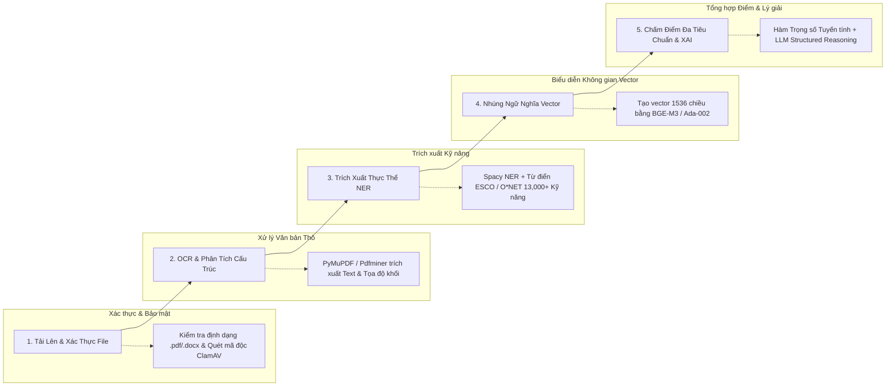

# TalentScout - System Architecture & Technical Specifications
**Kiến Trúc Tổng Thể Hệ Thống, Hạ Tầng AI Pipeline & Microservices**

---

## 1. Tổng Quan Kiến Trúc Đa Tầng (High-Level Multi-Tier Architecture)

TalentScout được thiết kế theo kiến trúc Microservices hướng sự kiện (Event-Driven Microservices Architecture) đảm bảo khả năng mở rộng quy mô linh hoạt, độ trễ thấp và bảo mật dữ liệu cấp doanh nghiệp.

```mermaid
graph TD
    Client[Người dùng: Web App / Mobile Responsive / ATS Extension] -->|HTTPS / WSS| CDN[Cloudflare CDN & WAF]
    CDN --> Gateway[Kong API Gateway & Reverse Proxy]

    subgraph Core_Services [Tầng Dịch Vụ Nghiệp Vụ Cốt Lõi - Golang / Node.js]
        AuthSvc[Auth & RBAC Service]
        JobSvc[Job & Workflow Service]
        AppSvc[Application & ATS Pipeline Service]
        OutreachSvc[Communication & Notification Service]
    end

    subgraph AI_ML_Pipeline [Tầng Trí Tuệ Nhân Tạo & Xử Lý Dữ Liệu - Python / FastAPI]
        ParserWorker[Resume Parser & OCR Service (Tesseract + LayoutLM)]
        EmbeddingWorker[Embedding Service (BGE-M3 / OpenAI)]
        MatchingWorker[Semantic Matching & Scoring Engine]
        XAIWorker[Explainable AI & Reasoning Engine (LLM RAG)]
    end

    subgraph Message_Broker [Tầng Hàng Đợi & Điều Phối Bất Đồng Bộ]
        RabbitMQ[RabbitMQ / Apache Kafka Event Bus]
        RedisCache[Redis Cache & Rate Limiting]
    end

    subgraph Storage_Tier [Tầng Lưu Trữ Đa Hình - Polyglot Persistence]
        PG[(PostgreSQL - Core Relational DB)]
        VectorDB[(Qdrant / pgvector - Vector DB)]
        S3[(AWS S3 / MinIO - Encrypted Object Store)]
    end

    Gateway --> Core_Services
    Core_Services <--> RedisCache
    Core_Services --> PG
    Core_Services --> RabbitMQ

    RabbitMQ --> AI_ML_Pipeline
    AI_ML_Pipeline --> S3
    AI_ML_Pipeline --> VectorDB
    AI_ML_Pipeline --> PG
```

---

## 2. Đường Ống Xử Lý Dữ Liệu AI (AI Processing Pipeline Breakdown)

Quá trình từ lúc người dùng nạp một bản CV đến khi có kết quả thẩm định hoàn chỉnh được tự động hóa qua 5 giai đoạn liên hoàn:



---

## 3. Khung Triển Khai Hạ Tầng & Bảo Mật (DevOps & Infrastructure)

- **Containerization & Orchestration**: Toàn bộ các dịch vụ được đóng gói bằng Docker và điều phối trên cụm Kubernetes (EKS / GKE).
- **Auto-Scaling**: Cấu hình HPA (Horizontal Pod Autoscaler) tự động nhân rộng các Pod phân tích CV khi số lượng tệp trong hàng đợi RabbitMQ vượt ngưỡng 50 tệp.
- **Bảo Mật Cấp Doanh Nghiệp**:
  - Mã hóa AES-256 đối với toàn bộ tệp CV lưu trữ trên S3 bucket.
  - Quản lý Secret & Credentials thông qua HashiCorp Vault.
  - Phân quyền chi tiết (Attribute-Based Access Control - ABAC) ngăn chặn rò rỉ dữ liệu giữa các tổ chức (Multi-tenancy Isolation).
