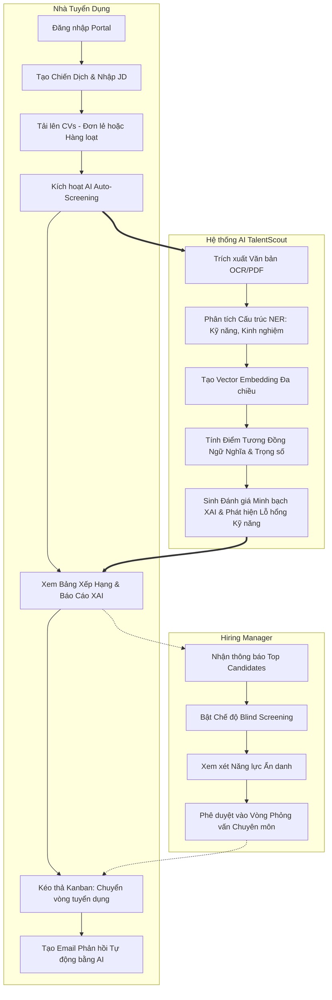
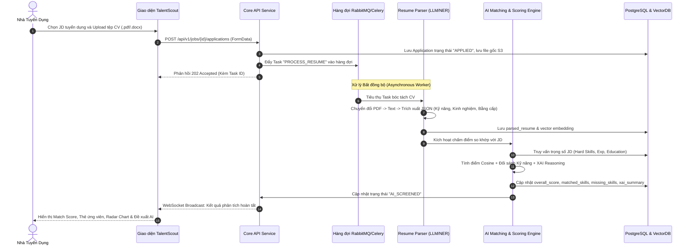
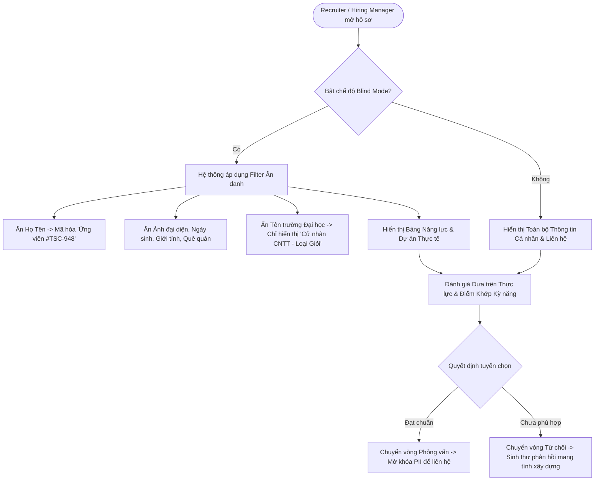
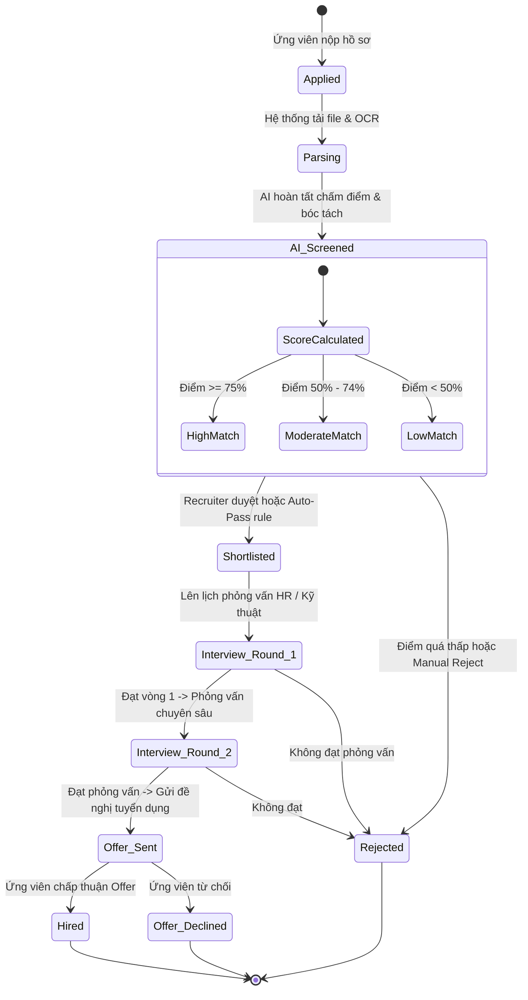
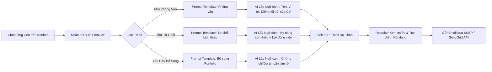

# TalentScout - User Flow & System Process Models
**Thiết kế Luồng Người dùng, Sơ đồ Tương tác & Vòng đời Xử lý Tuyển dụng**

---

## 1. Bản đồ Hành trình Người dùng Tổng thể (Overall User Journey)

Hệ thống TalentScout phục vụ 3 nhóm đối tượng người dùng chính (User Personas):
- **Nhà tuyển dụng (Recruiter)**: Thiết lập chiến dịch, nhập dữ liệu JD, tải lên/thu thập CV, giám sát AI chấm điểm, tương tác ứng viên.
- **Trưởng bộ phận chuyên môn (Hiring Manager)**: Thiết lập tiêu chí kỹ năng chuyên sâu, chấm điểm mù (Blind Review) các ứng viên qua vòng AI để loại bỏ thiên vị, phỏng vấn chuyên môn.
- **Ứng viên (Candidate)**: Ứng tuyển trực tuyến, nhận thông báo tiến độ minh bạch và nhận phản hồi cá nhân hóa từ AI.

---

## 2. Luồng Người Dùng Chi Tiết (Detailed Step-by-Step Flows)

### 2.1. Luồng Sàng Lọc Hồ Sơ Bằng AI (AI Screening Flow)

Đây là luồng nghiệp vụ trung tâm của bài toán: Từ lúc nạp hồ sơ đến lúc nhận kết quả chấm điểm phân rã.

---

### 2.2. Luồng Sàng Lọc Ẩn Danh (Blind Screening Mode Flow)

Tính năng cốt lõi giúp loại bỏ các thiên vị vô thức (Unconscious Bias) về giới tính, độ tuổi, trường học, ngoại hình.

---

### 2.3. Luồng Tương Tác Bảng Quản Trị Tuyển Dụng Kanban (ATS Pipeline Flow)

---

### 2.4. Luồng Tự Động Sinh Email Giao Tiếp (AI Outreach Generator)

---

## 3. Ma Trận Phân Quyền & Tương Tác Vai Trò (RACI Matrix)

| Chức Năng Nghiệp Vụ | Recruiter (HR) | Hiring Manager (Lead) | System AI Engine | Candidate (Ứng viên) |
| :--- | :---: | :---: | :---: | :---: |
| Tạo & Hiệu chỉnh JD Tuyển dụng | C (Tham gia) | A/R (Phê duyệt/Thực hiện) | I (Đề xuất kỹ năng) | I (Đọc thông tin) |
| Tải lên Hồ sơ CV Ứng viên | A/R (Chịu trách nhiệm) | I (Xem xét) | I (Xử lý) | R (Nộp trực tiếp) |
| Bóc tách & Chấm điểm Tương thích | I (Theo dõi) | I (Theo dõi) | A/R (Tự động thực thi) | I |
| Đánh giá Ẩn danh (Blind Screening) | C (Hỗ trợ) | A/R (Quyết định) | I (Cung cấp góc nhìn) | I |
| Chuyển trạng thái Kanban Pipeline | A/R (Thực hiện) | C (Đóng góp ý kiến) | I (Cập nhật logs) | I (Nhận trạng thái) |
| Gửi Thư Phản hồi Cá nhân hóa | A/R (Phê duyệt gửi) | I | R (Sinh nội dung tự động)| A (Người nhận) |

*(Quy ước RACI: R = Responsible, A = Accountable, C = Consulted, I = Informed)*
