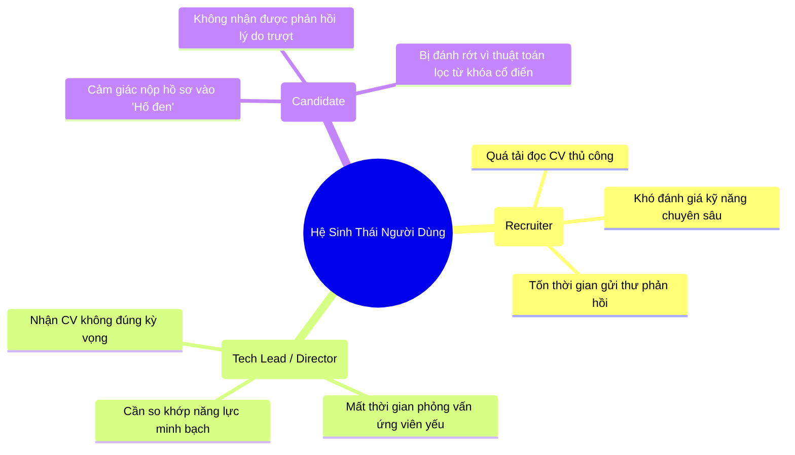
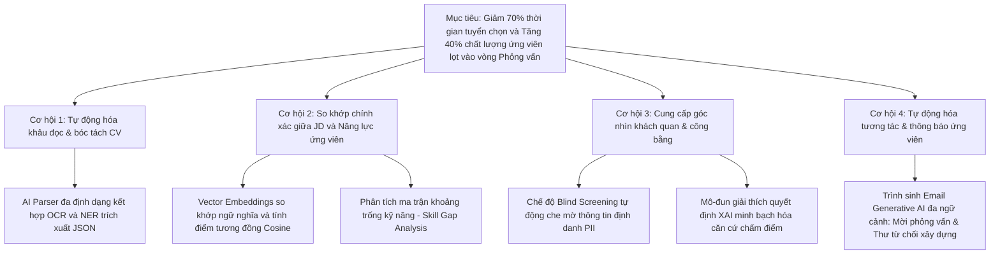

# Chương 3. AI trong Phân tích Yêu cầu & Sản phẩm
## 3.1 Khám Phá Sản Phẩm (Product Discovery) - TalentScout

---

## 1. Bối Cảnh Thị Trường & Vấn Nạn Ngành Tuyển Dụng

Trong kỷ nguyên chuyển đổi số và bùng nổ các nền tảng tuyển dụng trực tuyến (LinkedIn, TopCV, VietnamWorks, Indeed), các doanh nghiệp đang đối mặt với bài toán nan giải: **"Quá tải hồ sơ ứng tuyển nhưng khủng hoảng nhân tài phù hợp"**.

### Số liệu Thực trạng Đáng báo động:
- **Tình trạng "CV Spam"**: Trung bình một vị trí tuyển dụng công nghệ (Software Engineer, Product Manager, Data Scientist) nhận về từ **200 đến 500 hồ sơ**, trong đó có tới **65% - 75% ứng viên không thỏa mãn các yêu cầu tối thiểu**.
- **Áp lực thời gian sàng lọc**: Theo nghiên cứu của Ladders Inc., một Chuyên viên Tuyển dụng (Recruiter) chỉ dành trung bình **6 đến 7.4 giây** để đọc lướt một bản CV. Việc đọc lướt trong áp lực cao dẫn tới bỏ sót nhân tài thực thụ (False Negatives) và chọn nhầm ứng viên "thổi phồng" từ khóa (Keyword Stuffing).
- **Chi phí và thời gian tuyển dụng (Time-to-Hire)**: Doanh nghiệp mất trung bình **38 đến 45 ngày** để hoàn tất một quy trình tuyển dụng vị trí chuyên môn, gây thiệt hại ước tính hàng chục nghìn USD do vị trí trống bị đình trệ.
- **Thiên vị vô thức (Unconscious Bias)**: Các định kiến về trường đại học, giới tính, độ tuổi, hình ảnh đại diện vẫn âm thầm ảnh hưởng đến quyết định sơ tuyển, làm giảm tính đa dạng và công bằng trong tổ chức.

---

## 2. Phân Tích Chân Dung Người Dùng (Target User Personas)

### Persona 1: Nguyễn Thùy Linh - Senior Tech Recruiter (29 tuổi)
- **Mục tiêu**: Tuyển đủ 15 vị trí IT chất lượng cao mỗi tháng; giảm thiểu tối đa các tác vụ thủ công như lọc CV và gửi email thông báo.
- **Nỗi đau (Pain Points)**:
  - Mất 4-5 tiếng mỗi ngày chỉ để mở từng file PDF/Docx, sao chép thông tin vào bảng tính Excel.
  - Không có chuyên môn lập trình sâu nên thường lọc sai lệch các từ khóa kỹ thuật (ví dụ: không biết TypeScript thuộc hệ sinh thái JavaScript).
  - Thường xuyên bị ứng viên phàn nàn vì phản hồi trễ hoặc gửi thư từ chối chung chung vô cảm.

### Persona 2: Trần Quốc Tuấn - Engineering Director / Hiring Manager (38 tuổi)
- **Mục tiêu**: Tuyển được các kỹ sư có năng lực thực chiến, tư duy giải quyết vấn đề tốt, vào việc nhanh.
- **Nỗi đau (Pain Points)**:
  - Thất vọng vì HR chuyển sang những hồ sơ đạt điểm từ khóa nhưng khi vào phỏng vấn kỹ thuật thì năng lực thực tế rất yếu.
  - Mất từ 10 - 15 giờ phỏng vấn mỗi tuần với các ứng viên không đạt chuẩn cơ bản.
  - Khó đo lường mức độ phù hợp giữa bản mô tả công việc (JD) và năng lực của ứng viên nếu chỉ nhìn qua bằng cấp.

### Persona 3: Lê Hoàng Minh - Ứng viên Backend Developer (24 tuổi)
- **Mục tiêu**: Tìm được công việc đúng năng lực kỹ năng, có cơ hội thăng tiến và môi trường minh bạch.
- **Nỗi đau (Pain Points)**:
  - Nộp hàng chục công ty nhưng rơi vào tình trạng "Ghosting" (im lặng không phản hồi).
  - Hồ sơ có dự án thực tế xuất sắc nhưng bị các hệ thống ATS truyền thống loại bỏ chỉ vì thiếu một vài từ khóa chính xác.

---

## 3. Khung Mô Hình Kinh Doanh Tinh Gọn (Lean Canvas)

| **Vấn Đề (Problem)** | **Giải Pháp (Solution)** | **Đề Xuất Giá Trị Độc Nhất (UVP)** | **Lợi Thế Khó Sao Chép (Unfair Advantage)** | **Phân Khúc Khách Hàng (Customer Segments)** |
| :--- | :--- | :--- | :--- | :--- |
| 1. Quá tải hàng trăm CV mỗi tin đăng tuyển. 2. Sàng lọc thủ công chậm, dễ sai sót và bỏ lỡ nhân tài. 3. Hệ thống ATS truyền thống lọc từ khóa ngô nghê. 4. Thiên vị vô thức trong tuyển dụng. | 1. **AI Parsing**: Bóc tách tự động đa định dạng (.pdf, .docx). 2. **Semantic Matching**: So khớp ngữ nghĩa đa chiều kết hợp Vector DB. 3. **Explainable AI**: Báo cáo minh bạch điểm mạnh/yếu. 4. **Blind Mode**: Sàng lọc ẩn danh PII. | **"Sàng lọc thông minh, tuyển dụng chuẩn xác – Giảm 70% thời gian tuyển chọn nhân tài với độ minh bạch AI tuyệt đối."** | 1. Động cơ chấm điểm Hybrid kết hợp Tri thức Kỹ năng chuyên sâu & Vector ngữ nghĩa. 2. Báo cáo giải trình XAI minh bạch, không hộp đen. | 1. Doanh nghiệp Công nghệ (Tech Startups & Tech Giants). 2. Các công ty Headhunt & Dịch vụ Nhân sự (HR Agencies). 3. Tập đoàn quy mô lớn có lưu lượng ứng tuyển cao. |
| **Chỉ Số Then Chốt (Key Metrics)** | **Kênh Tiếp Cận (Channels)** | | | **Mô Hình Doanh Thu (Revenue Streams)** |
| - Time-to-screen (giây/CV) - Độ chính xác đề xuất (Precision/Recall) - Tỷ lệ chuyển đổi phỏng vấn (Pass Rate) - Monthly Recurring Revenue (MRR) | - Kênh B2B Inbound & Content Marketing chuyên sâu HR Tech. - Hội thảo HR Summit & Demo trực tiếp cho các Giám đốc Nhân sự. - Tiếp thị qua LinkedIn & Tích hợp đối tác. | | | - **Gói Starter (SaaS)**: $99/tháng (Tối đa 300 CV/tháng). - **Gói Pro**: $299/tháng (1,500 CV, Blind Mode, XAI). - **Gói Enterprise**: Custom pricing (Tích hợp ATS nội bộ, API tùy biến). |

---

## 4. Bảng So Sánh Đối Thủ Cạnh Tranh (Competitor Benchmarking)

| Tiêu Chí Đánh Giá | ATS Truyền Thống (Taleo, SAP) | Nền Tảng Nước Ngoài (Greenhouse, Lever) | Nền Tảng AI Mới (Eightfold.ai, PyjamaHR) | **TalentScout (Giải Pháp Của Chúng Ta)** |
| :--- | :---: | :---: | :---: | :---: |
| **Cơ chế Sàng lọc CV** | Lọc từ khóa cứng (Exact Match) | Lọc từ khóa + Bộ lọc quy tắc tĩnh | Deep Learning & Vector Matching | **Hybrid Semantic Matching + Tri thức kỹ năng ngành** |
| **Tính Minh Bạch AI (XAI)** | ❌ Không có | ❌ Không có | ⚠️ Thấp (Hộp đen, chỉ có % điểm) | **✅ Cao (Giải trình chi tiết điểm mạnh/yếu, Skill Gap)** |
| **Chế độ Blind Screening** | ❌ Không hỗ trợ | ⚠️ Cấu hình phức tạp | ⚠️ Phải mua gói cao cấp | **✅ Tích hợp sẵn 1 chạm (One-click Blind Mode)** |
| **Soạn Thảo Email Tự Động** | Bản mẫu tĩnh (Static Template) | Tự động hóa gửi mẫu cố định | Gợi ý đoạn văn | **✅ Generative AI cá nhân hóa theo từng hồ sơ** |
| **Chi Phí Triển Khai** | Cực kỳ đắt đỏ ($10k+ / năm) | Trung bình - Cao ($6k - $15k / năm) | Tương đối cao ($3k - $8k / năm) | **Tối ưu, linh hoạt SaaS và sẵn sàng mở rộng** |

---

## 5. Cây Cơ Hội - Giải Pháp Ứng Dụng AI (AI Opportunity Solution Tree)

