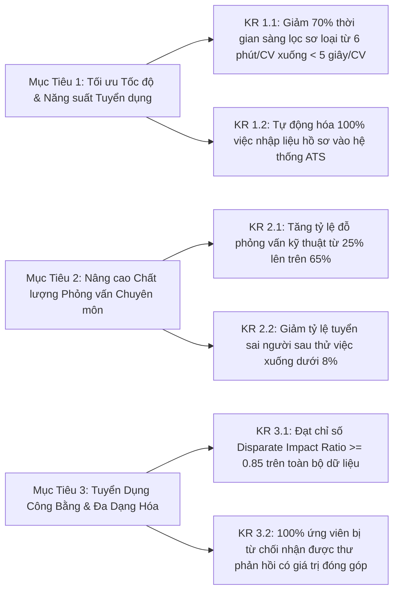
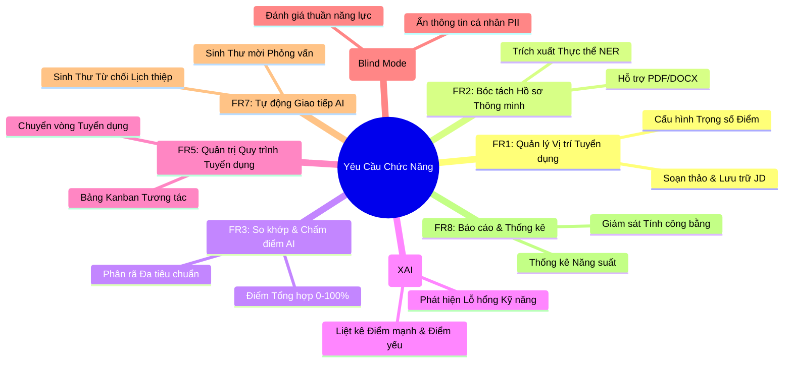

# Chương 3. AI trong Phân tích Yêu cầu & Sản phẩm
## 3.2 Tài Liệu Yêu Cầu Sản Phẩm (Product Requirements Document - PRD)

**Tên Sản Phẩm:** TalentScout - AI-Powered Recruitment Management & Resume Screening Platform  
**Phiên Bản:** 1.2.0 (Enterprise Specification)  
**Trạng Thái:** Sẵn sàng Triển khai (Approved for Engineering)  
**Chủ Trì Thiết Kế:** Nhóm Phát Triển Sản Phẩm AI

---

## 1. Tầm Nhìn Sản Phẩm & Mục Tiêu Chiến Lược (Product Vision & Goals)

### 1.1. Tuyên Bố Tầm Nhìn (Vision Statement)
Xây dựng một nền tảng quản trị tuyển dụng và sàng lọc ứng viên thông minh thế hệ mới, trao quyền cho các doanh nghiệp tiếp cận đúng nhân tài với tốc độ nhanh gấp 3 lần, loại bỏ hoàn toàn các rào cản thiên vị vô thức và mang lại trải nghiệm ứng tuyển minh bạch, nhân văn cho mọi ứng viên.

### 1.2. Mục Tiêu & Kết Quả Then Chốt (OKRs & Product KPIs)

---

## 2. Phạm Vi Sản Phẩm (Product Scope)

### 2.1. Trong Phạm Vi (In-Scope for Phase 1 & 2)
- Tiếp nhận và phân tích tự động file CV (PDF, DOCX, TXT) và trích xuất cấu trúc thực thể (NER).
- Quản lý mô tả công việc (Job Description) và cấu hình trọng số tiêu chí đánh giá.
- Động cơ so khớp ngữ nghĩa đa tiêu chuẩn (Hybrid Semantic Matching Engine) tính điểm 0 - 100%.
- Báo cáo phân rã điểm số và diễn giải minh bạch (Explainable AI - XAI).
- Quản trị ứng viên theo luồng Kanban linh hoạt (Applied -> Screened -> Interview -> Offer -> Rejected).
- Chế độ sàng lọc ẩn danh (Blind Screening Mode) bảo vệ công bằng tuyển dụng.
- Trình sinh email giao tiếp tự động (AI Auto-Outreach) cá nhân hóa.
- Bảng điều khiển thống kê và giám sát thiên vị (Analytics & Fairness Dashboard).

### 2.2. Ngoài Phạm Vi (Out-of-Scope - Dành cho các giai đoạn tiếp theo)
- Tích hợp cổng phỏng vấn video trực tuyến (Video Interviewing Tool).
- Tự động chấm bài kiểm tra lập trình (Automated Code Assessment Engine).
- Tích hợp tính lương tự động (Payroll Integration).

---

## 3. Yêu Cầu Chức Năng (Functional Requirements - FR)

### Chi Tiết Từng Yêu Cầu Chức Năng:

| Mã FR | Tên Chức Năng | Mức Độ Ưu Tiên | Mô Tả Nghiệp Vụ & Quy Tắc |
| :--- | :--- | :---: | :--- |
| **FR-01** | **Quản Lý JD Tuyển Dụng** | **Must-Have** | Hệ thống cho phép người dùng tạo, chỉnh sửa, lưu trữ các bản JD. Cho phép thiết lập trọng số (Weighting) cho từng nhóm tiêu chí: Kỹ năng chuyên môn, Số năm kinh nghiệm, Trình độ học vấn. |
| **FR-02** | **Bóc Tách CV Thông Minh** | **Must-Have** | Cho phép tải lên tệp CV đơn lẻ hoặc hàng loạt (.pdf, .docx, .txt). Hệ thống trích xuất tự động: Thông tin cá nhân, Danh sách kỹ năng, Lịch sử việc làm, Bằng cấp học vấn, Chứng chỉ chuyên môn. |
| **FR-03** | **Động Cơ So Khớp & Chấm Điểm AI** | **Must-Have** | Tính toán chỉ số phù hợp tổng hợp (Overall Match Score 0 - 100%) và điểm thành phần theo công thức trọng số. Sử dụng Vector Cosine Similarity kết hợp từ điển phân loại kỹ năng. |
| **FR-04** | **Giải Trình Minh Bạch (XAI)** | **Must-Have** | Cung cấp bảng phân tích lý giải rõ ràng: Danh sách kỹ năng trùng khớp, Kỹ năng còn thiếu (Skill Gap), Đánh giá điểm mạnh vượt trội, Rủi ro tiềm ẩn và Khuyến nghị tuyển dụng. |
| **FR-05** | **Quản Trị Pipeline Tuyển Dụng (Kanban)** | **Must-Have** | Giao diện kéo thả trực quan theo các giai đoạn: *Applied* $\rightarrow$ *AI Screened* $\rightarrow$ *Interview* $\rightarrow$ *Offer* $\rightarrow$ *Rejected*. Hỗ trợ lọc theo điểm số, kỹ năng và từ khóa. |
| **FR-06** | **Chế Độ Tuyển Dụng Ẩn Danh (Blind Screening)** | **Should-Have** | Cho phép kích hoạt chế độ ẩn danh bằng 1 nút bấm: Hệ thống tự động che giấu Họ tên, Giới tính, Tuổi tác, Ảnh đại diện, Địa chỉ của ứng viên để hạn chế tối đa thiên vị vô thức. |
| **FR-07** | **Trình Sinh Email Giao Tiếp Tự Động (AI Outreach)** | **Should-Have** | Generative AI tự động tạo thư mời phỏng vấn hoặc thư từ chối mang tính xây dựng, cá nhân hóa theo từng hồ sơ và điểm mạnh của ứng viên, cho phép Recruiter chỉnh sửa trước khi gửi. |
| **FR-08** | **Báo Cáo & Giám Sát Công Bằng Tuyển Dụng** | **Could-Have** | Cung cấp bảng điều khiển thống kê: Số lượng hồ sơ đã xử lý, Phân bổ điểm trung bình, Thời gian xử lý trung bình, Chỉ số phân bổ công bằng (Demographic Parity / Disparate Impact). |

---

## 4. Yêu Cầu Phi Chức Năng (Non-Functional Requirements - NFR)

### 4.1. Hiệu Năng & Tốc Độ Xử Lý (Performance)
- **NFR-P1**: Thời gian bóc tách và hoàn tất chấm điểm 01 hồ sơ CV tiêu chuẩn không vượt quá **3.0 giây** trên môi trường điện toán đám mây tiêu chuẩn.
- **NFR-P2**: Khả năng xử lý song song (Concurrency): Hỗ trợ xử lý đồng thời ít nhất **50 tệp CV** được tải lên cùng lúc mà không làm sụt giảm quá 10% hiệu năng hệ thống.
- **NFR-P3**: Độ trễ tương tác giao diện người dùng (UI Response Time) cho các thao tác kéo thả Kanban, chuyển tab nhỏ hơn **200ms**.

### 4.2. Độ Chính Xác Của Mô Hình AI (Model Accuracy)
- **NFR-A1**: Độ chính xác trích xuất thực thể (NER Precision & Recall - F1 Score) đối với Kỹ năng công nghệ và Bằng cấp đạt tối thiểu **88%**.
- **NFR-A2**: Hệ số tương quan xếp hạng giữa kết quả AI đề xuất và đánh giá chuyên gia nhân sự thực tế (Spearman's Rank Correlation) đạt tối thiểu **0.75**.

### 4.3. Bảo Mật & Quyền Riêng Tư Dữ Liệu (Security & Privacy)
- **NFR-S1**: Mã hóa toàn bộ dữ liệu lưu trữ (Encryption at Rest) sử dụng chuẩn AES-256; mã hóa dữ liệu truyền tải (Encryption in Transit) bằng TLS 1.3.
- **NFR-S2**: Tuân thủ tuyệt đối quy chuẩn GDPR (Article 17 - Quyền được lãng quên): Khi ứng viên yêu cầu hủy thông tin, toàn bộ tệp tin, dữ liệu bóc tách và vector embeddings liên quan phải được xóa sạch vĩnh viễn trong vòng 24 giờ.
- **NFR-S3**: Phân quyền truy cập dựa trên vai trò nghiêm ngặt (Role-Based Access Control - RBAC).

---

## 5. Kế Hoạch Quản Trị Rủi Ro & Biện Pháp Giảm Thiểu (Risk & Mitigation)

| Rủi Ro Nhận Diện | Khả Năng & Tác Động | Biện Pháp Phòng Ngừa & Xử Lý |
| :--- | :---: | :--- |
| **Ảo giác AI (Hallucination)**: Mô hình LLM tự bịa đặt kỹ năng không có trong CV. | Trung bình / Cao | Áp dụng kỹ thuật RAG nghiêm ngặt; bắt buộc mô hình phải trích dẫn số trang và câu văn gốc chứng minh sự tồn tại của kỹ năng; kiểm tra chéo bằng hàm kiểm định chuỗi ký tự. |
| **Thiên vị thuật toán (Algorithmic Bias)**: Đánh rớt ứng viên do giới tính hoặc trường đại học. | Trung bình / Rất cao | Thiết lập cơ chế Blind Screening ở mức hệ thống; loại bỏ triệt để các biến số nhân khẩu học trước khi tính điểm; giám sát tự động bằng bộ đo Four-Fifths Rule. |
| **CV định dạng phức tạp (Infographic, 2 cột lộn xộn)**: Parser đọc sai thứ tự thời gian. | Cao / Trung bình | Tích hợp OCR kết hợp mô hình thị giác phân tích bố cục (LayoutLMv3 / Document Vision AI) để nhận dạng đúng các khối văn bản độc lập. |
