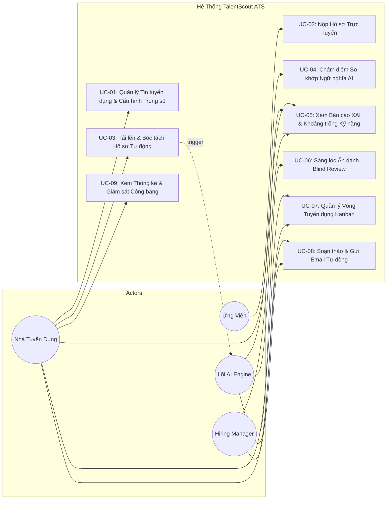
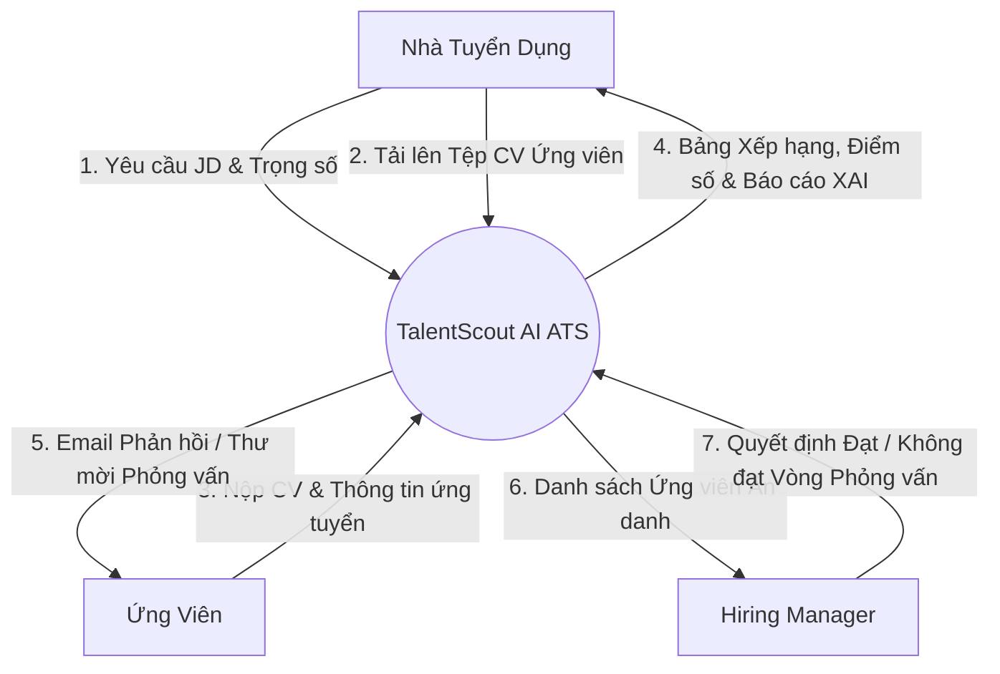
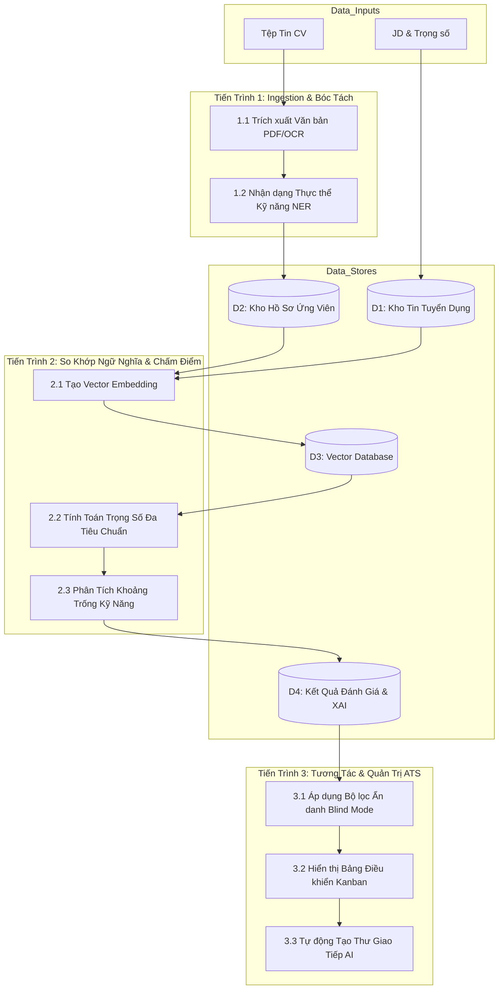
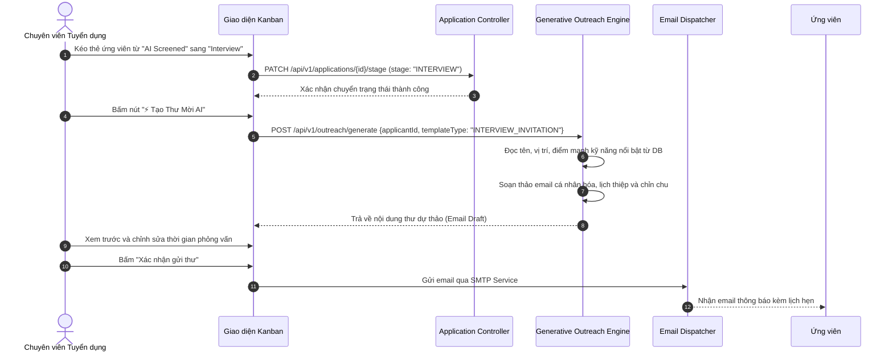

# Chương 3. AI trong Phân tích Yêu cầu & Sản phẩm
## 3.3 Phân Tích Yêu Cầu (Requirements Analysis) - TalentScout

---

## 1. Mô Hình Ca Sử Dụng (Use Case Modeling)

### 1.1. Sơ Đồ Use Case Tổng Thể Hệ Thống

---

### 1.2. Đặc Tả Chi Tiết Ca Sử Dụng Trọng Tâm (Core Use Case Specifications)

#### Đặc Tả Use Case UC-04: Chấm Điểm So Khớp Ngữ Nghĩa & Tổng Hợp XAI
- **Mã Ca Sử Dụng**: `UC-04`
- **Tác nhân chính (Primary Actor)**: Lõi AI Engine (Tự động kích hoạt sau khi Recruiter tải lên CV hoặc hoàn tất bóc tách).
- **Mục tiêu**: So khớp toàn diện năng lực của ứng viên với yêu cầu của bản mô tả công việc (JD), sinh điểm số tổng hợp và bản giải trình lý do minh bạch.
- **Tiền điều kiện (Preconditions)**:
  1. Bản mô tả công việc (JD) đã được khởi tạo và cấu hình trọng số thành công.
  2. Tệp hồ sơ CV đã được trích xuất thành văn bản cấu trúc JSON hợp lệ.
- **Hậu điều kiện (Postconditions)**:
  1. Điểm số Match Score (0 - 100%) và các điểm thành phần được cập nhật vào cơ sở dữ liệu.
  2. Bảng phân tích kỹ năng (Kỹ năng trùng khớp, Kỹ năng thiếu sót) và báo cáo XAI được lưu trữ sẵn sàng hiển thị.
- **Luồng sự kiện chính (Main Success Scenario)**:
  1. Hệ thống tiếp nhận cấu trúc dữ liệu parsed JSON của CV và JD tương ứng.
  2. Hệ thống chuyển đổi văn bản sang Vector Embeddings thông qua mô hình Embedding.
  3. Hệ thống tính toán độ tương đồng ngữ nghĩa Cosine Similarity giữa Vector CV và Vector JD.
  4. Hệ thống đối sánh danh mục kỹ năng bắt buộc (Hard Skills) và kỹ năng mở rộng.
  5. Hệ thống tính toán số năm kinh nghiệm thực tế so với yêu cầu tối thiểu của vị trí.
  6. Hệ thống áp dụng hàm trọng số tổng hợp để tính `Overall Match Score`.
  7. Lõi LLM Reasoning tổng hợp các luận điểm: Ưu điểm nổi bật, Hạn chế/Rủi ro, và Đề xuất bước tiếp theo.
  8. Hệ thống lưu kết quả vào bảng `AI_SCREENING_RESULT` và phát thông báo cập nhật UI theo thời gian thực.
- **Luồng sự kiện nhánh / Ngoại lệ (Alternative / Exception Flows)**:
  - *4a. Tệp CV không chứa thông tin kỹ năng hoặc rỗng*: Hệ thống gán cờ cảnh báo `LOW_DATA_QUALITY`, chấm điểm 0%, và đề xuất Recruiter kiểm tra thủ công.
  - *6a. Có sự khác biệt lớn giữa kinh nghiệm tự khai và bằng chứng dự án*: Hệ thống ghi chú cảnh báo nghi vấn (Discrepancy Warning) trong mục Rủi ro của báo cáo XAI.

---

## 2. Sơ Đồ Luồng Dữ Liệu (Data Flow Diagrams - DFD)

### 2.1. DFD Mức Ngữ Cảnh (Context Diagram - Level 0)

---

### 2.2. DFD Mức Chi Tiết (Level 1 Processing Diagram)

---

## 3. Sơ Đồ Tuần Tự Xử Lý Nghiệp Vụ (Sequence Diagrams)

### Quy Trình Kéo Thả Trạng Thái Tuyển Dụng & Kích Hoạt AI Email Generator

---

## 4. Ma Trận Quy Tắc Nghiệp Vụ (Business Rules Matrix)

| Mã Quy Tắc | Tên Quy Tắc | Điều Kiện Kích Hoạt | Hành Động Hệ Thống Bắt Buộc |
| :--- | :--- | :--- | :--- |
| **BR-01** | **Ngưỡng Đề Xuất Tự Động (Auto-Shortlist Threshold)** | `Overall Match Score >= 80%` VÀ không thiếu kỹ năng bắt buộc | Gán nhãn `STRONG_MATCH` màu xanh lá cây; tự động gợi ý đẩy lên đầu bảng duyệt của Hiring Manager. |
| **BR-02** | **Cảnh Báo Thiếu Kỹ Năng Bắt Buộc (Mandatory Skill Deficiency)** | Thiếu bất kỳ kỹ năng nào được gắn cờ `is_mandatory = true` | Điểm kỹ năng chuyên môn bị giảm trừ tối thiểu 30%; hệ thống hiển thị cảnh báo đỏ `Missing Critical Skills`. |
| **BR-03** | **Bảo Vệ Tính Khách Quan (Blind Mode Enactment)** | Chế độ Blind Screening được bật trên giao diện | Toàn bộ dữ liệu PII bao gồm Tên thật, Ảnh, Giới tính, Năm sinh bị băm mã hóa hoặc ẩn hoàn toàn; chỉ hiển thị mã định danh (ví dụ: `Candidate #9402`). |
| **BR-04** | **Phản Hồi Không Bỏ Rơi (No Ghosting Policy)** | Hồ sơ nằm ở trạng thái `REJECTED` quá 24 giờ | Hệ thống tự động xếp hàng dự thảo email từ chối mang tính động viên và hướng dẫn kỹ năng cần cải thiện để Recruiter duyệt gửi. |
