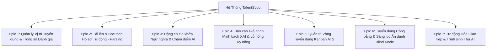

# Chương 3. AI trong Phân tích Yêu cầu & Sản phẩm
## 3.4 User Stories & Tiêu Chí Chấp Nhận (Acceptance Criteria) - TalentScout

---

## 1. Phương Pháp Luận & Tiêu Chuẩn Áp Dụng

Mọi User Story trong hệ thống TalentScout đều được thiết kế tuân thủ nghiêm ngặt nguyên tắc **INVEST**:
- **I (Independent)**: Độc lập, có thể triển khai và bàn giao tách biệt.
- **N (Negotiable)**: Linh hoạt, có thể thảo luận và tinh chỉnh giữa Product Owner và Engineering Team.
- **V (Valuable)**: Mang lại giá trị rõ ràng cho người dùng cuối (Recruiter, Hiring Manager, Candidate).
- **E (Estimable)**: Có thể ước lượng được độ phức tạp và thời gian thực hiện.
- **S (Small)**: Quy mô vừa phải, hoàn tất trong phạm vi một Sprint (1 - 2 tuần).
- **T (Testable)**: Có thể kiểm thử tự động hoặc kiểm thử chấp nhận được.

Toàn bộ **Tiêu chí Chấp nhận (Acceptance Criteria - AC)** được chuẩn hóa theo định dạng **Behavior-Driven Development (BDD / Gherkin)**:
```gherkin
Scenario: [Tên kịch bản kiểm thử]
  Given [Bối cảnh / Tiền điều kiện]
  When  [Hành động của người dùng hoặc sự kiện hệ thống]
  Then  [Kết quả kỳ vọng và trạng thái hệ thống sau hành động]
```

---

## 2. Phân Rã Danh Mục Epic & User Stories



---

## 3. Chi Tiết User Stories & Kịch Bản Kiểm Thử BDD

### Epic 1: Quản Lý Vị Trí Tuyển Dụng & Trọng Số Đánh Giá

#### US-01: Thiết lập Vị trí Tuyển dụng và Cấu hình Trọng số
- **Mô tả**: Là một **Nhà tuyển dụng (Recruiter)**, tôi muốn **nhập thông tin JD và tùy chỉnh tỷ lệ trọng số cho Kỹ năng, Kinh nghiệm, Học vấn**, để **hệ thống AI chấm điểm bám sát theo đúng nhu cầu thực tế của vị trí**.
- **Độ ưu tiên**: Must-Have | **Story Points**: 5

```gherkin
Scenario: Cấu hình trọng số hợp lệ cho vị trí Senior Backend
  Given Tôi đang ở trang "Tạo mới Vị trí Tuyển dụng"
  When  Tôi nhập tiêu đề "Senior Backend Engineer", yêu cầu tối thiểu "3 năm kinh nghiệm"
  And   Tôi thiết lập trọng số: Kỹ năng chuyên môn = 40%, Kinh nghiệm = 30%, Bằng cấp = 15%, Độ tương đồng ngữ nghĩa = 15%
  And   Tôi nhấn nút "Lưu và Xuất bản"
  Then  Hệ thống thông báo "Tạo chiến dịch tuyển dụng thành công"
  And   Tổng trọng số được xác thực bằng chính xác 100%
  And   Bản ghi được lưu vào cơ sở dữ liệu với trạng thái PUBLISHED

Scenario: Cảnh báo khi tổng trọng số không bằng 100%
  Given Tôi đang cấu hình trọng số đánh giá
  When  Tôi nhập tổng trọng số các tiêu chí bằng 85%
  And   Tôi nhấn nút "Lưu và Xuất bản"
  Then  Hệ thống ngăn chặn thao tác lưu
  And   Hiển thị thông báo lỗi màu đỏ: "Tổng tỷ lệ trọng số phải đạt chính xác 100%. Hiện tại: 85%"
```

---

### Epic 2: Tải Lên & Bóc Tách Hồ Sơ Tự Động (Parsing)

#### US-02: Tải lên Tệp CV và Trích xuất Dữ liệu Cấu trúc
- **Mô tả**: Là một **Nhà tuyển dụng**, tôi muốn **tải lên tệp CV dạng PDF hoặc DOCX**, để **hệ thống tự động trích xuất kỹ năng, thời gian kinh nghiệm và bằng cấp mà không cần nhập liệu thủ công**.
- **Độ ưu tiên**: Must-Have | **Story Points**: 8

```gherkin
Scenario: Tải lên tệp CV PDF tiêu chuẩn thành công
  Given Tôi đã chọn một vị trí tuyển dụng đang hoạt động
  When  Tôi kéo thả tệp "Nguyen_Van_A_Resume.pdf" (kích thước 1.8MB) vào khung Upload
  Then  Hệ thống hiển thị thanh tiến trình quét "Parsing Resume..."
  And   Trong vòng dưới 3 giây, hoàn tất bóc tách dữ liệu
  And   Hiển thị danh sách kỹ năng bóc tách được (ví dụ: Python, Docker, FastApi)
  And   Hiển thị số năm kinh nghiệm tính toán được (ví dụ: 4 năm)
  And   Tạo một bản ghi ứng viên mới trong bảng danh sách với trạng thái "APPLIED"

Scenario: Tải lên tệp không đúng định dạng hoặc vượt quá dung lượng
  Given Tôi đang ở màn hình tải lên CV
  When  Tôi tải lên tệp "portfolio.zip" hoặc tệp PDF có dung lượng 25MB (vượt ngưỡng 10MB)
  Then  Hệ thống từ chối nhận tệp
  And   Hiển thị cảnh báo: "Định dạng không được hỗ trợ hoặc dung lượng vượt quá giới hạn 10MB"
```

---

### Epic 3: Động Cơ So Khớp Ngữ Nghĩa & Chấm Điểm AI

#### US-03: So khớp Năng lực và Tính Điểm Tương Đồng Tổng Hợp
- **Mô tả**: Là một **Hiring Manager**, tôi muốn **xem điểm số phù hợp tổng hợp (Overall Match Score) từ 0 đến 100% kèm điểm chi tiết từng hạng mục**, để **nhanh chóng nhận biết ứng viên nào xứng đáng được mời phỏng vấn**.
- **Độ ưu tiên**: Must-Have | **Story Points**: 8

```gherkin
Scenario: Tính toán điểm cho ứng viên đáp ứng xuất sắc yêu cầu
  Given Hồ sơ ứng viên đã được bóc tách có 5 năm kinh nghiệm và đầy đủ kỹ năng Go, Kubernetes, Microservices
  And   Vị trí tuyển dụng yêu cầu tối thiểu 3 năm kinh nghiệm với Go và Docker/K8s
  When  Hệ thống thực thi thuật toán so khớp đa tiêu chuẩn
  Then  Hệ thống gán điểm Overall Match Score >= 85%
  And   Trạng thái đánh giá được gắn nhãn xanh lá: "STRONG_MATCH"
  And   Hiển thị điểm thành phần: Kỹ năng (92%), Kinh nghiệm (95%), Học vấn (85%)
```

---

### Epic 4: Báo Cáo Giải Trình Minh Bạch XAI & Lỗ Hổng Kỹ Năng

#### US-04: Xem Báo cáo Giải trình AI và Khoảng trống Kỹ năng
- **Mô tả**: Là một **Nhà tuyển dụng**, tôi muốn **đọc báo cáo lý giải tại sao ứng viên được chấm điểm cao hoặc thấp kèm danh sách kỹ năng còn thiếu**, để **tôi có căn cứ vững chắc khi trao đổi với Trưởng bộ phận chuyên môn**.
- **Độ ưu tiên**: Must-Have | **Story Points**: 5

```gherkin
Scenario: Xem phân tích khoảng trống kỹ năng của ứng viên
  Given Ứng viên đạt 68% điểm phù hợp cho vị trí Fullstack Developer
  When  Tôi mở cửa sổ chi tiết "AI Assessment Breakdown" của ứng viên
  Then  Hệ thống hiển thị danh sách "Matched Skills" (ví dụ: React, TypeScript, Node.js)
  And   Hệ thống hiển thị danh sách "Missing Skills" nổi bật màu đỏ (ví dụ: GraphQL, AWS Lambda)
  And   Hệ thống hiển thị đoạn văn bản tóm tắt điểm mạnh nổi bật và rủi ro cần kiểm tra khi phỏng vấn
```

---

### Epic 5: Quản Trị Vòng Tuyển Dụng Kanban ATS

#### US-05: Kéo thả Di chuyển Giai đoạn Tuyển dụng trên Kanban
- **Mô tả**: Là một **Nhà tuyển dụng**, tôi muốn **kéo thả thẻ ứng viên giữa các cột giai đoạn (Applied, Screened, Interview, Offer, Rejected)**, để **cập nhật tiến độ tuyển dụng trực quan và nhanh chóng**.
- **Độ ưu tiên**: Must-Have | **Story Points**: 5

```gherkin
Scenario: Chuyển ứng viên từ vòng AI Screened sang vòng Phỏng vấn
  Given Thẻ ứng viên "Trần Bảo Nam" đang nằm ở cột "AI Screened"
  When  Tôi kéo thẻ ứng viên và thả sang cột "Interview"
  Then  Thẻ ứng viên lập tức neo vào vị trí mới tại cột "Interview"
  And   Hệ thống cập nhật trạng thái ứng viên trong CSDL thành "INTERVIEW"
  And   Hiển thị một thanh thông báo nhỏ (Toast): "Đã chuyển ứng viên sang vòng Phỏng vấn"
```

---

### Epic 6: Tuyển Dụng Công Bằng & Sàng Lọc Ẩn Danh (Blind Mode)

#### US-06: Kích hoạt Chế độ Sàng lọc Ẩn danh (Blind Screening)
- **Mô tả**: Là một **Hiring Manager**, tôi muốn **bật chế độ Blind Mode để che giấu tên tuổi, giới tính, hình ảnh của ứng viên**, để **đánh giá hồ sơ dựa trên thực lực khách quan và tránh mọi định kiến vô thức**.
- **Độ ưu tiên**: Should-Have | **Story Points**: 3

```gherkin
Scenario: Bật chế độ Blind Screening trên bảng ứng viên
  Given Bảng danh sách ứng viên đang hiển thị đầy đủ tên thật, ảnh và giới tính
  When  Tôi gạt công tắc "Blind Screening Mode" sang trạng thái ON
  Then  Toàn bộ tên ứng viên được thay thế bằng mã định danh (ví dụ: "Candidate #8301")
  And   Ảnh đại diện chuyển thành biểu tượng ẩn danh trung tính
  And   Các thông tin ngày sinh, giới tính, quê quán bị che hoàn toàn
  And   Chỉ giữ lại dữ liệu về Kỹ năng, Dự án, Kinh nghiệm và Điểm số AI
```

---

### Epic 7: Tự Động Hóa Giao Tiếp & Trình Sinh Thư AI

#### US-07: Sinh Thư Mời Phỏng Vấn Hoặc Từ Chối Tự Động Bằng AI
- **Mô tả**: Là một **Nhà tuyển dụng**, tôi muốn **nhấn nút để AI tự động soạn thảo email mời phỏng vấn hoặc thư từ chối mang tính xây dựng**, để **tiết kiệm thời gian soạn thảo văn bản mà vẫn giữ được sự chỉn chu, ấm áp**.
- **Độ ưu tiên**: Should-Have | **Story Points**: 5

```gherkin
Scenario: Sinh email mời phỏng vấn tự động cho ứng viên điểm cao
  Given Ứng viên đạt 88% điểm phù hợp và đang ở cột "Interview"
  When  Tôi nhấn nút "Tạo Thư Mời Phỏng Vấn AI"
  Then  Trong vòng 1 giây, hệ thống hiển thị bản thảo email hoàn chỉnh
  And   Nội dung thư có chứa tên vị trí, lời khen ngợi kỹ năng nổi trội (ví dụ: K8s và Microservices)
  And   Có sẵn khung thời gian gợi ý phỏng vấn để tôi điền ngày giờ cụ thể
  And   Tôi có thể nhấn "Copy" hoặc "Gửi ngay"
```

---

## 4. Ma Trận Đánh Giá Nỗ Lực & Mức Độ Ưu Tiên (MoSCoW Matrix)

| Mã Story | Tên User Story | Phân Loại MoSCoW | Story Points | Sprint Dự Kiến |
| :--- | :--- | :---: | :---: | :---: |
| **US-01** | Cấu hình Vị trí Tuyển dụng & Trọng số | **Must-Have** | 5 | Sprint 1 |
| **US-02** | Bóc tách CV Thông minh (Parsing & NER) | **Must-Have** | 8 | Sprint 1 |
| **US-03** | So khớp Ngữ nghĩa & Chấm điểm Đa tiêu chuẩn | **Must-Have** | 8 | Sprint 1 |
| **US-04** | Báo cáo Minh bạch AI & Lỗ hổng Kỹ năng (XAI) | **Must-Have** | 5 | Sprint 2 |
| **US-05** | Bảng Quản trị Tuyển dụng Kanban Tương tác | **Must-Have** | 5 | Sprint 2 |
| **US-06** | Chế độ Sàng lọc Ẩn danh (Blind Mode) | **Should-Have** | 3 | Sprint 2 |
| **US-07** | Trình sinh Thư Giao tiếp AI Cá nhân hóa | **Should-Have** | 5 | Sprint 3 |
| **US-08** | Bảng Thống kê Hiệu năng Tuyển dụng & Fairness | **Could-Have** | 5 | Sprint 3 |
